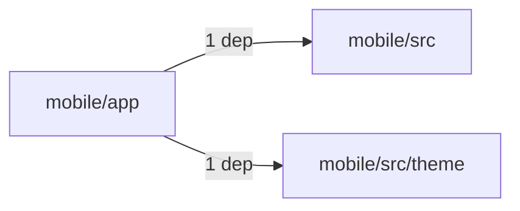
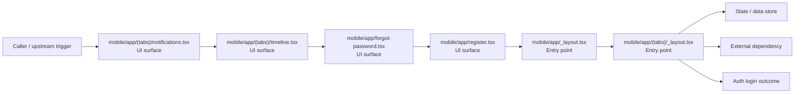

# Module mobile/app

- Overview: [emplus Docs Wiki](../../../index.md)
- Summary: [SUMMARY](../../../SUMMARY.md)
- Feature catalog: [All features](../../../features/index.md)
- Module index: [All modules](../index.md)
- Workspace index: [All workspaces](../../../workspaces/index.md)

## Snapshot

- Path: `mobile/app`
- Descendant files: 24
- Descendant symbols: 54
- Languages: `TypeScript`
- Workspace: [@emplus/mobile](../../../workspaces/mobile.md)

## Related Features

- [Authentication Login](../../../features/auth-login.md) - Authentication Login captures the login workflow inside authentication. It spans 2 workspaces. Key flows include Auth login, Auth registration, Auth login.
- [Authentication Read / List](../../../features/auth-list.md) - Authentication Read / List captures the read / list workflow inside authentication. It spans 3 workspaces.
- [User Management Login](../../../features/user-login.md) - User Management Login captures the login workflow inside user management. It spans 2 workspaces. Key flows include Auth login, Auth registration, Auth login.
- [Search Login](../../../features/search-login.md) - Search Login captures the login workflow inside search. It spans 2 workspaces. Key flows include Auth login, Auth registration, Auth login.
- [Notifications Read / List](../../../features/notification-list.md) - Notifications Read / List captures the read / list workflow inside notifications. It spans 2 workspaces.
- [Notifications Notify](../../../features/notification-notify.md) - Notifications Notify captures the notify workflow inside notifications. It spans 2 workspaces.
- [Order Management Login](../../../features/order-login.md) - Order Management Login captures the login workflow inside order management. It spans 2 workspaces. Key flows include Auth login, Auth login, Auth login.
- [Notifications Login](../../../features/notification-login.md) - Notifications Login captures the login workflow inside notifications. It spans 2 workspaces. Key flows include Auth login, Auth registration, Auth login.
- [Search Notify](../../../features/search-notify.md) - Search Notify captures the notify workflow inside search. It spans 2 workspaces.
- [Storage Login](../../../features/storage-login.md) - Storage Login captures the login workflow inside storage. It spans 2 workspaces. Key flows include Auth login, Auth registration, Auth login.
- [Authentication Verification](../../../features/auth-verify.md) - Authentication Verification captures the verification workflow inside authentication. It spans 2 workspaces. Key flows include Credential validation, Auth login, Auth login.
- [Integrations Login](../../../features/integration-login.md) - Integrations Login captures the login workflow inside integrations. It spans 2 workspaces. Key flows include Auth login, Auth registration, Auth login.
- [Search Create](../../../features/search-create.md) - Search Create captures the create workflow inside search. It spans 2 workspaces.
- [User Management Notify](../../../features/user-notify.md) - User Management Notify captures the notify workflow inside user management. It spans 2 workspaces.
- [Authentication Password Reset](../../../features/auth-reset.md) - Authentication Password Reset captures the password reset workflow inside authentication. It spans 3 workspaces. Key flows include Password reset, Password reset, Password reset.
- [User Management Create](../../../features/user-create.md) - User Management Create captures the create workflow inside user management. It spans 2 workspaces.
- [Order Management Verification](../../../features/order-verify.md) - Order Management Verification captures the verification workflow inside order management. It spans 2 workspaces. Key flows include Credential validation, Auth login, Auth login.

## Business Capability

ErrorBoundary component handles error situations and provides an optional fallback screen

## Basic Design

App is inferred as a authentication and access control area. The visible implementation layers are Entry point, UI surface. State is likely persisted in session / token state, primary database. The module also integrates with @, @expo-google-fonts, expo-font, expo-router, expo-splash-screen, expo-status-bar.

### Boundaries

- Entry points: `mobile/app/(tabs)/notifications.tsx`, `mobile/app/(tabs)/timeline.tsx`, `mobile/app/forgot-password.tsx`, `mobile/app/register.tsx`, `mobile/app/_layout.tsx`, `mobile/app/(tabs)/_layout.tsx`
- Data stores: Session / token state, Primary database
- External interfaces: `@`, `@expo-google-fonts`, `expo-font`, `expo-router`, `expo-splash-screen`, `expo-status-bar`

## Detail Design

Primary flow coverage includes Auth login. Representative files are mobile/app/_layout.tsx, mobile/app/(tabs)/_layout.tsx, mobile/app/(tabs)/care.tsx, mobile/app/(tabs)/home.tsx, mobile/app/(tabs)/notifications.tsx. Observed behavior hints: A function that returns the icon for a given route in the Ionicons library.

### Components

- UI surface: mobile/app/(tabs)/notifications.tsx
- UI surface: mobile/app/(tabs)/timeline.tsx
- UI surface: mobile/app/forgot-password.tsx
- UI surface: mobile/app/register.tsx
- Entry point: mobile/app/_layout.tsx
- Entry point: mobile/app/(tabs)/_layout.tsx
- Entry point: mobile/app/(tabs)/care.tsx
- Entry point: mobile/app/(tabs)/home.tsx

## Module Interactions

- `mobile/app` -> `mobile/src` (1 dependencies)
- `mobile/app` -> `mobile/src/theme` (1 dependencies)

### Interaction Diagram

## Inferred Business Flows

### Auth login

Authenticate the caller, validate credentials, and establish a usable session or token.

#### Steps

- The user or operator enters the flow through mobile/app/(tabs)/notifications.tsx, which surfaces the login interaction.
- The user or operator enters the flow through mobile/app/(tabs)/timeline.tsx, which surfaces the login interaction.
- The user or operator enters the flow through mobile/app/forgot-password.tsx, which surfaces the login interaction.
- The user or operator enters the flow through mobile/app/register.tsx, which surfaces the login interaction.
- mobile/app/_layout.tsx receives the request and turns it into an application-level login command.
- mobile/app/(tabs)/_layout.tsx receives the request and turns it into an application-level login command.

#### Flow Diagram

## Child Modules

- [mobile/app/(tabs)](app/tabs--7761ed0d.md) - 6 files, 19 symbols
- [mobile/app/memory](app/memory.md) - 1 file, 1 symbol
- [mobile/app/profile-details](app/profile-details.md) - 5 files, 12 symbols

## Direct Files

- [mobile/app/_layout.tsx](../../files/mobile/app/_layout.tsx.md) — ErrorBoundary component handles error situations and provides an optional fallback screen
- [mobile/app/add-expense.tsx](../../files/mobile/app/add-expense.tsx.md) — Add Expense Screen function returns AddExpenseScene object
- [mobile/app/add-memory.tsx](../../files/mobile/app/add-memory.tsx.md) — The `AddMemoryScreen` function creates a new memory screen with a title, date, note, and options for adding or selecting assets.
- [mobile/app/forgot-password.tsx](../../files/mobile/app/forgot-password.tsx.md) — The ForgotPasswordScreen function component in the mobile/app/forgot-password.tsx file.
- [mobile/app/index.tsx](../../files/mobile/app/index.tsx.md) — The Index component displays a login or redirect UI based on user state
- [mobile/app/login.tsx](../../files/mobile/app/login.tsx.md) — Login screen component for user authentication.
- [mobile/app/pairing.tsx](../../files/mobile/app/pairing.tsx.md) — function:symbol:0
- [mobile/app/policy.tsx](../../files/mobile/app/policy.tsx.md) — Section props interface in mobile/app/policy.tsx
- [mobile/app/register.tsx](../../files/mobile/app/register.tsx.md) — The RegisterScreen function configuration
- [mobile/app/reset-password.tsx](../../files/mobile/app/reset-password.tsx.md) — Resets the user's password after a failed email login attempt.
- [mobile/app/theme-showcase.tsx](../../files/mobile/app/theme-showcase.tsx.md) — The ThemeShowcaseScreen function represents the main screen of the app, designed to showcase different themes and allow users to switch between them.
- [mobile/app/verify-otp.tsx](../../files/mobile/app/verify-otp.tsx.md) — The VerifyOtpScreen function renders a screen with OTP verification options.
