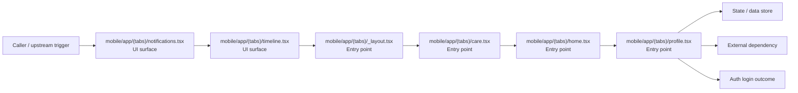

# Module mobile/app/(tabs)

- Overview: [emplus Docs Wiki](../../../../index.md)
- Summary: [SUMMARY](../../../../SUMMARY.md)
- Feature catalog: [All features](../../../../features/index.md)
- Module index: [All modules](../../index.md)
- Workspace index: [All workspaces](../../../../workspaces/index.md)

## Snapshot

- Path: `mobile/app/(tabs)`
- Descendant files: 6
- Descendant symbols: 19
- Languages: `TypeScript`
- Workspace: [@emplus/mobile](../../../../workspaces/mobile.md)

## Related Features

- [Authentication Login](../../../../features/auth-login.md) - Authentication Login captures the login workflow inside authentication. It spans 2 workspaces. Key flows include Auth login, Auth registration, Auth login.
- [Search Login](../../../../features/search-login.md) - Search Login captures the login workflow inside search. It spans 2 workspaces. Key flows include Auth login, Auth registration, Auth login.
- [Order Management Login](../../../../features/order-login.md) - Order Management Login captures the login workflow inside order management. It spans 2 workspaces. Key flows include Auth login, Auth login, Auth login.
- [Notifications Login](../../../../features/notification-login.md) - Notifications Login captures the login workflow inside notifications. It spans 2 workspaces. Key flows include Auth login, Auth registration, Auth login.
- [User Management Login](../../../../features/user-login.md) - User Management Login captures the login workflow inside user management. It spans 2 workspaces. Key flows include Auth login, Auth registration, Auth login.
- [Search Create](../../../../features/search-create.md) - Search Create captures the create workflow inside search. It spans 4 workspaces.
- [User Management Create](../../../../features/user-create.md) - User Management Create captures the create workflow inside user management. It spans 3 workspaces.

## Business Capability

(tabs) appears to implement authentication and access control through entry point, ui surface.

## Basic Design

(tabs) is inferred as a authentication and access control area. The visible implementation layers are Entry point, UI surface. State is likely persisted in session / token state, primary database. The module also integrates with @, @expo, @react-navigation, expo-blur, expo-haptics, expo-linear-gradient.

### Boundaries

- Entry points: `mobile/app/(tabs)/notifications.tsx`, `mobile/app/(tabs)/timeline.tsx`, `mobile/app/(tabs)/_layout.tsx`, `mobile/app/(tabs)/care.tsx`, `mobile/app/(tabs)/home.tsx`, `mobile/app/(tabs)/profile.tsx`
- Data stores: Session / token state, Primary database
- External interfaces: `@`, `@expo`, `@react-navigation`, `expo-blur`, `expo-haptics`, `expo-linear-gradient`

## Detail Design

Primary flow coverage includes Auth login. Representative files are mobile/app/(tabs)/_layout.tsx, mobile/app/(tabs)/care.tsx, mobile/app/(tabs)/home.tsx, mobile/app/(tabs)/notifications.tsx, mobile/app/(tabs)/profile.tsx.

### Components

- UI surface: mobile/app/(tabs)/notifications.tsx
- UI surface: mobile/app/(tabs)/timeline.tsx
- Entry point: mobile/app/(tabs)/_layout.tsx
- Entry point: mobile/app/(tabs)/care.tsx
- Entry point: mobile/app/(tabs)/home.tsx
- Entry point: mobile/app/(tabs)/profile.tsx

## Inferred Business Flows

### Auth login

Authenticate the caller, validate credentials, and establish a usable session or token.

#### Steps

- The user or operator enters the flow through mobile/app/(tabs)/notifications.tsx, which surfaces the login interaction.
- The user or operator enters the flow through mobile/app/(tabs)/timeline.tsx, which surfaces the login interaction.
- mobile/app/(tabs)/_layout.tsx receives the request and turns it into an application-level login command.
- mobile/app/(tabs)/care.tsx receives the request and turns it into an application-level login command.
- mobile/app/(tabs)/home.tsx receives the request and turns it into an application-level login command.
- mobile/app/(tabs)/profile.tsx receives the request and turns it into an application-level login command.

#### Flow Diagram

## Child Modules

No child modules.

## Direct Files

- [mobile/app/(tabs)/_layout.tsx](../../../files/mobile/app/(tabs)/_layout.tsx.md)
- [mobile/app/(tabs)/care.tsx](../../../files/mobile/app/(tabs)/care.tsx.md)
- [mobile/app/(tabs)/home.tsx](../../../files/mobile/app/(tabs)/home.tsx.md)
- [mobile/app/(tabs)/notifications.tsx](../../../files/mobile/app/(tabs)/notifications.tsx.md)
- [mobile/app/(tabs)/profile.tsx](../../../files/mobile/app/(tabs)/profile.tsx.md)
- [mobile/app/(tabs)/timeline.tsx](../../../files/mobile/app/(tabs)/timeline.tsx.md)
