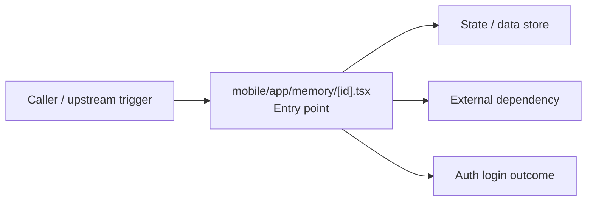

# Module mobile/app/memory

- Overview: [emplus Docs Wiki](../../../../index.md)
- Summary: [SUMMARY](../../../../SUMMARY.md)
- Feature catalog: [All features](../../../../features/index.md)
- Module index: [All modules](../../index.md)
- Workspace index: [All workspaces](../../../../workspaces/index.md)

## Snapshot

- Path: `mobile/app/memory`
- Descendant files: 1
- Descendant symbols: 1
- Languages: `TypeScript`
- Workspace: [@emplus/mobile](../../../../workspaces/mobile.md)

## Related Features

- [Authentication Login](../../../../features/auth-login.md) - Authentication Login captures the login workflow inside authentication. It spans 2 workspaces. Key flows include Auth login, Auth registration, Auth login.
- [Search Login](../../../../features/search-login.md) - Search Login captures the login workflow inside search. It spans 2 workspaces. Key flows include Auth login, Auth registration, Auth login.

## Business Capability

Memory appears to implement authentication and access control through entry point.

## Basic Design

Memory is inferred as a authentication and access control area. The visible implementation layers are Entry point. State is likely persisted in primary database, session / token state. The module also integrates with @, @expo, @tanstack, expo-router, expo-status-bar, react.

### Boundaries

- Entry points: `mobile/app/memory/[id].tsx`
- Data stores: Primary database, Session / token state
- External interfaces: `@`, `@expo`, `@tanstack`, `expo-router`, `expo-status-bar`, `react`

## Detail Design

Primary flow coverage includes Auth login. Representative files are mobile/app/memory/[id].tsx.

### Components

- Entry point: mobile/app/memory/[id].tsx

## Inferred Business Flows

### Auth login

Authenticate the caller, validate credentials, and establish a usable session or token.

#### Steps

- mobile/app/memory/[id].tsx receives the request and turns it into an application-level login command.

#### Flow Diagram

## Child Modules

No child modules.

## Direct Files

- [mobile/app/memory/[id].tsx](../../../files/mobile/app/memory/param-id--bb6303db.tsx.md)
