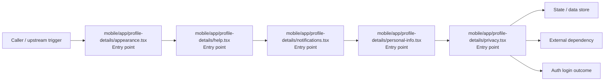

# Module mobile/app/profile-details

- Overview: [emplus Docs Wiki](../../../../index.md)
- Summary: [SUMMARY](../../../../SUMMARY.md)
- Feature catalog: [All features](../../../../features/index.md)
- Module index: [All modules](../../index.md)
- Workspace index: [All workspaces](../../../../workspaces/index.md)

## Snapshot

- Path: `mobile/app/profile-details`
- Descendant files: 5
- Descendant symbols: 12
- Languages: `TypeScript`
- Workspace: [@emplus/mobile](../../../../workspaces/mobile.md)

## Related Features

- [Authentication Login](../../../../features/auth-login.md) - Authentication Login captures the login workflow inside authentication. It spans 2 workspaces. Key flows include Auth login, Auth registration, Auth login.
- [User Management Login](../../../../features/user-login.md) - User Management Login captures the login workflow inside user management. It spans 2 workspaces. Key flows include Auth login, Auth registration, Auth login.
- [Search Login](../../../../features/search-login.md) - Search Login captures the login workflow inside search. It spans 2 workspaces. Key flows include Auth login, Auth registration, Auth login.
- [Search Create](../../../../features/search-create.md) - Search Create captures the create workflow inside search. It spans 2 workspaces.
- [User Management Create](../../../../features/user-create.md) - User Management Create captures the create workflow inside user management. It spans 2 workspaces.

## Business Capability

AppearanceScreen function returns a styled application layout with customizable themes, colors, and styling.

## Basic Design

Profile Details is inferred as a authentication and access control area. The visible implementation layers are Entry point. State is likely persisted in primary database, session / token state. The module also integrates with @, @expo, expo-router, expo-status-bar, react, react-native.

### Boundaries

- Entry points: `mobile/app/profile-details/appearance.tsx`, `mobile/app/profile-details/help.tsx`, `mobile/app/profile-details/notifications.tsx`, `mobile/app/profile-details/personal-info.tsx`, `mobile/app/profile-details/privacy.tsx`
- Data stores: Primary database, Session / token state
- External interfaces: `@`, `@expo`, `expo-router`, `expo-status-bar`, `react`, `react-native`

## Detail Design

Primary flow coverage includes Auth login. Representative files are mobile/app/profile-details/appearance.tsx, mobile/app/profile-details/help.tsx, mobile/app/profile-details/notifications.tsx, mobile/app/profile-details/personal-info.tsx, mobile/app/profile-details/privacy.tsx. Observed behavior hints: The HelpScreen function creates a component for displaying help information at the bottom of the mobile screen.

### Components

- Entry point: mobile/app/profile-details/appearance.tsx
- Entry point: mobile/app/profile-details/help.tsx
- Entry point: mobile/app/profile-details/notifications.tsx
- Entry point: mobile/app/profile-details/personal-info.tsx
- Entry point: mobile/app/profile-details/privacy.tsx

## Inferred Business Flows

### Auth login

Authenticate the caller, validate credentials, and establish a usable session or token.

#### Steps

- mobile/app/profile-details/appearance.tsx receives the request and turns it into an application-level login command.
- mobile/app/profile-details/help.tsx receives the request and turns it into an application-level login command.
- mobile/app/profile-details/notifications.tsx receives the request and turns it into an application-level login command.
- mobile/app/profile-details/personal-info.tsx receives the request and turns it into an application-level login command.
- mobile/app/profile-details/privacy.tsx receives the request and turns it into an application-level login command.

#### Flow Diagram

## Child Modules

No child modules.

## Direct Files

- [mobile/app/profile-details/appearance.tsx](../../../files/mobile/app/profile-details/appearance.tsx.md) — AppearanceScreen function returns a styled application layout with customizable themes, colors, and styling.
- [mobile/app/profile-details/help.tsx](../../../files/mobile/app/profile-details/help.tsx.md) — The HelpScreen function creates a component for displaying help information at the bottom of the mobile screen.
- [mobile/app/profile-details/notifications.tsx](../../../files/mobile/app/profile-details/notifications.tsx.md) — The NotificationsScreen function provides the necessary state and functionality to display and handle notifications in a mobile app.
- [mobile/app/profile-details/personal-info.tsx](../../../files/mobile/app/profile-details/personal-info.tsx.md) — PersonalInfoScreen function generates and manages user profile information data.
- [mobile/app/profile-details/privacy.tsx](../../../files/mobile/app/profile-details/privacy.tsx.md) — The `PrivacyScreen` class is responsible for rendering the privacy settings screen in an application.
