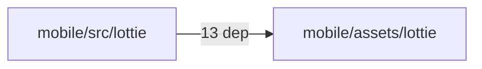

# Module mobile/assets/lottie

- Overview: [emplus Docs Wiki](../../../../index.md)
- Summary: [SUMMARY](../../../../SUMMARY.md)
- Feature catalog: [All features](../../../../features/index.md)
- Module index: [All modules](../../index.md)
- Workspace index: [All workspaces](../../../../workspaces/index.md)

## Snapshot

- Path: `mobile/assets/lottie`
- Descendant files: 13
- Descendant symbols: 13
- Languages: `JSON`
- Workspace: [@emplus/mobile](../../../../workspaces/mobile.md)

## Related Features

- [Authentication Login](../../../../features/auth-login.md) - Authentication Login captures the login workflow inside authentication. It spans 2 workspaces. Key flows include Auth login, Auth registration, Auth login.
- [Search Login](../../../../features/search-login.md) - Search Login captures the login workflow inside search. It spans 2 workspaces. Key flows include Auth login, Auth registration, Auth login.
- [Order Management Login](../../../../features/order-login.md) - Order Management Login captures the login workflow inside order management. It spans 2 workspaces. Key flows include Auth login, Auth login, Auth login.
- [Storage Login](../../../../features/storage-login.md) - Storage Login captures the login workflow inside storage. It spans 2 workspaces. Key flows include Auth login, Auth registration, Auth login.
- [Authentication Verification](../../../../features/auth-verify.md) - Authentication Verification captures the verification workflow inside authentication. It spans 2 workspaces. Key flows include Credential validation, Auth login, Auth login.
- [Authentication Password Reset](../../../../features/auth-reset.md) - Authentication Password Reset captures the password reset workflow inside authentication. It spans 3 workspaces. Key flows include Password reset, Password reset, Password reset.
- [Storage Verification](../../../../features/storage-verify.md) - Storage Verification captures the verification workflow inside storage. It spans 2 workspaces. Key flows include Credential validation, Auth login, Auth login.
- [Order Management Verification](../../../../features/order-verify.md) - Order Management Verification captures the verification workflow inside order management. It spans 2 workspaces. Key flows include Credential validation, Auth login, Auth login.

## Business Capability

{"v":"5.7.4","fr":"30","ip":0,"op":30,"w":200,"h":200,"nm":"Empløs","ddd":0,"assets":[],"layers":[{"ddd":0,"ind":1,"ty":4,"nm":"dot","sr":1,"ks":{"o":{"a":0,"k":100},"r":{"a":1,"k…

## Basic Design

Lottie is inferred as a files and storage area. The visible implementation layers are Utility.

## Detail Design

Primary flow coverage includes Files Storage login. Representative files are mobile/assets/lottie/care-heart.json, mobile/assets/lottie/empty.json, mobile/assets/lottie/error.json, mobile/assets/lottie/home-counter-bird-pair-sky.json, mobile/assets/lottie/loader.json. Observed behavior hints: Provides 1 documented symbol in mobile/assets/lottie/error.json.

### Components

- Utility: mobile/assets/lottie/care-heart.json
- Utility: mobile/assets/lottie/empty.json
- Utility: mobile/assets/lottie/error.json
- Utility: mobile/assets/lottie/home-counter-bird-pair-sky.json
- Utility: mobile/assets/lottie/loader.json
- Utility: mobile/assets/lottie/login-cat-love.json
- Utility: mobile/assets/lottie/notifications-empty-cat.json
- Utility: mobile/assets/lottie/pairing-family-love.json

## Module Interactions

- `mobile/src/lottie` -> `mobile/assets/lottie` (13 dependencies)

### Interaction Diagram

## Inferred Business Flows

### Files Storage login

Execute the module's login use case inside files and storage.

#### Steps

- mobile/assets/lottie/care-heart.json provides helper logic used during the flow.
- mobile/assets/lottie/empty.json provides helper logic used during the flow.
- mobile/assets/lottie/error.json provides helper logic used during the flow.
- mobile/assets/lottie/home-counter-bird-pair-sky.json provides helper logic used during the flow.
- mobile/assets/lottie/loader.json provides helper logic used during the flow.
- mobile/assets/lottie/login-cat-love.json provides helper logic used during the flow.

#### Flow Diagram

```mermaid
flowchart LR
  caller["Caller / upstream trigger"]
  n1_care_heart_json["mobile/assets/lottie/care-heart.json\nUtility"]
  n2_empty_json["mobile/assets/lottie/empty.json\nUtility"]
  n3_error_json["mobile/assets/lottie/error.json\nUtility"]
  n4_home_counter_bird_pair_sky_json["mobile/assets/lottie/home-counter-bird-pair-sky.json\nUtility"]
  n5_loader_json["mobile/assets/lottie/loader.json\nUtility"]
  n6_login_cat_love_json["mobile/assets/lottie/login-cat-love.json\nUtility"]
  caller --> n1_care_heart_json
  n1_care_heart_json --> n2_empty_json
  n2_empty_json --> n3_error_json
  n3_error_json --> n4_home_counter_bird_pair_sky_json
  n4_home_counter_bird_pair_sky_json --> n5_loader_json
  n5_loader_json --> n6_login_cat_love_json
  outcome["Files Storage login outcome"]
  n6_login_cat_love_json --> outcome
```

## Child Modules

No child modules.

## Direct Files

- [mobile/assets/lottie/care-heart.json](../../../files/mobile/assets/lottie/care-heart.json.md)
- [mobile/assets/lottie/empty.json](../../../files/mobile/assets/lottie/empty.json.md) — {"v":"5.7.4","fr":"30","ip":0,"op":30,"w":200,"h":200,"nm":"Empløs","ddd":0,"assets":[],"layers":[{"ddd":0,"ind":1,"ty":4,"nm":"dot","sr":1,"ks":{"o":{"a":0,"k":100},"r":{"a":1,"k":[{Ùx:[0.667],Ùy:[1]}],"o":{"x:[0.333],&amp;quot;y:[0]},"t":0,"s":[0]},{tan}:30,"s":[360]}"],
- [mobile/assets/lottie/error.json](../../../files/mobile/assets/lottie/error.json.md) — Provides 1 documented symbol in mobile/assets/lottie/error.json.
- [mobile/assets/lottie/home-counter-bird-pair-sky.json](../../../files/mobile/assets/lottie/home-counter-bird-pair-sky.json.md) — %s string %s - Layer 10 parameters%n
- [mobile/assets/lottie/loader.json](../../../files/mobile/assets/lottie/loader.json.md) — Lottie loader configuration info
- [mobile/assets/lottie/login-cat-love.json](../../../files/mobile/assets/lottie/login-cat-love.json.md) — Lottie animation configuration file for a cat love logo.
- [mobile/assets/lottie/notifications-empty-cat.json](../../../files/mobile/assets/lottie/notifications-empty-cat.json.md) — File containing notifications for an empty cat.
- [mobile/assets/lottie/pairing-family-love.json](../../../files/mobile/assets/lottie/pairing-family-love.json.md) — The pairing family love configuration for Lottie assets.
- [mobile/assets/lottie/placeholder.json](../../../files/mobile/assets/lottie/placeholder.json.md) — Placeholder for Lottie animation files
- [mobile/assets/lottie/register-love-hearts.json](../../../files/mobile/assets/lottie/register-love-hearts.json.md) — Provides 1 documented symbol in mobile/assets/lottie/register-love-hearts.json.
- [mobile/assets/lottie/success.json](../../../files/mobile/assets/lottie/success.json.md) — Lottie success file data structure
- [mobile/assets/lottie/timeline-empty-love.json](../../../files/mobile/assets/lottie/timeline-empty-love.json.md) — Lottie Timeline Empty Love symbol in a Lottie animation
- [mobile/assets/lottie/verify-otp-password-auth.json](../../../files/mobile/assets/lottie/verify-otp-password-auth.json.md) — String value corresponding to verified OTP password authentication
