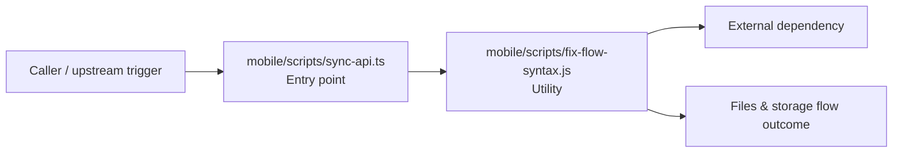

# Module mobile/scripts

- Overview: [emplus Docs Wiki](../../../index.md)
- Summary: [SUMMARY](../../../SUMMARY.md)
- Feature catalog: [All features](../../../features/index.md)
- Module index: [All modules](../index.md)
- Workspace index: [All workspaces](../../../workspaces/index.md)

## Snapshot

- Path: `mobile/scripts`
- Descendant files: 2
- Descendant symbols: 4
- Languages: `JavaScript`, `TypeScript`
- Workspace: [@emplus/mobile](../../../workspaces/mobile.md)

## Related Features

- [Authentication Read / List](../../../features/auth-list.md) - Authentication Read / List captures the read / list workflow inside authentication. It spans 3 workspaces.
- [Storage Read / List](../../../features/storage-list.md) - Storage Read / List captures the read / list workflow inside storage. It spans 4 workspaces.

## Business Capability

File that checks and transforms React Native project files with flow syntax.

## Basic Design

Scripts is inferred as a files and storage area. The visible implementation layers are Entry point, Utility. The module also integrates with *.flow, fs, path, node.

### Boundaries

- Entry points: `mobile/scripts/sync-api.ts`
- External interfaces: `*.flow`, `fs`, `path`, `node`

## Detail Design

Primary flow coverage includes Files &amp; storage flow. Representative files are mobile/scripts/fix-flow-syntax.js, mobile/scripts/sync-api.ts. Observed behavior hints: Provides 1 documented symbol in mobile/scripts/sync-api.ts.

### Components

- Entry point: mobile/scripts/sync-api.ts
- Utility: mobile/scripts/fix-flow-syntax.js

## Inferred Business Flows

### Files &amp; storage flow

Handle the main files and storage use case exposed by this module.

#### Steps

- mobile/scripts/sync-api.ts receives the request and turns it into an application-level request handling command.
- mobile/scripts/fix-flow-syntax.js provides helper logic used during the flow.

#### Flow Diagram

## Child Modules

No child modules.

## Direct Files

- [mobile/scripts/fix-flow-syntax.js](../../files/mobile/scripts/fix-flow-syntax.js.md) — File that checks and transforms React Native project files with flow syntax.
- [mobile/scripts/sync-api.ts](../../files/mobile/scripts/sync-api.ts.md) — Provides 1 documented symbol in mobile/scripts/sync-api.ts.
