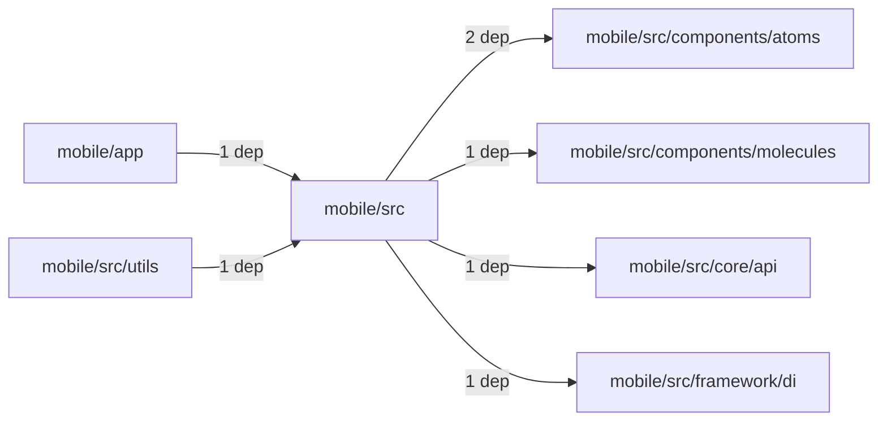
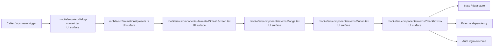

# Module mobile/src

- Overview: [emplus Docs Wiki](../../../index.md)
- Summary: [SUMMARY](../../../SUMMARY.md)
- Feature catalog: [All features](../../../features/index.md)
- Module index: [All modules](../index.md)
- Workspace index: [All workspaces](../../../workspaces/index.md)

## Snapshot

- Path: `mobile/src`
- Descendant files: 188
- Descendant symbols: 570
- Languages: `TypeScript`
- Workspace: [@emplus/mobile](../../../workspaces/mobile.md)

## Related Features

- [Authentication Login](../../../features/auth-login.md) - Authentication Login captures the login workflow inside authentication. It spans 2 workspaces. Key flows include Auth login, Auth registration, Auth login.
- [Authentication Read / List](../../../features/auth-list.md) - Authentication Read / List captures the read / list workflow inside authentication. It spans 3 workspaces.
- [User Management Login](../../../features/user-login.md) - User Management Login captures the login workflow inside user management. It spans 2 workspaces. Key flows include Auth login, Auth registration, Auth login.
- [Search Read / List](../../../features/search-list.md) - Search Read / List captures the read / list workflow inside search. It spans 3 workspaces.
- [Search Login](../../../features/search-login.md) - Search Login captures the login workflow inside search. It spans 2 workspaces. Key flows include Auth login, Auth registration, Auth login.
- [Notifications Read / List](../../../features/notification-list.md) - Notifications Read / List captures the read / list workflow inside notifications. It spans 2 workspaces.
- [Storage Read / List](../../../features/storage-list.md) - Storage Read / List captures the read / list workflow inside storage. It spans 4 workspaces.
- [Integrations Read / List](../../../features/integration-list.md) - Integrations Read / List captures the read / list workflow inside integrations. It spans 3 workspaces.
- [User Management Read / List](../../../features/user-list.md) - User Management Read / List captures the read / list workflow inside user management. It spans 3 workspaces.
- [Notifications Notify](../../../features/notification-notify.md) - Notifications Notify captures the notify workflow inside notifications. It spans 2 workspaces.
- [Order Management Login](../../../features/order-login.md) - Order Management Login captures the login workflow inside order management. It spans 2 workspaces. Key flows include Auth login, Auth login, Auth login.
- [Notifications Login](../../../features/notification-login.md) - Notifications Login captures the login workflow inside notifications. It spans 2 workspaces. Key flows include Auth login, Auth registration, Auth login.
- [Reporting Read / List](../../../features/reporting-list.md) - Reporting Read / List captures the read / list workflow inside reporting. It spans 2 workspaces.
- [Search Notify](../../../features/search-notify.md) - Search Notify captures the notify workflow inside search. It spans 2 workspaces.
- [Storage Login](../../../features/storage-login.md) - Storage Login captures the login workflow inside storage. It spans 2 workspaces. Key flows include Auth login, Auth registration, Auth login.
- [Administration Read / List](../../../features/admin-list.md) - Administration Read / List captures the read / list workflow inside administration. It spans 2 workspaces.
- [Authentication Verification](../../../features/auth-verify.md) - Authentication Verification captures the verification workflow inside authentication. It spans 2 workspaces. Key flows include Credential validation, Auth login, Auth login.
- [Integrations Login](../../../features/integration-login.md) - Integrations Login captures the login workflow inside integrations. It spans 2 workspaces. Key flows include Auth login, Auth registration, Auth login.
- [Integrations Notify](../../../features/integration-notify.md) - Integrations Notify captures the notify workflow inside integrations. It spans 2 workspaces.
- [Search Create](../../../features/search-create.md) - Search Create captures the create workflow inside search. It spans 2 workspaces.
- [User Management Notify](../../../features/user-notify.md) - User Management Notify captures the notify workflow inside user management. It spans 2 workspaces.
- [Administration Login](../../../features/admin-login.md) - Administration Login captures the login workflow inside administration. It spans 2 workspaces. Key flows include Auth login, Auth registration, Auth login.
- [Authentication Password Reset](../../../features/auth-reset.md) - Authentication Password Reset captures the password reset workflow inside authentication. It spans 3 workspaces. Key flows include Password reset, Password reset, Password reset.
- [Storage Notify](../../../features/storage-notify.md) - Storage Notify captures the notify workflow inside storage. It spans 2 workspaces.
- [User Management Create](../../../features/user-create.md) - User Management Create captures the create workflow inside user management. It spans 2 workspaces.
- [Order Management Read / List](../../../features/order-list.md) - Order Management Read / List captures the read / list workflow inside order management. It spans 2 workspaces.
- [Reporting Login](../../../features/reporting-login.md) - Reporting Login captures the login workflow inside reporting. It spans 2 workspaces. Key flows include Auth login, Auth registration, Auth login.
- [Notifications Verification](../../../features/notification-verify.md) - Notifications Verification captures the verification workflow inside notifications. It spans 2 workspaces. Key flows include Credential validation, Auth login, Auth login.
- [Storage Verification](../../../features/storage-verify.md) - Storage Verification captures the verification workflow inside storage. It spans 2 workspaces. Key flows include Credential validation, Auth login, Auth login.
- [Administration Notify](../../../features/admin-notify.md) - Administration Notify captures the notify workflow inside administration. It spans 2 workspaces.
- [Administration Verification](../../../features/admin-verify.md) - Administration Verification captures the verification workflow inside administration. It spans 2 workspaces. Key flows include Credential validation, Auth login, Auth login.
- [Integrations Verification](../../../features/integration-verify.md) - Integrations Verification captures the verification workflow inside integrations. It spans 2 workspaces. Key flows include Credential validation, Auth login, Auth login.
- [Reporting Verification](../../../features/reporting-verify.md) - Reporting Verification captures the verification workflow inside reporting. It spans 2 workspaces. Key flows include Credential validation, Auth login, Auth login.
- [Order Management Verification](../../../features/order-verify.md) - Order Management Verification captures the verification workflow inside order management. It spans 2 workspaces. Key flows include Credential validation, Auth login, Auth login.
- [Order Management Notify](../../../features/order-notify.md) - Order Management Notify captures the notify workflow inside order management. It spans 2 workspaces.
- [Mobile](../../../features/mobile.md) - Mobile captures the main mobile behavior discovered in the codebase. Key flows include Mobile operations flow, Mobile operations flow.

## Business Capability

AlertDialogProvider is a React component that provides the AlertDialogContextValue function and DialogState type.

## Basic Design

Src is inferred as a authentication and access control area. The visible implementation layers are UI surface, Entry point, Utility. State is likely persisted in primary database, session / token state. The module also integrates with @, react, react-native, react-native-safe-area-context, react-native-reanimated, expo-linear-gradient.

### Boundaries

- Entry points: `mobile/src/alert-dialog-context.tsx`, `mobile/src/animations/presets.ts`, `mobile/src/components/AnimatedSplashScreen.tsx`, `mobile/src/components/atoms/Badge.tsx`, `mobile/src/components/atoms/Button.tsx`, `mobile/src/components/atoms/Checkbox.tsx`
- Data stores: Primary database, Session / token state
- External interfaces: `@`, `react`, `react-native`, `react-native-safe-area-context`, `react-native-reanimated`, `expo-linear-gradient`

## Detail Design

Primary flow coverage includes Auth login. Representative files are mobile/src/alert-dialog-context.tsx, mobile/src/animations/hooks.ts, mobile/src/animations/motion-presets.ts, mobile/src/animations/presets.ts, mobile/src/api.ts. Observed behavior hints: Hooks for animation-related functionality.

### Components

- UI surface: mobile/src/alert-dialog-context.tsx
- UI surface: mobile/src/animations/presets.ts
- UI surface: mobile/src/components/AnimatedSplashScreen.tsx
- UI surface: mobile/src/components/atoms/Badge.tsx
- UI surface: mobile/src/components/atoms/Button.tsx
- UI surface: mobile/src/components/atoms/Checkbox.tsx
- UI surface: mobile/src/components/atoms/EmplusLottie.tsx
- UI surface: mobile/src/components/atoms/index.ts

## Module Interactions

- `mobile/src` -> `mobile/src/components/atoms` (2 dependencies)
- `mobile/app` -> `mobile/src` (1 dependencies)
- `mobile/src` -> `mobile/src/components/molecules` (1 dependencies)
- `mobile/src` -> `mobile/src/core/api` (1 dependencies)
- `mobile/src` -> `mobile/src/framework/di` (1 dependencies)
- `mobile/src/utils` -> `mobile/src` (1 dependencies)

### Interaction Diagram

## Inferred Business Flows

### Auth login

Authenticate the caller, validate credentials, and establish a usable session or token.

#### Steps

- The user or operator enters the flow through mobile/src/alert-dialog-context.tsx, which surfaces the login interaction.
- The user or operator enters the flow through mobile/src/animations/presets.ts, which surfaces the login interaction. It then hands off to index.ts, withDelayRM, hooks.ts.
- The user or operator enters the flow through mobile/src/components/AnimatedSplashScreen.tsx, which surfaces the login interaction.
- The user or operator enters the flow through mobile/src/components/atoms/Badge.tsx, which surfaces the login interaction.
- The user or operator enters the flow through mobile/src/components/atoms/Button.tsx, which surfaces the login interaction.
- The user or operator enters the flow through mobile/src/components/atoms/Checkbox.tsx, which surfaces the login interaction. It then hands off to Text, Text.tsx.

#### Flow Diagram

## Child Modules

- [mobile/src/animations](src/animations.md) - 3 files, 10 symbols
- [mobile/src/components](src/components.md) - 34 files, 103 symbols
- [mobile/src/core](src/core.md) - 16 files, 47 symbols
- [mobile/src/data](src/data.md) - 3 files, 34 symbols
- [mobile/src/domain](src/domain.md) - 6 files, 89 symbols
- [mobile/src/features](src/features.md) - 82 files, 127 symbols
- [mobile/src/framework](src/framework.md) - 3 files, 6 symbols
- [mobile/src/hooks](src/hooks.md) - 2 files, 10 symbols
- [mobile/src/lib](src/lib.md) - 1 file, 4 symbols
- [mobile/src/lottie](src/lottie.md) - 1 file, 1 symbol
- [mobile/src/presentation](src/presentation.md) - 7 files, 11 symbols
- [mobile/src/theme](src/theme.md) - 13 files, 40 symbols
- [mobile/src/types](src/types.md) - 2 files, 7 symbols
- [mobile/src/utils](src/utils.md) - 9 files, 44 symbols

## Direct Files

- [mobile/src/alert-dialog-context.tsx](../../files/mobile/src/alert-dialog-context.tsx.md) — AlertDialogProvider is a React component that provides the AlertDialogContextValue function and DialogState type.
- [mobile/src/api.ts](../../files/mobile/src/api.ts.md) — API Functionality for User Authentication
- [mobile/src/forms.ts](../../files/mobile/src/forms.ts.md) — AuthFlowFields
- [mobile/src/session-context.tsx](../../files/mobile/src/session-context.tsx.md) — Mobile App Session Context File
- [mobile/src/toast-context.tsx](../../files/mobile/src/toast-context.tsx.md) — The ToastProvider component makes the showToast function available for use in child components.
- [mobile/src/ui-kit.tsx](../../files/mobile/src/ui-kit.tsx.md) — contains function call: PressableScaleProps:73
