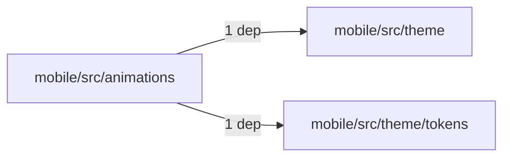
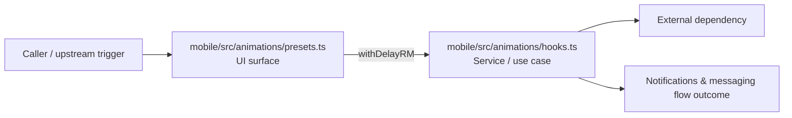

# Module mobile/src/animations

- Overview: [emplus Docs Wiki](../../../../index.md)
- Summary: [SUMMARY](../../../../SUMMARY.md)
- Feature catalog: [All features](../../../../features/index.md)
- Module index: [All modules](../../index.md)
- Workspace index: [All workspaces](../../../../workspaces/index.md)

## Snapshot

- Path: `mobile/src/animations`
- Descendant files: 3
- Descendant symbols: 10
- Languages: `TypeScript`
- Workspace: [@emplus/mobile](../../../../workspaces/mobile.md)

## Related Features

- [Notifications Notify](../../../../features/notification-notify.md) - Notifications Notify captures the notify workflow inside notifications. It spans 2 workspaces.
- [Search Notify](../../../../features/search-notify.md) - Search Notify captures the notify workflow inside search. It spans 2 workspaces.
- [User Management Notify](../../../../features/user-notify.md) - User Management Notify captures the notify workflow inside user management. It spans 2 workspaces.

## Business Capability

Hooks for animation-related functionality.

## Basic Design

Animations is inferred as a notifications and messaging area. The visible implementation layers are Service / use case, UI surface, Utility. The module also integrates with react, react-native, react-native-reanimated.

### Boundaries

- Entry points: `mobile/src/animations/presets.ts`
- External interfaces: `react`, `react-native`, `react-native-reanimated`

## Detail Design

Primary flow coverage includes Notifications &amp; messaging flow. Representative files are mobile/src/animations/hooks.ts, mobile/src/animations/motion-presets.ts, mobile/src/animations/presets.ts. Observed behavior hints: Motion presets with animated motion effects.

### Components

- UI surface: mobile/src/animations/presets.ts
- Service / use case: mobile/src/animations/hooks.ts
- Utility: mobile/src/animations/motion-presets.ts

## Module Interactions

- `mobile/src/animations` -> `mobile/src/theme` (1 dependencies)
- `mobile/src/animations` -> `mobile/src/theme/tokens` (1 dependencies)

### Interaction Diagram

## Inferred Business Flows

### Notifications &amp; messaging flow

Handle the main notifications and messaging use case exposed by this module.

#### Steps

- The user or operator enters the flow through mobile/src/animations/presets.ts, which surfaces the request handling interaction. It then hands off to index.ts, withDelayRM, hooks.ts.
- mobile/src/animations/hooks.ts coordinates the core business rules and state changes for the flow.

#### Flow Diagram

## Child Modules

No child modules.

## Direct Files

- [mobile/src/animations/hooks.ts](../../../files/mobile/src/animations/hooks.ts.md) — Hooks for animation-related functionality.
- [mobile/src/animations/motion-presets.ts](../../../files/mobile/src/animations/motion-presets.ts.md) — Motion presets with animated motion effects.
- [mobile/src/animations/presets.ts](../../../files/mobile/src/animations/presets.ts.md) — The `useEntranceAnimation` function generates an animated transition effect when the user navigates to a new screen.
