# Module mobile/src/components

- Overview: [emplus Docs Wiki](../../../../index.md)
- Summary: [SUMMARY](../../../../SUMMARY.md)
- Feature catalog: [All features](../../../../features/index.md)
- Module index: [All modules](../../index.md)
- Workspace index: [All workspaces](../../../../workspaces/index.md)

## Snapshot

- Path: `mobile/src/components`
- Descendant files: 34
- Descendant symbols: 103
- Languages: `TypeScript`
- Workspace: [@emplus/mobile](../../../../workspaces/mobile.md)

## Related Features

- [Authentication Login](../../../../features/auth-login.md) - Authentication Login captures the login workflow inside authentication. It spans 2 workspaces. Key flows include Auth login, Auth registration, Auth login.
- [Authentication Read / List](../../../../features/auth-list.md) - Authentication Read / List captures the read / list workflow inside authentication. It spans 3 workspaces.
- [User Management Login](../../../../features/user-login.md) - User Management Login captures the login workflow inside user management. It spans 2 workspaces. Key flows include Auth login, Auth registration, Auth login.
- [Search Read / List](../../../../features/search-list.md) - Search Read / List captures the read / list workflow inside search. It spans 3 workspaces.
- [Search Login](../../../../features/search-login.md) - Search Login captures the login workflow inside search. It spans 2 workspaces. Key flows include Auth login, Auth registration, Auth login.
- [Notifications Read / List](../../../../features/notification-list.md) - Notifications Read / List captures the read / list workflow inside notifications. It spans 2 workspaces.
- [Storage Read / List](../../../../features/storage-list.md) - Storage Read / List captures the read / list workflow inside storage. It spans 4 workspaces.
- [Integrations Read / List](../../../../features/integration-list.md) - Integrations Read / List captures the read / list workflow inside integrations. It spans 3 workspaces.
- [Notifications Notify](../../../../features/notification-notify.md) - Notifications Notify captures the notify workflow inside notifications. It spans 2 workspaces.
- [Search Notify](../../../../features/search-notify.md) - Search Notify captures the notify workflow inside search. It spans 2 workspaces.
- [Integrations Notify](../../../../features/integration-notify.md) - Integrations Notify captures the notify workflow inside integrations. It spans 2 workspaces.
- [Search Create](../../../../features/search-create.md) - Search Create captures the create workflow inside search. It spans 2 workspaces.

## Business Capability

AnimatedSplashScreen component

## Basic Design

Components is inferred as a search and discovery area. The visible implementation layers are UI surface, Utility, Entry point. The module also integrates with expo-linear-gradient, react, react-native, react-native-reanimated, react-native-svg, @.

### Boundaries

- Entry points: `mobile/src/components/AnimatedSplashScreen.tsx`, `mobile/src/components/atoms/Badge.tsx`, `mobile/src/components/atoms/Button.tsx`, `mobile/src/components/atoms/Checkbox.tsx`, `mobile/src/components/atoms/EmplusLottie.tsx`, `mobile/src/components/atoms/index.ts`
- External interfaces: `expo-linear-gradient`, `react`, `react-native`, `react-native-reanimated`, `react-native-svg`, `@`

## Detail Design

Primary flow coverage includes Search Discovery listing, Search Discovery creation, Search Discovery synchronization. Representative files are mobile/src/components/AnimatedSplashScreen.tsx, mobile/src/components/atoms/Avatar.tsx, mobile/src/components/atoms/Badge.tsx, mobile/src/components/atoms/BottomSheet.tsx, mobile/src/components/atoms/Button.tsx. Observed behavior hints: Retrieves a color from an avatar's name

### Components

- UI surface: mobile/src/components/AnimatedSplashScreen.tsx
- UI surface: mobile/src/components/atoms/Badge.tsx
- UI surface: mobile/src/components/atoms/Button.tsx
- UI surface: mobile/src/components/atoms/Checkbox.tsx
- UI surface: mobile/src/components/atoms/EmplusLottie.tsx
- UI surface: mobile/src/components/atoms/index.ts
- UI surface: mobile/src/components/atoms/InputErrorLeadingIcon.tsx
- UI surface: mobile/src/components/atoms/Switch.tsx

## Inferred Business Flows

### Search Discovery listing

Execute the module's listing use case inside search and discovery.

#### Steps

- The user or operator enters the flow through mobile/src/components/AnimatedSplashScreen.tsx, which surfaces the listing interaction.
- The user or operator enters the flow through mobile/src/components/atoms/Badge.tsx, which surfaces the listing interaction.
- The user or operator enters the flow through mobile/src/components/atoms/Button.tsx, which surfaces the listing interaction.
- The user or operator enters the flow through mobile/src/components/atoms/Checkbox.tsx, which surfaces the listing interaction. It then hands off to Text, Text.tsx.
- The user or operator enters the flow through mobile/src/components/atoms/EmplusLottie.tsx, which surfaces the listing interaction.
- The user or operator enters the flow through mobile/src/components/atoms/index.ts, which surfaces the listing interaction.

#### Flow Diagram

```mermaid
flowchart LR
  caller["Caller / upstream trigger"]
  n1_AnimatedSplashScreen_tsx["mobile/src/components/AnimatedSplashScreen.tsx\nUI surface"]
  n2_Badge_tsx["mobile/src/components/atoms/Badge.tsx\nUI surface"]
  n3_Button_tsx["mobile/src/components/atoms/Button.tsx\nUI surface"]
  n4_Checkbox_tsx["mobile/src/components/atoms/Checkbox.tsx\nUI surface"]
  n5_EmplusLottie_tsx["mobile/src/components/atoms/EmplusLottie.tsx\nUI surface"]
  n6_index_ts["mobile/src/components/atoms/index.ts\nUI surface"]
  caller --> n1_AnimatedSplashScreen_tsx
  n1_AnimatedSplashScreen_tsx --> n2_Badge_tsx
  n2_Badge_tsx --> n3_Button_tsx
  n3_Button_tsx --> n4_Checkbox_tsx
  n4_Checkbox_tsx --> n5_EmplusLottie_tsx
  n5_EmplusLottie_tsx --> n6_index_ts
  ext["External dependency"]
  n6_index_ts --> ext
  outcome["Search Discovery listing outcome"]
  n6_index_ts --> outcome
```

### Search Discovery creation

Execute the module's creation use case inside search and discovery.

#### Steps

- The user or operator enters the flow through mobile/src/components/AnimatedSplashScreen.tsx, which surfaces the creation interaction.
- The user or operator enters the flow through mobile/src/components/atoms/Badge.tsx, which surfaces the creation interaction.
- The user or operator enters the flow through mobile/src/components/atoms/Button.tsx, which surfaces the creation interaction.
- The user or operator enters the flow through mobile/src/components/atoms/Checkbox.tsx, which surfaces the creation interaction. It then hands off to Text, Text.tsx.
- The user or operator enters the flow through mobile/src/components/atoms/EmplusLottie.tsx, which surfaces the creation interaction.
- The user or operator enters the flow through mobile/src/components/atoms/index.ts, which surfaces the creation interaction.

#### Flow Diagram

### Search Discovery synchronization

Execute the module's synchronization use case inside search and discovery.

#### Steps

- The user or operator enters the flow through mobile/src/components/AnimatedSplashScreen.tsx, which surfaces the synchronization interaction.
- The user or operator enters the flow through mobile/src/components/atoms/Badge.tsx, which surfaces the synchronization interaction.
- The user or operator enters the flow through mobile/src/components/atoms/Button.tsx, which surfaces the synchronization interaction.
- The user or operator enters the flow through mobile/src/components/atoms/Checkbox.tsx, which surfaces the synchronization interaction. It then hands off to Text, Text.tsx.
- The user or operator enters the flow through mobile/src/components/atoms/EmplusLottie.tsx, which surfaces the synchronization interaction.
- The user or operator enters the flow through mobile/src/components/atoms/index.ts, which surfaces the synchronization interaction.

#### Flow Diagram

```mermaid
flowchart LR
  caller["Caller / upstream trigger"]
  n1_AnimatedSplashScreen_tsx["mobile/src/components/AnimatedSplashScreen.tsx\nUI surface"]
  n2_Badge_tsx["mobile/src/components/atoms/Badge.tsx\nUI surface"]
  n3_Button_tsx["mobile/src/components/atoms/Button.tsx\nUI surface"]
  n4_Checkbox_tsx["mobile/src/components/atoms/Checkbox.tsx\nUI surface"]
  n5_EmplusLottie_tsx["mobile/src/components/atoms/EmplusLottie.tsx\nUI surface"]
  n6_index_ts["mobile/src/components/atoms/index.ts\nUI surface"]
  caller --> n1_AnimatedSplashScreen_tsx
  n1_AnimatedSplashScreen_tsx --> n2_Badge_tsx
  n2_Badge_tsx --> n3_Button_tsx
  n3_Button_tsx --> n4_Checkbox_tsx
  n4_Checkbox_tsx --> n5_EmplusLottie_tsx
  n5_EmplusLottie_tsx --> n6_index_ts
  ext["External dependency"]
  n6_index_ts --> ext
  outcome["Search Discovery synchronization outcome"]
  n6_index_ts --> outcome
```

## Child Modules

- [mobile/src/components/atoms](components/atoms.md) - 13 files, 49 symbols
- [mobile/src/components/glass](components/glass.md) - 3 files, 10 symbols
- [mobile/src/components/molecules](components/molecules.md) - 11 files, 27 symbols
- [mobile/src/components/organisms](components/organisms.md) - 4 files, 9 symbols
- [mobile/src/components/templates](components/templates.md) - 1 file, 0 symbols

## Direct Files

- [mobile/src/components/AnimatedSplashScreen.tsx](../../../files/mobile/src/components/AnimatedSplashScreen.tsx.md) — AnimatedSplashScreen component
- [mobile/src/components/NotificationBootstrap.tsx](../../../files/mobile/src/components/NotificationBootstrap.tsx.md) — The NotificationBootstrap module handles notifications from the mobile app.
