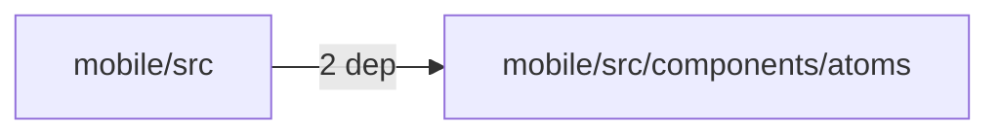

# Module mobile/src/components/atoms

- Overview: [emplus Docs Wiki](../../../../../index.md)
- Summary: [SUMMARY](../../../../../SUMMARY.md)
- Feature catalog: [All features](../../../../../features/index.md)
- Module index: [All modules](../../../index.md)
- Workspace index: [All workspaces](../../../../../workspaces/index.md)

## Snapshot

- Path: `mobile/src/components/atoms`
- Descendant files: 13
- Descendant symbols: 49
- Languages: `TypeScript`
- Workspace: [@emplus/mobile](../../../../../workspaces/mobile.md)

## Related Features

- [Authentication Login](../../../../../features/auth-login.md) - Authentication Login captures the login workflow inside authentication. It spans 2 workspaces. Key flows include Auth login, Auth registration, Auth login.
- [Authentication Read / List](../../../../../features/auth-list.md) - Authentication Read / List captures the read / list workflow inside authentication. It spans 3 workspaces.
- [User Management Login](../../../../../features/user-login.md) - User Management Login captures the login workflow inside user management. It spans 2 workspaces. Key flows include Auth login, Auth registration, Auth login.
- [Search Read / List](../../../../../features/search-list.md) - Search Read / List captures the read / list workflow inside search. It spans 3 workspaces.
- [Search Login](../../../../../features/search-login.md) - Search Login captures the login workflow inside search. It spans 2 workspaces. Key flows include Auth login, Auth registration, Auth login.
- [Notifications Read / List](../../../../../features/notification-list.md) - Notifications Read / List captures the read / list workflow inside notifications. It spans 2 workspaces.
- [Integrations Read / List](../../../../../features/integration-list.md) - Integrations Read / List captures the read / list workflow inside integrations. It spans 3 workspaces.
- [Notifications Notify](../../../../../features/notification-notify.md) - Notifications Notify captures the notify workflow inside notifications. It spans 2 workspaces.
- [Search Notify](../../../../../features/search-notify.md) - Search Notify captures the notify workflow inside search. It spans 2 workspaces.
- [Integrations Notify](../../../../../features/integration-notify.md) - Integrations Notify captures the notify workflow inside integrations. It spans 2 workspaces.
- [Search Create](../../../../../features/search-create.md) - Search Create captures the create workflow inside search. It spans 2 workspaces.

## Business Capability

Retrieves a color from an avatar's name

## Basic Design

Atoms is inferred as a authentication and access control area. The visible implementation layers are UI surface, Entry point, Utility. The module also integrates with @, react, react-native, react-native-gesture-handler, react-native-reanimated, react-native-safe-area-context.

### Boundaries

- Entry points: `mobile/src/components/atoms/Badge.tsx`, `mobile/src/components/atoms/Button.tsx`, `mobile/src/components/atoms/Checkbox.tsx`, `mobile/src/components/atoms/EmplusLottie.tsx`, `mobile/src/components/atoms/index.ts`, `mobile/src/components/atoms/InputErrorLeadingIcon.tsx`
- External interfaces: `@`, `react`, `react-native`, `react-native-gesture-handler`, `react-native-reanimated`, `react-native-safe-area-context`

## Detail Design

Primary flow coverage includes Auth login. Representative files are mobile/src/components/atoms/Avatar.tsx, mobile/src/components/atoms/Badge.tsx, mobile/src/components/atoms/BottomSheet.tsx, mobile/src/components/atoms/Button.tsx, mobile/src/components/atoms/Checkbox.tsx. Observed behavior hints: Badge component properties and usage notes.

### Components

- UI surface: mobile/src/components/atoms/Badge.tsx
- UI surface: mobile/src/components/atoms/Button.tsx
- UI surface: mobile/src/components/atoms/Checkbox.tsx
- UI surface: mobile/src/components/atoms/EmplusLottie.tsx
- UI surface: mobile/src/components/atoms/index.ts
- UI surface: mobile/src/components/atoms/InputErrorLeadingIcon.tsx
- UI surface: mobile/src/components/atoms/Switch.tsx
- UI surface: mobile/src/components/atoms/Text.tsx

## Module Interactions

- `mobile/src` -> `mobile/src/components/atoms` (2 dependencies)

### Interaction Diagram

## Inferred Business Flows

### Auth login

Authenticate the caller, validate credentials, and establish a usable session or token.

#### Steps

- The user or operator enters the flow through mobile/src/components/atoms/Badge.tsx, which surfaces the login interaction.
- The user or operator enters the flow through mobile/src/components/atoms/Button.tsx, which surfaces the login interaction.
- The user or operator enters the flow through mobile/src/components/atoms/Checkbox.tsx, which surfaces the login interaction. It then hands off to Text, Text.tsx.
- The user or operator enters the flow through mobile/src/components/atoms/EmplusLottie.tsx, which surfaces the login interaction.
- The user or operator enters the flow through mobile/src/components/atoms/index.ts, which surfaces the login interaction.
- The user or operator enters the flow through mobile/src/components/atoms/InputErrorLeadingIcon.tsx, which surfaces the login interaction.

#### Flow Diagram

```mermaid
flowchart LR
  caller["Caller / upstream trigger"]
  n1_Badge_tsx["mobile/src/components/atoms/Badge.tsx\nUI surface"]
  n2_Button_tsx["mobile/src/components/atoms/Button.tsx\nUI surface"]
  n3_Checkbox_tsx["mobile/src/components/atoms/Checkbox.tsx\nUI surface"]
  n4_EmplusLottie_tsx["mobile/src/components/atoms/EmplusLottie.tsx\nUI surface"]
  n5_index_ts["mobile/src/components/atoms/index.ts\nUI surface"]
  n6_InputErrorLeadingIcon_tsx["mobile/src/components/atoms/InputErrorLeadingIcon.tsx\nUI surface"]
  caller --> n1_Badge_tsx
  n1_Badge_tsx --> n2_Button_tsx
  n2_Button_tsx --> n3_Checkbox_tsx
  n3_Checkbox_tsx --> n4_EmplusLottie_tsx
  n4_EmplusLottie_tsx --> n5_index_ts
  n5_index_ts --> n6_InputErrorLeadingIcon_tsx
  ext["External dependency"]
  n6_InputErrorLeadingIcon_tsx --> ext
  outcome["Auth login outcome"]
  n6_InputErrorLeadingIcon_tsx --> outcome
```

## Child Modules

No child modules.

## Direct Files

- [mobile/src/components/atoms/Avatar.tsx](../../../../files/mobile/src/components/atoms/Avatar.tsx.md) — Retrieves a color from an avatar's name
- [mobile/src/components/atoms/Badge.tsx](../../../../files/mobile/src/components/atoms/Badge.tsx.md) — Badge component properties and usage notes.
- [mobile/src/components/atoms/BottomSheet.tsx](../../../../files/mobile/src/components/atoms/BottomSheet.tsx.md) — BottomSheetComponent
- [mobile/src/components/atoms/Button.tsx](../../../../files/mobile/src/components/atoms/Button.tsx.md) — The Button component represents a button in React Native
- [mobile/src/components/atoms/Checkbox.tsx](../../../../files/mobile/src/components/atoms/Checkbox.tsx.md) — A checkbox component that allows the user to toggle a boolean value.
- [mobile/src/components/atoms/EmplusLottie.tsx](../../../../files/mobile/src/components/atoms/EmplusLottie.tsx.md) — Provides 2 documented symbols in mobile/src/components/atoms/EmplusLottie.tsx.
- [mobile/src/components/atoms/index.ts](../../../../files/mobile/src/components/atoms/index.ts.md) — Primary component index file
- [mobile/src/components/atoms/Input.tsx](../../../../files/mobile/src/components/atoms/Input.tsx.md) — Input component properties
- [mobile/src/components/atoms/InputErrorLeadingIcon.tsx](../../../../files/mobile/src/components/atoms/InputErrorLeadingIcon.tsx.md) — A reusable InputErrorLeadingIcon component that renders an Ionicons alert-circle icon when the provided error string is empty.
- [mobile/src/components/atoms/Skeleton.tsx](../../../../files/mobile/src/components/atoms/Skeleton.tsx.md) — The getBorderRadius function returns a border radius based on the given SkeletonVariant.
- [mobile/src/components/atoms/Switch.tsx](../../../../files/mobile/src/components/atoms/Switch.tsx.md) — A component that exhibits a 'Switch' behavior, controlling an underlying state or action.
- [mobile/src/components/atoms/Text.tsx](../../../../files/mobile/src/components/atoms/Text.tsx.md) — A React Native component for rendering text in various styles and sizes.
- [mobile/src/components/atoms/Toast.tsx](../../../../files/mobile/src/components/atoms/Toast.tsx.md) — Toast component implementation
