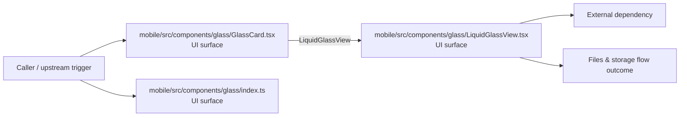

# Module mobile/src/components/glass

- Overview: [emplus Docs Wiki](../../../../../index.md)
- Summary: [SUMMARY](../../../../../SUMMARY.md)
- Feature catalog: [All features](../../../../../features/index.md)
- Module index: [All modules](../../../index.md)
- Workspace index: [All workspaces](../../../../../workspaces/index.md)

## Snapshot

- Path: `mobile/src/components/glass`
- Descendant files: 3
- Descendant symbols: 10
- Languages: `TypeScript`
- Workspace: [@emplus/mobile](../../../../../workspaces/mobile.md)

## Business Capability

The GlassCard component is a card component that displays content and can be customized with various props.

## Basic Design

Glass is inferred as a files and storage area. The visible implementation layers are UI surface. The module also integrates with expo-blur, expo-linear-gradient, react, react-native, expo-glass-effect.

### Boundaries

- Entry points: `mobile/src/components/glass/GlassCard.tsx`, `mobile/src/components/glass/index.ts`, `mobile/src/components/glass/LiquidGlassView.tsx`
- External interfaces: `expo-blur`, `expo-linear-gradient`, `react`, `react-native`, `expo-glass-effect`

## Detail Design

Primary flow coverage includes Files &amp; storage flow. Representative files are mobile/src/components/glass/GlassCard.tsx, mobile/src/components/glass/index.ts, mobile/src/components/glass/LiquidGlassView.tsx. Observed behavior hints: The index file for the Glass component.

### Components

- UI surface: mobile/src/components/glass/GlassCard.tsx
- UI surface: mobile/src/components/glass/index.ts
- UI surface: mobile/src/components/glass/LiquidGlassView.tsx

## Inferred Business Flows

### Files &amp; storage flow

Handle the main files and storage use case exposed by this module.

#### Steps

- The user or operator enters the flow through mobile/src/components/glass/GlassCard.tsx, which surfaces the request handling interaction. It then hands off to LiquidGlassView, LiquidGlassView.tsx.
- The user or operator enters the flow through mobile/src/components/glass/index.ts, which surfaces the request handling interaction.
- The user or operator enters the flow through mobile/src/components/glass/LiquidGlassView.tsx, which surfaces the request handling interaction.

#### Flow Diagram

## Child Modules

No child modules.

## Direct Files

- [mobile/src/components/glass/GlassCard.tsx](../../../../files/mobile/src/components/glass/GlassCard.tsx.md) — The GlassCard component is a card component that displays content and can be customized with various props.
- [mobile/src/components/glass/index.ts](../../../../files/mobile/src/components/glass/index.ts.md) — The index file for the Glass component.
- [mobile/src/components/glass/LiquidGlassView.tsx](../../../../files/mobile/src/components/glass/LiquidGlassView.tsx.md) — The LiquidGlassView component renders a glassy view with customizable properties and behavior.
