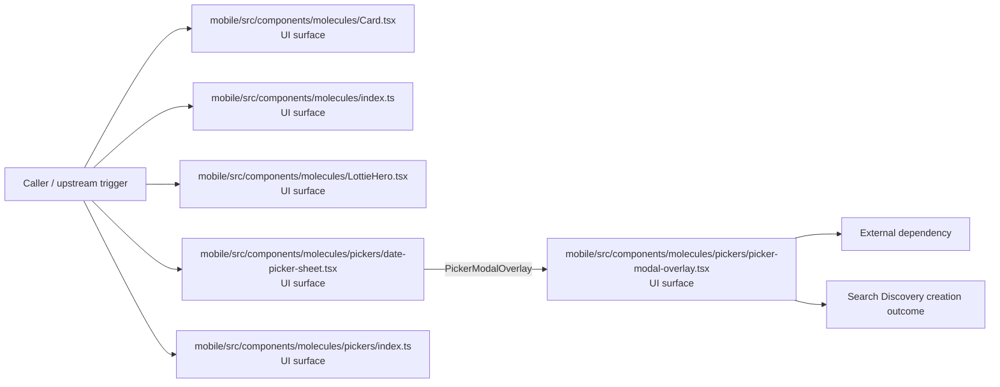
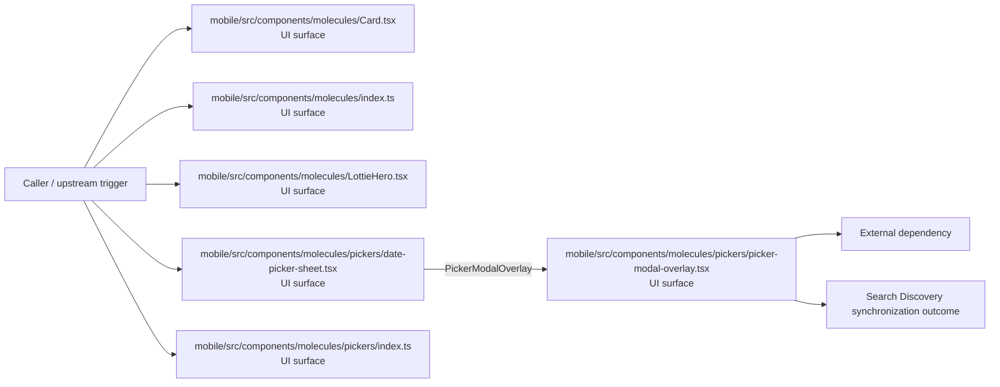

# Module mobile/src/components/molecules

- Overview: [emplus Docs Wiki](../../../../../index.md)
- Summary: [SUMMARY](../../../../../SUMMARY.md)
- Feature catalog: [All features](../../../../../features/index.md)
- Module index: [All modules](../../../index.md)
- Workspace index: [All workspaces](../../../../../workspaces/index.md)

## Snapshot

- Path: `mobile/src/components/molecules`
- Descendant files: 11
- Descendant symbols: 27
- Languages: `TypeScript`
- Workspace: [@emplus/mobile](../../../../../workspaces/mobile.md)

## Related Features

- [Search Create](../../../../../features/search-create.md) - Search Create captures the create workflow inside search. It spans 2 workspaces.

## Business Capability

A React component representing a card layer with customizable props.

## Basic Design

Molecules is inferred as a search and discovery area. The visible implementation layers are UI surface, Utility. The module also integrates with @, react, react-native, expo-linear-gradient, @expo, react-native-safe-area-context.

### Boundaries

- Entry points: `mobile/src/components/molecules/Card.tsx`, `mobile/src/components/molecules/index.ts`, `mobile/src/components/molecules/LottieHero.tsx`, `mobile/src/components/molecules/pickers/date-picker-sheet.tsx`, `mobile/src/components/molecules/pickers/index.ts`, `mobile/src/components/molecules/pickers/picker-modal-overlay.tsx`
- External interfaces: `@`, `react`, `react-native`, `expo-linear-gradient`, `@expo`, `react-native-safe-area-context`

## Detail Design

Primary flow coverage includes Search Discovery creation, Search Discovery synchronization. Representative files are mobile/src/components/molecules/Card.tsx, mobile/src/components/molecules/index.ts, mobile/src/components/molecules/LottieHero.tsx, mobile/src/components/molecules/pickers/calendar-day-cell.tsx, mobile/src/components/molecules/pickers/calendar-utils.ts. Observed behavior hints: File containing the definition of an index molecule in a mobile-specific component.

### Components

- UI surface: mobile/src/components/molecules/Card.tsx
- UI surface: mobile/src/components/molecules/index.ts
- UI surface: mobile/src/components/molecules/LottieHero.tsx
- UI surface: mobile/src/components/molecules/pickers/date-picker-sheet.tsx
- UI surface: mobile/src/components/molecules/pickers/index.ts
- UI surface: mobile/src/components/molecules/pickers/picker-modal-overlay.tsx
- UI surface: mobile/src/components/molecules/pickers/snapping-wheel-column.tsx
- UI surface: mobile/src/components/molecules/pickers/time-picker-sheet.tsx

## Module Interactions

- `mobile/src` -> `mobile/src/components/molecules` (1 dependencies)

### Interaction Diagram

## Inferred Business Flows

### Search Discovery creation

Execute the module's creation use case inside search and discovery.

#### Steps

- The user or operator enters the flow through mobile/src/components/molecules/Card.tsx, which surfaces the creation interaction.
- The user or operator enters the flow through mobile/src/components/molecules/index.ts, which surfaces the creation interaction.
- The user or operator enters the flow through mobile/src/components/molecules/LottieHero.tsx, which surfaces the creation interaction.
- The user or operator enters the flow through mobile/src/components/molecules/pickers/date-picker-sheet.tsx, which surfaces the creation interaction. It then hands off to CalendarDayCell, addDays, PickerModalOverlay.
- The user or operator enters the flow through mobile/src/components/molecules/pickers/index.ts, which surfaces the creation interaction.
- The user or operator enters the flow through mobile/src/components/molecules/pickers/picker-modal-overlay.tsx, which surfaces the creation interaction.

#### Flow Diagram

### Search Discovery synchronization

Execute the module's synchronization use case inside search and discovery.

#### Steps

- The user or operator enters the flow through mobile/src/components/molecules/Card.tsx, which surfaces the synchronization interaction.
- The user or operator enters the flow through mobile/src/components/molecules/index.ts, which surfaces the synchronization interaction.
- The user or operator enters the flow through mobile/src/components/molecules/LottieHero.tsx, which surfaces the synchronization interaction.
- The user or operator enters the flow through mobile/src/components/molecules/pickers/date-picker-sheet.tsx, which surfaces the synchronization interaction. It then hands off to CalendarDayCell, addDays, PickerModalOverlay.
- The user or operator enters the flow through mobile/src/components/molecules/pickers/index.ts, which surfaces the synchronization interaction.
- The user or operator enters the flow through mobile/src/components/molecules/pickers/picker-modal-overlay.tsx, which surfaces the synchronization interaction.

#### Flow Diagram

## Child Modules

- [mobile/src/components/molecules/pickers](molecules/pickers.md) - 7 files, 21 symbols

## Direct Files

- [mobile/src/components/molecules/Card.tsx](../../../../files/mobile/src/components/molecules/Card.tsx.md) — A React component representing a card layer with customizable props.
- [mobile/src/components/molecules/index.ts](../../../../files/mobile/src/components/molecules/index.ts.md) — File containing the definition of an index molecule in a mobile-specific component.
- [mobile/src/components/molecules/LottieHero.tsx](../../../../files/mobile/src/components/molecules/LottieHero.tsx.md) — LottieHero component props
- [mobile/src/components/molecules/TabBarGridAnimatedBackground.tsx](../../../../files/mobile/src/components/molecules/TabBarGridAnimatedBackground.tsx.md) — A function that generates the TabBarGridAnimatedBackground component
