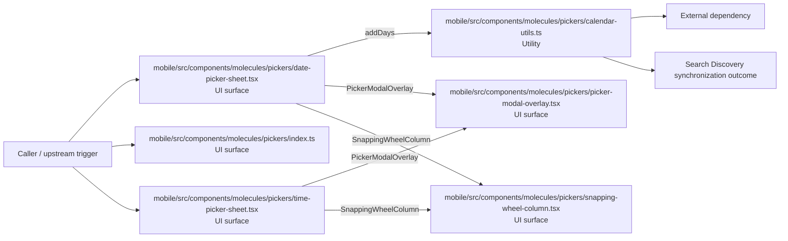

# Module mobile/src/components/molecules/pickers

- Overview: [emplus Docs Wiki](../../../../../../index.md)
- Summary: [SUMMARY](../../../../../../SUMMARY.md)
- Feature catalog: [All features](../../../../../../features/index.md)
- Module index: [All modules](../../../../index.md)
- Workspace index: [All workspaces](../../../../../../workspaces/index.md)

## Snapshot

- Path: `mobile/src/components/molecules/pickers`
- Descendant files: 7
- Descendant symbols: 21
- Languages: `TypeScript`
- Workspace: [@emplus/mobile](../../../../../../workspaces/mobile.md)

## Related Features

- [Search Create](../../../../../../features/search-create.md) - Search Create captures the create workflow inside search. It spans 2 workspaces.

## Business Capability

void

## Basic Design

Pickers is inferred as a search and discovery area. The visible implementation layers are UI surface, Utility. The module also integrates with @, react-native, @expo, react, react-native-safe-area-context.

### Boundaries

- Entry points: `mobile/src/components/molecules/pickers/date-picker-sheet.tsx`, `mobile/src/components/molecules/pickers/index.ts`, `mobile/src/components/molecules/pickers/picker-modal-overlay.tsx`, `mobile/src/components/molecules/pickers/snapping-wheel-column.tsx`, `mobile/src/components/molecules/pickers/time-picker-sheet.tsx`
- External interfaces: `@`, `react-native`, `@expo`, `react`, `react-native-safe-area-context`

## Detail Design

Primary flow coverage includes Search Discovery synchronization. Representative files are mobile/src/components/molecules/pickers/calendar-day-cell.tsx, mobile/src/components/molecules/pickers/calendar-utils.ts, mobile/src/components/molecules/pickers/date-picker-sheet.tsx, mobile/src/components/molecules/pickers/index.ts, mobile/src/components/molecules/pickers/picker-modal-overlay.tsx. Observed behavior hints: Date utilities for mobile application

### Components

- UI surface: mobile/src/components/molecules/pickers/date-picker-sheet.tsx
- UI surface: mobile/src/components/molecules/pickers/index.ts
- UI surface: mobile/src/components/molecules/pickers/picker-modal-overlay.tsx
- UI surface: mobile/src/components/molecules/pickers/snapping-wheel-column.tsx
- UI surface: mobile/src/components/molecules/pickers/time-picker-sheet.tsx
- Utility: mobile/src/components/molecules/pickers/calendar-day-cell.tsx
- Utility: mobile/src/components/molecules/pickers/calendar-utils.ts

## Inferred Business Flows

### Search Discovery synchronization

Execute the module's synchronization use case inside search and discovery.

#### Steps

- The user or operator enters the flow through mobile/src/components/molecules/pickers/date-picker-sheet.tsx, which surfaces the synchronization interaction. It then hands off to CalendarDayCell, addDays, PickerModalOverlay.
- The user or operator enters the flow through mobile/src/components/molecules/pickers/index.ts, which surfaces the synchronization interaction.
- The user or operator enters the flow through mobile/src/components/molecules/pickers/picker-modal-overlay.tsx, which surfaces the synchronization interaction.
- The user or operator enters the flow through mobile/src/components/molecules/pickers/snapping-wheel-column.tsx, which surfaces the synchronization interaction.
- The user or operator enters the flow through mobile/src/components/molecules/pickers/time-picker-sheet.tsx, which surfaces the synchronization interaction. It then hands off to PickerModalOverlay, SnappingWheelColumn, picker-modal-overlay.tsx.
- mobile/src/components/molecules/pickers/calendar-utils.ts provides helper logic used during the flow.

#### Flow Diagram

## Child Modules

No child modules.

## Direct Files

- [mobile/src/components/molecules/pickers/calendar-day-cell.tsx](../../../../../files/mobile/src/components/molecules/pickers/calendar-day-cell.tsx.md) — void
- [mobile/src/components/molecules/pickers/calendar-utils.ts](../../../../../files/mobile/src/components/molecules/pickers/calendar-utils.ts.md) — Date utilities for mobile application
- [mobile/src/components/molecules/pickers/date-picker-sheet.tsx](../../../../../files/mobile/src/components/molecules/pickers/date-picker-sheet.tsx.md) — DatePickerSheet function component responsible for managing a date picker sheet with picker steps, selected date model, and header icon.
- [mobile/src/components/molecules/pickers/index.ts](../../../../../files/mobile/src/components/molecules/pickers/index.ts.md) — picker component implementation details
- [mobile/src/components/molecules/pickers/picker-modal-overlay.tsx](../../../../../files/mobile/src/components/molecules/pickers/picker-modal-overlay.tsx.md) — The `PickerModalOverlay` is a functional React component that renders a modal overlay.
- [mobile/src/components/molecules/pickers/snapping-wheel-column.tsx](../../../../../files/mobile/src/components/molecules/pickers/snapping-wheel-column.tsx.md) — The SnappingWheelColumn component handles horizontal scrolling in a picking wheel.
- [mobile/src/components/molecules/pickers/time-picker-sheet.tsx](../../../../../files/mobile/src/components/molecules/pickers/time-picker-sheet.tsx.md) — TimePickerSheet component code.
