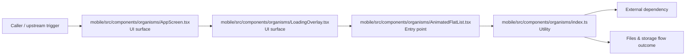

# Module mobile/src/components/organisms

- Overview: [emplus Docs Wiki](../../../../../index.md)
- Summary: [SUMMARY](../../../../../SUMMARY.md)
- Feature catalog: [All features](../../../../../features/index.md)
- Module index: [All modules](../../../index.md)
- Workspace index: [All workspaces](../../../../../workspaces/index.md)

## Snapshot

- Path: `mobile/src/components/organisms`
- Descendant files: 4
- Descendant symbols: 9
- Languages: `TypeScript`
- Workspace: [@emplus/mobile](../../../../../workspaces/mobile.md)

## Related Features

- [Authentication Read / List](../../../../../features/auth-list.md) - Authentication Read / List captures the read / list workflow inside authentication. It spans 3 workspaces.
- [Search Read / List](../../../../../features/search-list.md) - Search Read / List captures the read / list workflow inside search. It spans 3 workspaces.
- [Storage Read / List](../../../../../features/storage-list.md) - Storage Read / List captures the read / list workflow inside storage. It spans 4 workspaces.

## Business Capability

returns a React node

## Basic Design

Organisms is inferred as a files and storage area. The visible implementation layers are UI surface, Entry point, Utility. The module also integrates with @shopify, react, react-native, react-native-gesture-handler, react-native-reanimated, @.

### Boundaries

- Entry points: `mobile/src/components/organisms/AppScreen.tsx`, `mobile/src/components/organisms/LoadingOverlay.tsx`, `mobile/src/components/organisms/AnimatedFlatList.tsx`
- External interfaces: `@shopify`, `react`, `react-native`, `react-native-gesture-handler`, `react-native-reanimated`, `@`

## Detail Design

Primary flow coverage includes Files &amp; storage flow. Representative files are mobile/src/components/organisms/AnimatedFlatList.tsx, mobile/src/components/organisms/AppScreen.tsx, mobile/src/components/organisms/index.ts, mobile/src/components/organisms/LoadingOverlay.tsx. Observed behavior hints: The AppScreen component is a reusable screen container that wraps other views with interactive effects

### Components

- UI surface: mobile/src/components/organisms/AppScreen.tsx
- UI surface: mobile/src/components/organisms/LoadingOverlay.tsx
- Entry point: mobile/src/components/organisms/AnimatedFlatList.tsx
- Utility: mobile/src/components/organisms/index.ts

## Inferred Business Flows

### Files &amp; storage flow

Handle the main files and storage use case exposed by this module.

#### Steps

- The user or operator enters the flow through mobile/src/components/organisms/AppScreen.tsx, which surfaces the request handling interaction.
- The user or operator enters the flow through mobile/src/components/organisms/LoadingOverlay.tsx, which surfaces the request handling interaction.
- mobile/src/components/organisms/AnimatedFlatList.tsx receives the request and turns it into an application-level request handling command.
- mobile/src/components/organisms/index.ts provides helper logic used during the flow.

#### Flow Diagram

## Child Modules

No child modules.

## Direct Files

- [mobile/src/components/organisms/AnimatedFlatList.tsx](../../../../files/mobile/src/components/organisms/AnimatedFlatList.tsx.md) — returns a React node
- [mobile/src/components/organisms/AppScreen.tsx](../../../../files/mobile/src/components/organisms/AppScreen.tsx.md) — The AppScreen component is a reusable screen container that wraps other views with interactive effects
- [mobile/src/components/organisms/index.ts](../../../../files/mobile/src/components/organisms/index.ts.md) — Index file for Mobile Organisms Components
- [mobile/src/components/organisms/LoadingOverlay.tsx](../../../../files/mobile/src/components/organisms/LoadingOverlay.tsx.md) — A reusable loading overlay component that displays a progress indicator.
