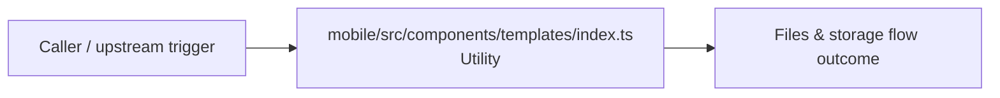

# Module mobile/src/components/templates

- Overview: [emplus Docs Wiki](../../../../../index.md)
- Summary: [SUMMARY](../../../../../SUMMARY.md)
- Feature catalog: [All features](../../../../../features/index.md)
- Module index: [All modules](../../../index.md)
- Workspace index: [All workspaces](../../../../../workspaces/index.md)

## Snapshot

- Path: `mobile/src/components/templates`
- Descendant files: 1
- Descendant symbols: 0
- Languages: `TypeScript`
- Workspace: [@emplus/mobile](../../../../../workspaces/mobile.md)

## Business Capability

Template index file for mobile application

## Basic Design

Templates is inferred as a files and storage area. The visible implementation layers are Utility.

## Detail Design

Primary flow coverage includes Files &amp; storage flow. Representative files are mobile/src/components/templates/index.ts.

### Components

- Utility: mobile/src/components/templates/index.ts

## Inferred Business Flows

### Files &amp; storage flow

Handle the main files and storage use case exposed by this module.

#### Steps

- mobile/src/components/templates/index.ts provides helper logic used during the flow.

#### Flow Diagram

## Child Modules

No child modules.

## Direct Files

- [mobile/src/components/templates/index.ts](../../../../files/mobile/src/components/templates/index.ts.md) — Template index file for mobile application
