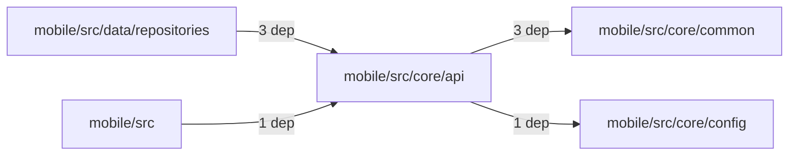
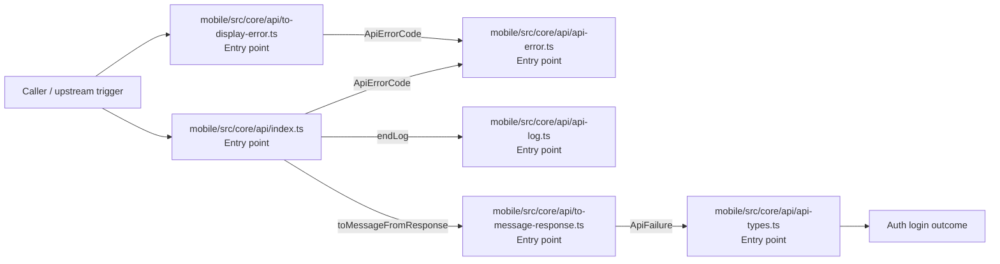

# Module mobile/src/core/api

- Overview: [emplus Docs Wiki](../../../../../index.md)
- Summary: [SUMMARY](../../../../../SUMMARY.md)
- Feature catalog: [All features](../../../../../features/index.md)
- Module index: [All modules](../../../index.md)
- Workspace index: [All workspaces](../../../../../workspaces/index.md)

## Snapshot

- Path: `mobile/src/core/api`
- Descendant files: 7
- Descendant symbols: 35
- Languages: `TypeScript`
- Workspace: [@emplus/mobile](../../../../../workspaces/mobile.md)

## Related Features

- [Authentication Login](../../../../../features/auth-login.md) - Authentication Login captures the login workflow inside authentication. It spans 2 workspaces. Key flows include Auth login, Auth registration, Auth login.
- [Authentication Read / List](../../../../../features/auth-list.md) - Authentication Read / List captures the read / list workflow inside authentication. It spans 3 workspaces.
- [User Management Login](../../../../../features/user-login.md) - User Management Login captures the login workflow inside user management. It spans 2 workspaces. Key flows include Auth login, Auth registration, Auth login.
- [Search Read / List](../../../../../features/search-list.md) - Search Read / List captures the read / list workflow inside search. It spans 3 workspaces.
- [Search Login](../../../../../features/search-login.md) - Search Login captures the login workflow inside search. It spans 2 workspaces. Key flows include Auth login, Auth registration, Auth login.
- [Notifications Read / List](../../../../../features/notification-list.md) - Notifications Read / List captures the read / list workflow inside notifications. It spans 2 workspaces.
- [Storage Read / List](../../../../../features/storage-list.md) - Storage Read / List captures the read / list workflow inside storage. It spans 4 workspaces.
- [Integrations Read / List](../../../../../features/integration-list.md) - Integrations Read / List captures the read / list workflow inside integrations. It spans 3 workspaces.
- [User Management Read / List](../../../../../features/user-list.md) - User Management Read / List captures the read / list workflow inside user management. It spans 3 workspaces.
- [Notifications Notify](../../../../../features/notification-notify.md) - Notifications Notify captures the notify workflow inside notifications. It spans 2 workspaces.
- [Notifications Login](../../../../../features/notification-login.md) - Notifications Login captures the login workflow inside notifications. It spans 2 workspaces. Key flows include Auth login, Auth registration, Auth login.
- [Reporting Read / List](../../../../../features/reporting-list.md) - Reporting Read / List captures the read / list workflow inside reporting. It spans 2 workspaces.
- [Search Notify](../../../../../features/search-notify.md) - Search Notify captures the notify workflow inside search. It spans 2 workspaces.
- [Storage Login](../../../../../features/storage-login.md) - Storage Login captures the login workflow inside storage. It spans 2 workspaces. Key flows include Auth login, Auth registration, Auth login.
- [Administration Read / List](../../../../../features/admin-list.md) - Administration Read / List captures the read / list workflow inside administration. It spans 2 workspaces.
- [Integrations Login](../../../../../features/integration-login.md) - Integrations Login captures the login workflow inside integrations. It spans 2 workspaces. Key flows include Auth login, Auth registration, Auth login.
- [Integrations Notify](../../../../../features/integration-notify.md) - Integrations Notify captures the notify workflow inside integrations. It spans 2 workspaces.
- [Search Create](../../../../../features/search-create.md) - Search Create captures the create workflow inside search. It spans 2 workspaces.
- [User Management Notify](../../../../../features/user-notify.md) - User Management Notify captures the notify workflow inside user management. It spans 2 workspaces.
- [Administration Login](../../../../../features/admin-login.md) - Administration Login captures the login workflow inside administration. It spans 2 workspaces. Key flows include Auth login, Auth registration, Auth login.
- [Storage Notify](../../../../../features/storage-notify.md) - Storage Notify captures the notify workflow inside storage. It spans 2 workspaces.
- [User Management Create](../../../../../features/user-create.md) - User Management Create captures the create workflow inside user management. It spans 2 workspaces.
- [Reporting Login](../../../../../features/reporting-login.md) - Reporting Login captures the login workflow inside reporting. It spans 2 workspaces. Key flows include Auth login, Auth registration, Auth login.
- [Administration Notify](../../../../../features/admin-notify.md) - Administration Notify captures the notify workflow inside administration. It spans 2 workspaces.

## Business Capability

Error class responsible for capturing and handling API errors.

## Basic Design

Api is inferred as a authentication and access control area. The visible implementation layers are Entry point.

### Boundaries

- Entry points: `mobile/src/core/api/api-error.ts`, `mobile/src/core/api/api-log.ts`, `mobile/src/core/api/api-types.ts`, `mobile/src/core/api/index.ts`, `mobile/src/core/api/to-display-error.ts`, `mobile/src/core/api/to-message-response.ts`

## Detail Design

Primary flow coverage includes Auth login. Representative files are mobile/src/core/api/api-error.ts, mobile/src/core/api/api-log.ts, mobile/src/core/api/api-types.ts, mobile/src/core/api/index.ts, mobile/src/core/api/to-display-error.ts. Observed behavior hints: Provides 2 documented symbols in mobile/src/core/api/api-log.ts.

### Components

- Entry point: mobile/src/core/api/api-error.ts
- Entry point: mobile/src/core/api/api-log.ts
- Entry point: mobile/src/core/api/api-types.ts
- Entry point: mobile/src/core/api/index.ts
- Entry point: mobile/src/core/api/to-display-error.ts
- Entry point: mobile/src/core/api/to-message-response.ts
- Entry point: mobile/src/core/api/token-manager.ts

## Module Interactions

- `mobile/src/core/api` -> `mobile/src/core/common` (3 dependencies)
- `mobile/src/data/repositories` -> `mobile/src/core/api` (3 dependencies)
- `mobile/src` -> `mobile/src/core/api` (1 dependencies)
- `mobile/src/core/api` -> `mobile/src/core/config` (1 dependencies)

### Interaction Diagram

## Inferred Business Flows

### Auth login

Authenticate the caller, validate credentials, and establish a usable session or token.

#### Steps

- mobile/src/core/api/api-error.ts receives the request and turns it into an application-level login command.
- mobile/src/core/api/api-log.ts receives the request and turns it into an application-level login command.
- mobile/src/core/api/api-types.ts receives the request and turns it into an application-level login command.
- mobile/src/core/api/index.ts receives the request and turns it into an application-level login command. It then hands off to app-config.ts, ApiErrorCode, endLog.
- mobile/src/core/api/to-display-error.ts receives the request and turns it into an application-level login command. It then hands off to messages.ts, ApiErrorCode, api-error.ts.
- mobile/src/core/api/to-message-response.ts receives the request and turns it into an application-level login command. It then hands off to isRecord, messages.ts, ApiFailure.

#### Flow Diagram

## Child Modules

No child modules.

## Direct Files

- [mobile/src/core/api/api-error.ts](../../../../files/mobile/src/core/api/api-error.ts.md) — Error class responsible for capturing and handling API errors.
- [mobile/src/core/api/api-log.ts](../../../../files/mobile/src/core/api/api-log.ts.md) — Provides 2 documented symbols in mobile/src/core/api/api-log.ts.
- [mobile/src/core/api/api-types.ts](../../../../files/mobile/src/core/api/api-types.ts.md) — API types documented in mobile/src/core/api/api-types.ts
- [mobile/src/core/api/index.ts](../../../../files/mobile/src/core/api/index.ts.md) — API Client
- [mobile/src/core/api/to-display-error.ts](../../../../files/mobile/src/core/api/to-display-error.ts.md) — Returns a human-readable error message based on the underlying exception
- [mobile/src/core/api/to-message-response.ts](../../../../files/mobile/src/core/api/to-message-response.ts.md) — An internal function to construct API response messages for error cases.
- [mobile/src/core/api/token-manager.ts](../../../../files/mobile/src/core/api/token-manager.ts.md) — The TokenManager class is responsible for managing authentication tokens.
