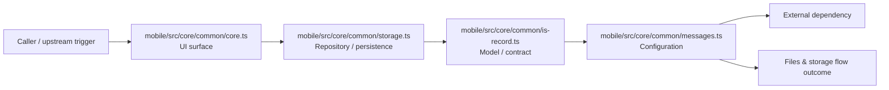

# Module mobile/src/core/common

- Overview: [emplus Docs Wiki](../../../../../index.md)
- Summary: [SUMMARY](../../../../../SUMMARY.md)
- Feature catalog: [All features](../../../../../features/index.md)
- Module index: [All modules](../../../index.md)
- Workspace index: [All workspaces](../../../../../workspaces/index.md)

## Snapshot

- Path: `mobile/src/core/common`
- Descendant files: 4
- Descendant symbols: 5
- Languages: `TypeScript`
- Workspace: [@emplus/mobile](../../../../../workspaces/mobile.md)

## Related Features

- [Notifications Notify](../../../../../features/notification-notify.md) - Notifications Notify captures the notify workflow inside notifications. It spans 2 workspaces.
- [Search Notify](../../../../../features/search-notify.md) - Search Notify captures the notify workflow inside search. It spans 2 workspaces.
- [Integrations Notify](../../../../../features/integration-notify.md) - Integrations Notify captures the notify workflow inside integrations. It spans 2 workspaces.
- [User Management Notify](../../../../../features/user-notify.md) - User Management Notify captures the notify workflow inside user management. It spans 2 workspaces.
- [Storage Notify](../../../../../features/storage-notify.md) - Storage Notify captures the notify workflow inside storage. It spans 2 workspaces.

## Business Capability

The `scrollPadBottomWithTabBar` function takes an optional number of insets at the bottom of a screen.

## Basic Design

Common is inferred as a files and storage area. The visible implementation layers are Configuration, Model / contract, Repository / persistence. The module also integrates with @react-native-async-storage, expo-secure-store.

### Boundaries

- Entry points: `mobile/src/core/common/core.ts`
- External interfaces: `@react-native-async-storage`, `expo-secure-store`

## Detail Design

Primary flow coverage includes Files &amp; storage flow. Representative files are mobile/src/core/common/core.ts, mobile/src/core/common/is-record.ts, mobile/src/core/common/messages.ts, mobile/src/core/common/storage.ts. Observed behavior hints: Determines whether a value is of type `Record&lt;string, unknown&gt;`

### Components

- UI surface: mobile/src/core/common/core.ts
- Repository / persistence: mobile/src/core/common/storage.ts
- Model / contract: mobile/src/core/common/is-record.ts
- Configuration: mobile/src/core/common/messages.ts

## Module Interactions

- `mobile/src/core/api` -> `mobile/src/core/common` (3 dependencies)
- `mobile/src/core/common` -> `mobile/src/core/config` (1 dependencies)

### Interaction Diagram

## Inferred Business Flows

### Files &amp; storage flow

Handle the main files and storage use case exposed by this module.

#### Steps

- The user or operator enters the flow through mobile/src/core/common/core.ts, which surfaces the request handling interaction.
- mobile/src/core/common/storage.ts loads or persists the records needed to complete the flow. It then hands off to app-config.ts.
- mobile/src/core/common/is-record.ts defines the contracts or state objects moved between layers.
- mobile/src/core/common/messages.ts supplies runtime configuration that shapes how the flow behaves.

#### Flow Diagram

## Child Modules

No child modules.

## Direct Files

- [mobile/src/core/common/core.ts](../../../../files/mobile/src/core/common/core.ts.md) — The `scrollPadBottomWithTabBar` function takes an optional number of insets at the bottom of a screen.
- [mobile/src/core/common/is-record.ts](../../../../files/mobile/src/core/common/is-record.ts.md) — Determines whether a value is of type `Record&lt;string, unknown&gt;`
- [mobile/src/core/common/messages.ts](../../../../files/mobile/src/core/common/messages.ts.md) — Message definitions and constants.
- [mobile/src/core/common/storage.ts](../../../../files/mobile/src/core/common/storage.ts.md) — An interface providing a method to persist and retrieve local app data.
