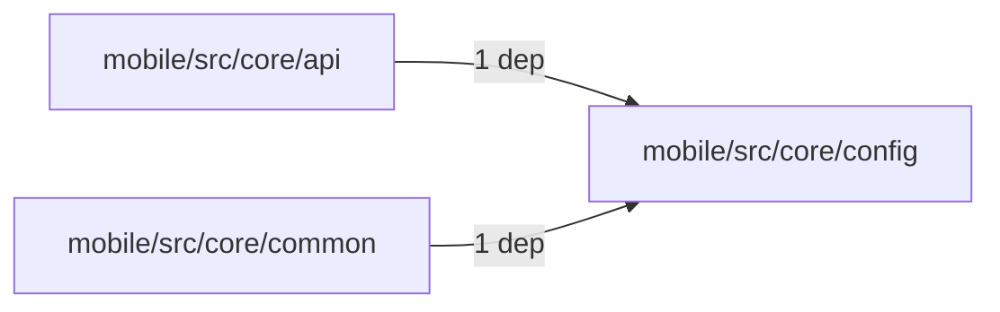
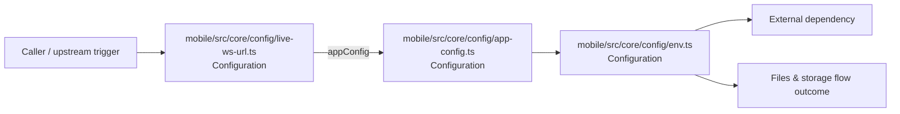

# Module mobile/src/core/config

- Overview: [emplus Docs Wiki](../../../../../index.md)
- Summary: [SUMMARY](../../../../../SUMMARY.md)
- Feature catalog: [All features](../../../../../features/index.md)
- Module index: [All modules](../../../index.md)
- Workspace index: [All workspaces](../../../../../workspaces/index.md)

## Snapshot

- Path: `mobile/src/core/config`
- Descendant files: 3
- Descendant symbols: 1
- Languages: `TypeScript`
- Workspace: [@emplus/mobile](../../../../../workspaces/mobile.md)

## Business Capability

File configuration data for the mobile mobile application.

## Basic Design

Config is inferred as a files and storage area. The visible implementation layers are Configuration. The module also integrates with zod.

### Boundaries

- External interfaces: `zod`

## Detail Design

Primary flow coverage includes Files &amp; storage flow. Representative files are mobile/src/core/config/app-config.ts, mobile/src/core/config/env.ts, mobile/src/core/config/live-ws-url.ts. Observed behavior hints: Environment configuration and settings file

### Components

- Configuration: mobile/src/core/config/app-config.ts
- Configuration: mobile/src/core/config/env.ts
- Configuration: mobile/src/core/config/live-ws-url.ts

## Module Interactions

- `mobile/src/core/api` -> `mobile/src/core/config` (1 dependencies)
- `mobile/src/core/common` -> `mobile/src/core/config` (1 dependencies)

### Interaction Diagram

## Inferred Business Flows

### Files &amp; storage flow

Handle the main files and storage use case exposed by this module.

#### Steps

- mobile/src/core/config/live-ws-url.ts supplies runtime configuration that shapes how the flow behaves. It then hands off to app-config.ts.
- mobile/src/core/config/app-config.ts supplies runtime configuration that shapes how the flow behaves. It then hands off to env.ts.
- mobile/src/core/config/env.ts supplies runtime configuration that shapes how the flow behaves.

#### Flow Diagram

## Child Modules

No child modules.

## Direct Files

- [mobile/src/core/config/app-config.ts](../../../../files/mobile/src/core/config/app-config.ts.md) — File configuration data for the mobile mobile application.
- [mobile/src/core/config/env.ts](../../../../files/mobile/src/core/config/env.ts.md) — Environment configuration and settings file
- [mobile/src/core/config/live-ws-url.ts](../../../../files/mobile/src/core/config/live-ws-url.ts.md) — Constructs a WebSocket URL for live websockets with the given token and couple ID
