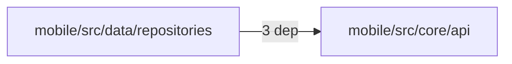

# Module mobile/src/data/repositories

- Overview: [emplus Docs Wiki](../../../../../index.md)
- Summary: [SUMMARY](../../../../../SUMMARY.md)
- Feature catalog: [All features](../../../../../features/index.md)
- Module index: [All modules](../../../index.md)
- Workspace index: [All workspaces](../../../../../workspaces/index.md)

## Snapshot

- Path: `mobile/src/data/repositories`
- Descendant files: 3
- Descendant symbols: 34
- Languages: `TypeScript`
- Workspace: [@emplus/mobile](../../../../../workspaces/mobile.md)

## Related Features

- [Authentication Login](../../../../../features/auth-login.md) - Authentication Login captures the login workflow inside authentication. It spans 2 workspaces. Key flows include Auth login, Auth registration, Auth login.
- [Authentication Read / List](../../../../../features/auth-list.md) - Authentication Read / List captures the read / list workflow inside authentication. It spans 3 workspaces.
- [User Management Login](../../../../../features/user-login.md) - User Management Login captures the login workflow inside user management. It spans 2 workspaces. Key flows include Auth login, Auth registration, Auth login.
- [Search Read / List](../../../../../features/search-list.md) - Search Read / List captures the read / list workflow inside search. It spans 3 workspaces.
- [Search Login](../../../../../features/search-login.md) - Search Login captures the login workflow inside search. It spans 2 workspaces. Key flows include Auth login, Auth registration, Auth login.
- [Notifications Read / List](../../../../../features/notification-list.md) - Notifications Read / List captures the read / list workflow inside notifications. It spans 2 workspaces.
- [Storage Read / List](../../../../../features/storage-list.md) - Storage Read / List captures the read / list workflow inside storage. It spans 4 workspaces.
- [Integrations Read / List](../../../../../features/integration-list.md) - Integrations Read / List captures the read / list workflow inside integrations. It spans 3 workspaces.
- [User Management Read / List](../../../../../features/user-list.md) - User Management Read / List captures the read / list workflow inside user management. It spans 3 workspaces.
- [Notifications Login](../../../../../features/notification-login.md) - Notifications Login captures the login workflow inside notifications. It spans 2 workspaces. Key flows include Auth login, Auth registration, Auth login.
- [Reporting Read / List](../../../../../features/reporting-list.md) - Reporting Read / List captures the read / list workflow inside reporting. It spans 2 workspaces.
- [Storage Login](../../../../../features/storage-login.md) - Storage Login captures the login workflow inside storage. It spans 2 workspaces. Key flows include Auth login, Auth registration, Auth login.
- [Administration Read / List](../../../../../features/admin-list.md) - Administration Read / List captures the read / list workflow inside administration. It spans 2 workspaces.
- [Authentication Verification](../../../../../features/auth-verify.md) - Authentication Verification captures the verification workflow inside authentication. It spans 2 workspaces. Key flows include Credential validation, Auth login, Auth login.
- [Integrations Login](../../../../../features/integration-login.md) - Integrations Login captures the login workflow inside integrations. It spans 2 workspaces. Key flows include Auth login, Auth registration, Auth login.
- [Search Create](../../../../../features/search-create.md) - Search Create captures the create workflow inside search. It spans 2 workspaces.
- [Administration Login](../../../../../features/admin-login.md) - Administration Login captures the login workflow inside administration. It spans 2 workspaces. Key flows include Auth login, Auth registration, Auth login.
- [Authentication Password Reset](../../../../../features/auth-reset.md) - Authentication Password Reset captures the password reset workflow inside authentication. It spans 3 workspaces. Key flows include Password reset, Password reset, Password reset.
- [User Management Create](../../../../../features/user-create.md) - User Management Create captures the create workflow inside user management. It spans 2 workspaces.
- [Reporting Login](../../../../../features/reporting-login.md) - Reporting Login captures the login workflow inside reporting. It spans 2 workspaces. Key flows include Auth login, Auth registration, Auth login.
- [Notifications Verification](../../../../../features/notification-verify.md) - Notifications Verification captures the verification workflow inside notifications. It spans 2 workspaces. Key flows include Credential validation, Auth login, Auth login.
- [Storage Verification](../../../../../features/storage-verify.md) - Storage Verification captures the verification workflow inside storage. It spans 2 workspaces. Key flows include Credential validation, Auth login, Auth login.
- [Administration Verification](../../../../../features/admin-verify.md) - Administration Verification captures the verification workflow inside administration. It spans 2 workspaces. Key flows include Credential validation, Auth login, Auth login.
- [Integrations Verification](../../../../../features/integration-verify.md) - Integrations Verification captures the verification workflow inside integrations. It spans 2 workspaces. Key flows include Credential validation, Auth login, Auth login.
- [Reporting Verification](../../../../../features/reporting-verify.md) - Reporting Verification captures the verification workflow inside reporting. It spans 2 workspaces. Key flows include Credential validation, Auth login, Auth login.

## Business Capability

AuthRepositoryImpl class

## Basic Design

Repositories is inferred as a authentication and access control area. The visible implementation layers are Entry point.

### Boundaries

- Entry points: `mobile/src/data/repositories/auth.repository.impl.ts`, `mobile/src/data/repositories/modules.repository.impl.ts`, `mobile/src/data/repositories/notifications.repository.impl.ts`

## Detail Design

Primary flow coverage includes Password reset, Auth login, Auth registration. Representative files are mobile/src/data/repositories/auth.repository.impl.ts, mobile/src/data/repositories/modules.repository.impl.ts, mobile/src/data/repositories/notifications.repository.impl.ts. Observed behavior hints: Provides 20 documented symbols in mobile/src/data/repositories/modules.repository.impl.ts.

### Components

- Entry point: mobile/src/data/repositories/auth.repository.impl.ts
- Entry point: mobile/src/data/repositories/modules.repository.impl.ts
- Entry point: mobile/src/data/repositories/notifications.repository.impl.ts

## Module Interactions

- `mobile/src/data/repositories` -> `mobile/src/core/api` (3 dependencies)

### Interaction Diagram

## Inferred Business Flows

### Password reset

Execute the module's password reset use case inside authentication and access control.

#### Steps

- mobile/src/data/repositories/auth.repository.impl.ts receives the request and turns it into an application-level password reset command. It then hands off to ApiResponse, index.ts.
- mobile/src/data/repositories/modules.repository.impl.ts receives the request and turns it into an application-level password reset command. It then hands off to ApiResponse, index.ts.
- mobile/src/data/repositories/notifications.repository.impl.ts receives the request and turns it into an application-level password reset command. It then hands off to ApiResponse, index.ts.

#### Flow Diagram

```mermaid
flowchart LR
  caller["Caller / upstream trigger"]
  n1_auth_repository_impl_ts["mobile/src/data/repositories/auth.repository.impl.ts\nEntry point"]
  n2_modules_repository_impl_ts["mobile/src/data/repositories/modules.repository.impl.ts\nEntry point"]
  n3_notifications_repository_impl_ts["mobile/src/data/repositories/notifications.repository.impl.ts\nEntry point"]
  caller --> n1_auth_repository_impl_ts
  n1_auth_repository_impl_ts --> n2_modules_repository_impl_ts
  n2_modules_repository_impl_ts --> n3_notifications_repository_impl_ts
  outcome["Password reset outcome"]
  n3_notifications_repository_impl_ts --> outcome
```

### Auth login

Authenticate the caller, validate credentials, and establish a usable session or token.

#### Steps

- mobile/src/data/repositories/auth.repository.impl.ts receives the request and turns it into an application-level login command. It then hands off to ApiResponse, index.ts.
- mobile/src/data/repositories/modules.repository.impl.ts receives the request and turns it into an application-level login command. It then hands off to ApiResponse, index.ts.
- mobile/src/data/repositories/notifications.repository.impl.ts receives the request and turns it into an application-level login command. It then hands off to ApiResponse, index.ts.

#### Flow Diagram

```mermaid
flowchart LR
  caller["Caller / upstream trigger"]
  n1_auth_repository_impl_ts["mobile/src/data/repositories/auth.repository.impl.ts\nEntry point"]
  n2_modules_repository_impl_ts["mobile/src/data/repositories/modules.repository.impl.ts\nEntry point"]
  n3_notifications_repository_impl_ts["mobile/src/data/repositories/notifications.repository.impl.ts\nEntry point"]
  caller --> n1_auth_repository_impl_ts
  n1_auth_repository_impl_ts --> n2_modules_repository_impl_ts
  n2_modules_repository_impl_ts --> n3_notifications_repository_impl_ts
  outcome["Auth login outcome"]
  n3_notifications_repository_impl_ts --> outcome
```

### Auth registration

Execute the module's registration use case inside authentication and access control.

#### Steps

- mobile/src/data/repositories/auth.repository.impl.ts receives the request and turns it into an application-level registration command. It then hands off to ApiResponse, index.ts.
- mobile/src/data/repositories/modules.repository.impl.ts receives the request and turns it into an application-level registration command. It then hands off to ApiResponse, index.ts.
- mobile/src/data/repositories/notifications.repository.impl.ts receives the request and turns it into an application-level registration command. It then hands off to ApiResponse, index.ts.

#### Flow Diagram

```mermaid
flowchart LR
  caller["Caller / upstream trigger"]
  n1_auth_repository_impl_ts["mobile/src/data/repositories/auth.repository.impl.ts\nEntry point"]
  n2_modules_repository_impl_ts["mobile/src/data/repositories/modules.repository.impl.ts\nEntry point"]
  n3_notifications_repository_impl_ts["mobile/src/data/repositories/notifications.repository.impl.ts\nEntry point"]
  caller --> n1_auth_repository_impl_ts
  n1_auth_repository_impl_ts --> n2_modules_repository_impl_ts
  n2_modules_repository_impl_ts --> n3_notifications_repository_impl_ts
  outcome["Auth registration outcome"]
  n3_notifications_repository_impl_ts --> outcome
```

## Child Modules

No child modules.

## Direct Files

- [mobile/src/data/repositories/auth.repository.impl.ts](../../../../files/mobile/src/data/repositories/auth.repository.impl.ts.md) — AuthRepositoryImpl class
- [mobile/src/data/repositories/modules.repository.impl.ts](../../../../files/mobile/src/data/repositories/modules.repository.impl.ts.md) — Provides 20 documented symbols in mobile/src/data/repositories/modules.repository.impl.ts.
- [mobile/src/data/repositories/notifications.repository.impl.ts](../../../../files/mobile/src/data/repositories/notifications.repository.impl.ts.md) — List notifications by page, limit and unread_only
