# Module mobile/src/domain/repositories

- Overview: [emplus Docs Wiki](../../../../../index.md)
- Summary: [SUMMARY](../../../../../SUMMARY.md)
- Feature catalog: [All features](../../../../../features/index.md)
- Module index: [All modules](../../../index.md)
- Workspace index: [All workspaces](../../../../../workspaces/index.md)

## Snapshot

- Path: `mobile/src/domain/repositories`
- Descendant files: 3
- Descendant symbols: 8
- Languages: `TypeScript`
- Workspace: [@emplus/mobile](../../../../../workspaces/mobile.md)

## Related Features

- [Authentication Login](../../../../../features/auth-login.md) - Authentication Login captures the login workflow inside authentication. It spans 2 workspaces. Key flows include Auth login, Auth registration, Auth login.
- [Authentication Read / List](../../../../../features/auth-list.md) - Authentication Read / List captures the read / list workflow inside authentication. It spans 3 workspaces.
- [User Management Login](../../../../../features/user-login.md) - User Management Login captures the login workflow inside user management. It spans 2 workspaces. Key flows include Auth login, Auth registration, Auth login.
- [Integrations Read / List](../../../../../features/integration-list.md) - Integrations Read / List captures the read / list workflow inside integrations. It spans 3 workspaces.
- [Reporting Read / List](../../../../../features/reporting-list.md) - Reporting Read / List captures the read / list workflow inside reporting. It spans 2 workspaces.
- [Authentication Verification](../../../../../features/auth-verify.md) - Authentication Verification captures the verification workflow inside authentication. It spans 2 workspaces. Key flows include Credential validation, Auth login, Auth login.
- [Administration Login](../../../../../features/admin-login.md) - Administration Login captures the login workflow inside administration. It spans 2 workspaces. Key flows include Auth login, Auth registration, Auth login.
- [Administration Verification](../../../../../features/admin-verify.md) - Administration Verification captures the verification workflow inside administration. It spans 2 workspaces. Key flows include Credential validation, Auth login, Auth login.

## Business Capability

Provides methods for user authentication and profile management.

## Basic Design

Repositories is inferred as a authentication and access control area. The visible implementation layers are Repository / persistence.

## Detail Design

Primary flow coverage includes Auth login. Representative files are mobile/src/domain/repositories/auth.repository.ts, mobile/src/domain/repositories/modules.repository.ts, mobile/src/domain/repositories/notifications.repository.ts. Observed behavior hints: 'TimelineRepository' interface provides methods for managing timeline-related data.

### Components

- Repository / persistence: mobile/src/domain/repositories/auth.repository.ts
- Repository / persistence: mobile/src/domain/repositories/modules.repository.ts
- Repository / persistence: mobile/src/domain/repositories/notifications.repository.ts

## Inferred Business Flows

### Auth login

Authenticate the caller, validate credentials, and establish a usable session or token.

#### Steps

- mobile/src/domain/repositories/auth.repository.ts loads or persists the records needed to complete the flow.
- mobile/src/domain/repositories/modules.repository.ts loads or persists the records needed to complete the flow.
- mobile/src/domain/repositories/notifications.repository.ts loads or persists the records needed to complete the flow.

#### Flow Diagram

```mermaid
flowchart LR
  caller["Caller / upstream trigger"]
  n1_auth_repository_ts["mobile/src/domain/repositories/auth.repository.ts\nRepository / persistence"]
  n2_modules_repository_ts["mobile/src/domain/repositories/modules.repository.ts\nRepository / persistence"]
  n3_notifications_repository_ts["mobile/src/domain/repositories/notifications.repository.ts\nRepository / persistence"]
  caller --> n1_auth_repository_ts
  n1_auth_repository_ts --> n2_modules_repository_ts
  n2_modules_repository_ts --> n3_notifications_repository_ts
  outcome["Auth login outcome"]
  n3_notifications_repository_ts --> outcome
```

## Child Modules

No child modules.

## Direct Files

- [mobile/src/domain/repositories/auth.repository.ts](../../../../files/mobile/src/domain/repositories/auth.repository.ts.md) — Provides methods for user authentication and profile management.
- [mobile/src/domain/repositories/modules.repository.ts](../../../../files/mobile/src/domain/repositories/modules.repository.ts.md) — 'TimelineRepository' interface provides methods for managing timeline-related data.
- [mobile/src/domain/repositories/notifications.repository.ts](../../../../files/mobile/src/domain/repositories/notifications.repository.ts.md) — NotificationsRepository interface definition.
