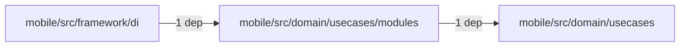
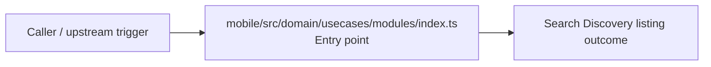
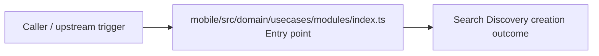

# Module mobile/src/domain/usecases/modules

- Overview: [emplus Docs Wiki](../../../../../../index.md)
- Summary: [SUMMARY](../../../../../../SUMMARY.md)
- Feature catalog: [All features](../../../../../../features/index.md)
- Module index: [All modules](../../../../index.md)
- Workspace index: [All workspaces](../../../../../../workspaces/index.md)

## Snapshot

- Path: `mobile/src/domain/usecases/modules`
- Descendant files: 1
- Descendant symbols: 54
- Languages: `TypeScript`
- Workspace: [@emplus/mobile](../../../../../../workspaces/mobile.md)

## Related Features

- [Authentication Read / List](../../../../../../features/auth-list.md) - Authentication Read / List captures the read / list workflow inside authentication. It spans 3 workspaces.
- [Search Read / List](../../../../../../features/search-list.md) - Search Read / List captures the read / list workflow inside search. It spans 3 workspaces.
- [Notifications Read / List](../../../../../../features/notification-list.md) - Notifications Read / List captures the read / list workflow inside notifications. It spans 2 workspaces.
- [Storage Read / List](../../../../../../features/storage-list.md) - Storage Read / List captures the read / list workflow inside storage. It spans 4 workspaces.
- [Integrations Read / List](../../../../../../features/integration-list.md) - Integrations Read / List captures the read / list workflow inside integrations. It spans 3 workspaces.
- [User Management Read / List](../../../../../../features/user-list.md) - User Management Read / List captures the read / list workflow inside user management. It spans 3 workspaces.
- [Reporting Read / List](../../../../../../features/reporting-list.md) - Reporting Read / List captures the read / list workflow inside reporting. It spans 2 workspaces.
- [Administration Read / List](../../../../../../features/admin-list.md) - Administration Read / List captures the read / list workflow inside administration. It spans 2 workspaces.
- [Authentication Verification](../../../../../../features/auth-verify.md) - Authentication Verification captures the verification workflow inside authentication. It spans 2 workspaces. Key flows include Credential validation, Auth login, Auth login.
- [Search Create](../../../../../../features/search-create.md) - Search Create captures the create workflow inside search. It spans 2 workspaces.
- [User Management Create](../../../../../../features/user-create.md) - User Management Create captures the create workflow inside user management. It spans 2 workspaces.
- [Notifications Verification](../../../../../../features/notification-verify.md) - Notifications Verification captures the verification workflow inside notifications. It spans 2 workspaces. Key flows include Credential validation, Auth login, Auth login.
- [Storage Verification](../../../../../../features/storage-verify.md) - Storage Verification captures the verification workflow inside storage. It spans 2 workspaces. Key flows include Credential validation, Auth login, Auth login.
- [Administration Verification](../../../../../../features/admin-verify.md) - Administration Verification captures the verification workflow inside administration. It spans 2 workspaces. Key flows include Credential validation, Auth login, Auth login.
- [Integrations Verification](../../../../../../features/integration-verify.md) - Integrations Verification captures the verification workflow inside integrations. It spans 2 workspaces. Key flows include Credential validation, Auth login, Auth login.
- [Reporting Verification](../../../../../../features/reporting-verify.md) - Reporting Verification captures the verification workflow inside reporting. It spans 2 workspaces. Key flows include Credential validation, Auth login, Auth login.

## Business Capability

Provides 54 documented symbols in mobile/src/domain/usecases/modules/index.ts.

## Basic Design

Modules is inferred as a search and discovery area. The visible implementation layers are Entry point.

### Boundaries

- Entry points: `mobile/src/domain/usecases/modules/index.ts`

## Detail Design

Primary flow coverage includes Search Discovery listing, Search Discovery creation. Representative files are mobile/src/domain/usecases/modules/index.ts.

### Components

- Entry point: mobile/src/domain/usecases/modules/index.ts

## Module Interactions

- `mobile/src/domain/usecases/modules` -> `mobile/src/domain/usecases` (1 dependencies)
- `mobile/src/framework/di` -> `mobile/src/domain/usecases/modules` (1 dependencies)

### Interaction Diagram

## Inferred Business Flows

### Search Discovery listing

Execute the module's listing use case inside search and discovery.

#### Steps

- mobile/src/domain/usecases/modules/index.ts receives the request and turns it into an application-level listing command. It then hands off to base.ts.

#### Flow Diagram

### Search Discovery creation

Execute the module's creation use case inside search and discovery.

#### Steps

- mobile/src/domain/usecases/modules/index.ts receives the request and turns it into an application-level creation command. It then hands off to base.ts.

#### Flow Diagram

## Child Modules

No child modules.

## Direct Files

- [mobile/src/domain/usecases/modules/index.ts](../../../../../files/mobile/src/domain/usecases/modules/index.ts.md) — Provides 54 documented symbols in mobile/src/domain/usecases/modules/index.ts.
