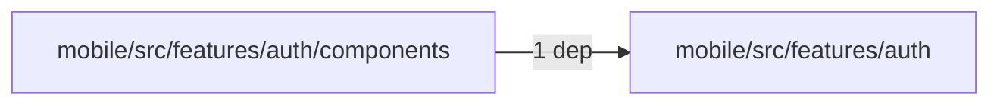
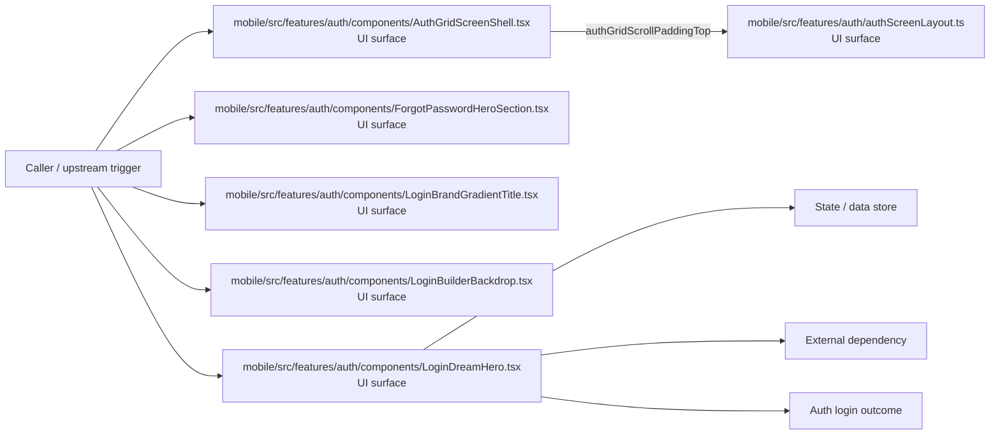

# Module mobile/src/features/auth

- Overview: [emplus Docs Wiki](../../../../../index.md)
- Summary: [SUMMARY](../../../../../SUMMARY.md)
- Feature catalog: [All features](../../../../../features/index.md)
- Module index: [All modules](../../../index.md)
- Workspace index: [All workspaces](../../../../../workspaces/index.md)

## Snapshot

- Path: `mobile/src/features/auth`
- Descendant files: 30
- Descendant symbols: 38
- Languages: `TypeScript`
- Workspace: [@emplus/mobile](../../../../../workspaces/mobile.md)

## Related Features

- [Authentication Login](../../../../../features/auth-login.md) - Authentication Login captures the login workflow inside authentication. It spans 2 workspaces. Key flows include Auth login, Auth registration, Auth login.
- [User Management Login](../../../../../features/user-login.md) - User Management Login captures the login workflow inside user management. It spans 2 workspaces. Key flows include Auth login, Auth registration, Auth login.
- [Search Login](../../../../../features/search-login.md) - Search Login captures the login workflow inside search. It spans 2 workspaces. Key flows include Auth login, Auth registration, Auth login.
- [Notifications Notify](../../../../../features/notification-notify.md) - Notifications Notify captures the notify workflow inside notifications. It spans 2 workspaces.
- [Order Management Login](../../../../../features/order-login.md) - Order Management Login captures the login workflow inside order management. It spans 2 workspaces. Key flows include Auth login, Auth login, Auth login.
- [Notifications Login](../../../../../features/notification-login.md) - Notifications Login captures the login workflow inside notifications. It spans 2 workspaces. Key flows include Auth login, Auth registration, Auth login.
- [Search Notify](../../../../../features/search-notify.md) - Search Notify captures the notify workflow inside search. It spans 2 workspaces.
- [Storage Login](../../../../../features/storage-login.md) - Storage Login captures the login workflow inside storage. It spans 2 workspaces. Key flows include Auth login, Auth registration, Auth login.
- [Authentication Verification](../../../../../features/auth-verify.md) - Authentication Verification captures the verification workflow inside authentication. It spans 2 workspaces. Key flows include Credential validation, Auth login, Auth login.
- [User Management Notify](../../../../../features/user-notify.md) - User Management Notify captures the notify workflow inside user management. It spans 2 workspaces.
- [Authentication Password Reset](../../../../../features/auth-reset.md) - Authentication Password Reset captures the password reset workflow inside authentication. It spans 3 workspaces. Key flows include Password reset, Password reset, Password reset.
- [Notifications Verification](../../../../../features/notification-verify.md) - Notifications Verification captures the verification workflow inside notifications. It spans 2 workspaces. Key flows include Credential validation, Auth login, Auth login.
- [Order Management Verification](../../../../../features/order-verify.md) - Order Management Verification captures the verification workflow inside order management. It spans 2 workspaces. Key flows include Credential validation, Auth login, Auth login.
- [Order Management Notify](../../../../../features/order-notify.md) - Order Management Notify captures the notify workflow inside order management. It spans 2 workspaces.

## Business Capability

Implementation of authentication hero assets in a mobile source file

## Basic Design

Auth is inferred as a authentication and access control area. The visible implementation layers are UI surface, Entry point, Service / use case. State is likely persisted in primary database, session / token state. The module also integrates with @, expo-status-bar, react, react-native, react-native-keyboard-aware-scroll-view, react-native-safe-area-context.

### Boundaries

- Entry points: `mobile/src/features/auth/authScreenLayout.ts`, `mobile/src/features/auth/components/AuthGridScreenShell.tsx`, `mobile/src/features/auth/components/ForgotPasswordHeroSection.tsx`, `mobile/src/features/auth/components/LoginBrandGradientTitle.tsx`, `mobile/src/features/auth/components/LoginBuilderBackdrop.tsx`, `mobile/src/features/auth/components/LoginDreamHero.tsx`
- Data stores: Primary database, Session / token state
- External interfaces: `@`, `expo-status-bar`, `react`, `react-native`, `react-native-keyboard-aware-scroll-view`, `react-native-safe-area-context`

## Detail Design

Primary flow coverage includes Auth login. Representative files are mobile/src/features/auth/auth-hero-assets.ts, mobile/src/features/auth/authScreenLayout.ts, mobile/src/features/auth/components/AuthGridScreenShell.tsx, mobile/src/features/auth/components/ForgotPasswordAuthForm.tsx, mobile/src/features/auth/components/ForgotPasswordHeroSection.tsx. Observed behavior hints: Calculates the starting vertical padding for the authentication grid in AuthScreenLayout.

### Components

- UI surface: mobile/src/features/auth/authScreenLayout.ts
- UI surface: mobile/src/features/auth/components/AuthGridScreenShell.tsx
- UI surface: mobile/src/features/auth/components/ForgotPasswordHeroSection.tsx
- UI surface: mobile/src/features/auth/components/LoginBrandGradientTitle.tsx
- UI surface: mobile/src/features/auth/components/LoginBuilderBackdrop.tsx
- UI surface: mobile/src/features/auth/components/LoginDreamHero.tsx
- UI surface: mobile/src/features/auth/components/LoginFooterSlot.tsx
- UI surface: mobile/src/features/auth/components/LoginGridAnimatedBackground.tsx

## Module Interactions

- `mobile/src/features/auth/components` -> `mobile/src/features/auth` (1 dependencies)

### Interaction Diagram

## Inferred Business Flows

### Auth login

Authenticate the caller, validate credentials, and establish a usable session or token.

#### Steps

- The user or operator enters the flow through mobile/src/features/auth/authScreenLayout.ts, which surfaces the login interaction.
- The user or operator enters the flow through mobile/src/features/auth/components/AuthGridScreenShell.tsx, which surfaces the login interaction. It then hands off to authGridScrollPaddingTop, useAuthGridChrome, LoginGridAnimatedBackground.
- The user or operator enters the flow through mobile/src/features/auth/components/ForgotPasswordHeroSection.tsx, which surfaces the login interaction.
- The user or operator enters the flow through mobile/src/features/auth/components/LoginBrandGradientTitle.tsx, which surfaces the login interaction.
- The user or operator enters the flow through mobile/src/features/auth/components/LoginBuilderBackdrop.tsx, which surfaces the login interaction.
- The user or operator enters the flow through mobile/src/features/auth/components/LoginDreamHero.tsx, which surfaces the login interaction. It then hands off to LoginTopDecor, LoginTopDecor.tsx.

#### Flow Diagram

## Child Modules

- [mobile/src/features/auth/components](auth/components.md) - 23 files, 35 symbols
- [mobile/src/features/auth/hooks](auth/hooks.md) - 1 file, 1 symbol

## Direct Files

- [mobile/src/features/auth/auth-hero-assets.ts](../../../../files/mobile/src/features/auth/auth-hero-assets.ts.md) — Implementation of authentication hero assets in a mobile source file
- [mobile/src/features/auth/authScreenLayout.ts](../../../../files/mobile/src/features/auth/authScreenLayout.ts.md) — Calculates the starting vertical padding for the authentication grid in AuthScreenLayout.
- [mobile/src/features/auth/forgotPassword.styles.ts](../../../../files/mobile/src/features/auth/forgotPassword.styles.ts.md) — Style for forgot password form HTML element.
- [mobile/src/features/auth/loginScreen.styles.ts](../../../../files/mobile/src/features/auth/loginScreen.styles.ts.md) — Stylesheet for the Login Screen
- [mobile/src/features/auth/registerScreen.styles.ts](../../../../files/mobile/src/features/auth/registerScreen.styles.ts.md) — Styles definitions for the authRegisterScreen component
- [mobile/src/features/auth/verifyOtpScreen.styles.ts](../../../../files/mobile/src/features/auth/verifyOtpScreen.styles.ts.md) — Styles for the verification OTP screen.
