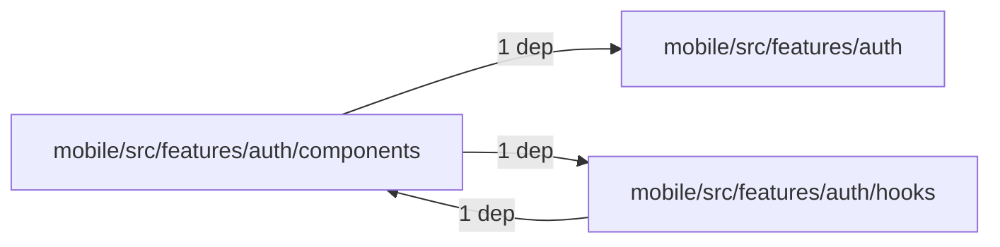

# Module mobile/src/features/auth/components

- Overview: [emplus Docs Wiki](../../../../../../index.md)
- Summary: [SUMMARY](../../../../../../SUMMARY.md)
- Feature catalog: [All features](../../../../../../features/index.md)
- Module index: [All modules](../../../../index.md)
- Workspace index: [All workspaces](../../../../../../workspaces/index.md)

## Snapshot

- Path: `mobile/src/features/auth/components`
- Descendant files: 23
- Descendant symbols: 35
- Languages: `TypeScript`
- Workspace: [@emplus/mobile](../../../../../../workspaces/mobile.md)

## Related Features

- [Authentication Login](../../../../../../features/auth-login.md) - Authentication Login captures the login workflow inside authentication. It spans 2 workspaces. Key flows include Auth login, Auth registration, Auth login.
- [User Management Login](../../../../../../features/user-login.md) - User Management Login captures the login workflow inside user management. It spans 2 workspaces. Key flows include Auth login, Auth registration, Auth login.
- [Search Login](../../../../../../features/search-login.md) - Search Login captures the login workflow inside search. It spans 2 workspaces. Key flows include Auth login, Auth registration, Auth login.
- [Notifications Notify](../../../../../../features/notification-notify.md) - Notifications Notify captures the notify workflow inside notifications. It spans 2 workspaces.
- [Order Management Login](../../../../../../features/order-login.md) - Order Management Login captures the login workflow inside order management. It spans 2 workspaces. Key flows include Auth login, Auth login, Auth login.
- [Notifications Login](../../../../../../features/notification-login.md) - Notifications Login captures the login workflow inside notifications. It spans 2 workspaces. Key flows include Auth login, Auth registration, Auth login.
- [Search Notify](../../../../../../features/search-notify.md) - Search Notify captures the notify workflow inside search. It spans 2 workspaces.
- [Storage Login](../../../../../../features/storage-login.md) - Storage Login captures the login workflow inside storage. It spans 2 workspaces. Key flows include Auth login, Auth registration, Auth login.
- [Authentication Verification](../../../../../../features/auth-verify.md) - Authentication Verification captures the verification workflow inside authentication. It spans 2 workspaces. Key flows include Credential validation, Auth login, Auth login.
- [User Management Notify](../../../../../../features/user-notify.md) - User Management Notify captures the notify workflow inside user management. It spans 2 workspaces.
- [Authentication Password Reset](../../../../../../features/auth-reset.md) - Authentication Password Reset captures the password reset workflow inside authentication. It spans 3 workspaces. Key flows include Password reset, Password reset, Password reset.
- [Notifications Verification](../../../../../../features/notification-verify.md) - Notifications Verification captures the verification workflow inside notifications. It spans 2 workspaces. Key flows include Credential validation, Auth login, Auth login.
- [Order Management Verification](../../../../../../features/order-verify.md) - Order Management Verification captures the verification workflow inside order management. It spans 2 workspaces. Key flows include Credential validation, Auth login, Auth login.
- [Order Management Notify](../../../../../../features/order-notify.md) - Order Management Notify captures the notify workflow inside order management. It spans 2 workspaces.

## Business Capability

AuthGridScreenShell component props

## Basic Design

Components is inferred as a authentication and access control area. The visible implementation layers are UI surface, Entry point, Service / use case. State is likely persisted in primary database, session / token state. The module also integrates with @, expo-status-bar, react, react-native, react-native-keyboard-aware-scroll-view, react-native-safe-area-context.

### Boundaries

- Entry points: `mobile/src/features/auth/components/AuthGridScreenShell.tsx`, `mobile/src/features/auth/components/ForgotPasswordHeroSection.tsx`, `mobile/src/features/auth/components/LoginBrandGradientTitle.tsx`, `mobile/src/features/auth/components/LoginBuilderBackdrop.tsx`, `mobile/src/features/auth/components/LoginDreamHero.tsx`, `mobile/src/features/auth/components/LoginFooterSlot.tsx`
- Data stores: Primary database, Session / token state
- External interfaces: `@`, `expo-status-bar`, `react`, `react-native`, `react-native-keyboard-aware-scroll-view`, `react-native-safe-area-context`

## Detail Design

Primary flow coverage includes Auth login. Representative files are mobile/src/features/auth/components/AuthGridScreenShell.tsx, mobile/src/features/auth/components/ForgotPasswordAuthForm.tsx, mobile/src/features/auth/components/ForgotPasswordHeroSection.tsx, mobile/src/features/auth/components/ForgotPasswordLoginFooter.tsx, mobile/src/features/auth/components/LoginAuthForm.tsx. Observed behavior hints: ForgotPasswordAuthForm component renders form to user for sending forgotten password code

### Components

- UI surface: mobile/src/features/auth/components/AuthGridScreenShell.tsx
- UI surface: mobile/src/features/auth/components/ForgotPasswordHeroSection.tsx
- UI surface: mobile/src/features/auth/components/LoginBrandGradientTitle.tsx
- UI surface: mobile/src/features/auth/components/LoginBuilderBackdrop.tsx
- UI surface: mobile/src/features/auth/components/LoginDreamHero.tsx
- UI surface: mobile/src/features/auth/components/LoginFooterSlot.tsx
- UI surface: mobile/src/features/auth/components/LoginGridAnimatedBackground.tsx
- UI surface: mobile/src/features/auth/components/LoginHeroBackground.tsx

## Module Interactions

- `mobile/src/features/auth/components` -> `mobile/src/features/auth` (1 dependencies)
- `mobile/src/features/auth/components` -> `mobile/src/features/auth/hooks` (1 dependencies)
- `mobile/src/features/auth/hooks` -> `mobile/src/features/auth/components` (1 dependencies)

### Interaction Diagram

## Inferred Business Flows

### Auth login

Authenticate the caller, validate credentials, and establish a usable session or token.

#### Steps

- The user or operator enters the flow through mobile/src/features/auth/components/AuthGridScreenShell.tsx, which surfaces the login interaction. It then hands off to authGridScrollPaddingTop, useAuthGridChrome, LoginGridAnimatedBackground.
- The user or operator enters the flow through mobile/src/features/auth/components/ForgotPasswordHeroSection.tsx, which surfaces the login interaction.
- The user or operator enters the flow through mobile/src/features/auth/components/LoginBrandGradientTitle.tsx, which surfaces the login interaction.
- The user or operator enters the flow through mobile/src/features/auth/components/LoginBuilderBackdrop.tsx, which surfaces the login interaction.
- The user or operator enters the flow through mobile/src/features/auth/components/LoginDreamHero.tsx, which surfaces the login interaction. It then hands off to LoginTopDecor, LoginTopDecor.tsx.
- The user or operator enters the flow through mobile/src/features/auth/components/LoginFooterSlot.tsx, which surfaces the login interaction.

#### Flow Diagram

```mermaid
flowchart LR
  caller["Caller / upstream trigger"]
  n1_AuthGridScreenShell_tsx["mobile/src/features/auth/components/AuthGridScreenShell.tsx\nUI surface"]
  n2_ForgotPasswordHeroSection_tsx["mobile/src/features/auth/components/ForgotPasswordHeroSection.tsx\nUI surface"]
  n3_LoginBrandGradientTitle_tsx["mobile/src/features/auth/components/LoginBrandGradientTitle.tsx\nUI surface"]
  n4_LoginBuilderBackdrop_tsx["mobile/src/features/auth/components/LoginBuilderBackdrop.tsx\nUI surface"]
  n5_LoginDreamHero_tsx["mobile/src/features/auth/components/LoginDreamHero.tsx\nUI surface"]
  n6_LoginFooterSlot_tsx["mobile/src/features/auth/components/LoginFooterSlot.tsx\nUI surface"]
  caller --> n1_AuthGridScreenShell_tsx
  n1_AuthGridScreenShell_tsx --> n2_ForgotPasswordHeroSection_tsx
  n2_ForgotPasswordHeroSection_tsx --> n3_LoginBrandGradientTitle_tsx
  n3_LoginBrandGradientTitle_tsx --> n4_LoginBuilderBackdrop_tsx
  n4_LoginBuilderBackdrop_tsx --> n5_LoginDreamHero_tsx
  n5_LoginDreamHero_tsx --> n6_LoginFooterSlot_tsx
  store["State / data store"]
  n6_LoginFooterSlot_tsx --> store
  ext["External dependency"]
  n6_LoginFooterSlot_tsx --> ext
  outcome["Auth login outcome"]
  n6_LoginFooterSlot_tsx --> outcome
```

## Child Modules

No child modules.

## Direct Files

- [mobile/src/features/auth/components/AuthGridScreenShell.tsx](../../../../../files/mobile/src/features/auth/components/AuthGridScreenShell.tsx.md) — AuthGridScreenShell component props
- [mobile/src/features/auth/components/ForgotPasswordAuthForm.tsx](../../../../../files/mobile/src/features/auth/components/ForgotPasswordAuthForm.tsx.md) — ForgotPasswordAuthForm component renders form to user for sending forgotten password code
- [mobile/src/features/auth/components/ForgotPasswordHeroSection.tsx](../../../../../files/mobile/src/features/auth/components/ForgotPasswordHeroSection.tsx.md) — ForgotPasswordHeroSection component that displays a forgot password hero section with an icon and title.
- [mobile/src/features/auth/components/ForgotPasswordLoginFooter.tsx](../../../../../files/mobile/src/features/auth/components/ForgotPasswordLoginFooter.tsx.md) — The ForgotPasswordLoginFooter component returns a login footer that provides options to reset login credentials.
- [mobile/src/features/auth/components/LoginAuthForm.tsx](../../../../../files/mobile/src/features/auth/components/LoginAuthForm.tsx.md) — Handle routing and theme mode
- [mobile/src/features/auth/components/LoginBrandGradientTitle.tsx](../../../../../files/mobile/src/features/auth/components/LoginBrandGradientTitle.tsx.md) — A React functional component that implements a login brand gradient title with a mask.
- [mobile/src/features/auth/components/LoginBuilderBackdrop.tsx](../../../../../files/mobile/src/features/auth/components/LoginBuilderBackdrop.tsx.md) — Background color for LoginBuilder component (with optional dark mode)
- [mobile/src/features/auth/components/LoginDreamAtmosphere.tsx](../../../../../files/mobile/src/features/auth/components/LoginDreamAtmosphere.tsx.md) — The LoginDreamAtmosphere function is responsible for rendering a dream globe animation
- [mobile/src/features/auth/components/LoginDreamHero.tsx](../../../../../files/mobile/src/features/auth/components/LoginDreamHero.tsx.md) — Component responsible for rendering the login screen's top part
- [mobile/src/features/auth/components/LoginFooterSlot.tsx](../../../../../files/mobile/src/features/auth/components/LoginFooterSlot.tsx.md) — children: ReactNode, gardenSlot?: ReactNode, style?: ViewStyle
- [mobile/src/features/auth/components/LoginGridAnimatedBackground.tsx](../../../../../files/mobile/src/features/auth/components/LoginGridAnimatedBackground.tsx.md) — The LoginGridAnimatedBackground component configures the user interface for a login form grid with animated background effects when the display mode changes from light to dark or vice versa.
- [mobile/src/features/auth/components/LoginHeroBackground.tsx](../../../../../files/mobile/src/features/auth/components/LoginHeroBackground.tsx.md) — The LoginHeroBackground component renders a background image with color variants based on the theme mode.
- [mobile/src/features/auth/components/LoginHeroSection.tsx](../../../../../files/mobile/src/features/auth/components/LoginHeroSection.tsx.md) — The LoginHeroSection component renders a header section with an animated logo mark.
- [mobile/src/features/auth/components/LoginMeshBackground.tsx](../../../../../files/mobile/src/features/auth/components/LoginMeshBackground.tsx.md) — LoginMeshBackground function returns a LoginMeshVariant type representing the variant of the mesh component.
- [mobile/src/features/auth/components/LoginScreenLoading.tsx](../../../../../files/mobile/src/features/auth/components/LoginScreenLoading.tsx.md) — The LoginScreenLoading component is a JSX fragment that displays a loading animation with an Em+Lottie icon.
- [mobile/src/features/auth/components/LoginSignUpFooter.tsx](../../../../../files/mobile/src/features/auth/components/LoginSignUpFooter.tsx.md) — LoginSignUpFooter component
- [mobile/src/features/auth/components/LoginTopDecor.tsx](../../../../../files/mobile/src/features/auth/components/LoginTopDecor.tsx.md) — The LoginTopDecor component renders a string decoration at the top of the screen.
- [mobile/src/features/auth/components/RegisterAuthForm.tsx](../../../../../files/mobile/src/features/auth/components/RegisterAuthForm.tsx.md) — The RegisterAuthForm component handles user registration logic.
- [mobile/src/features/auth/components/RegisterHeroSection.tsx](../../../../../files/mobile/src/features/auth/components/RegisterHeroSection.tsx.md) — HTML element for a registration hero section on the mobile app
- [mobile/src/features/auth/components/RegisterLoginFooter.tsx](../../../../../files/mobile/src/features/auth/components/RegisterLoginFooter.tsx.md) — registers the footer of the login page
- [mobile/src/features/auth/components/RegisterTopBar.tsx](../../../../../files/mobile/src/features/auth/components/RegisterTopBar.tsx.md) — The RegisterTopBar component renders a top navigation bar with options for back pressing, branding, and accessibility settings.
- [mobile/src/features/auth/components/VerifyOtpForm.tsx](../../../../../files/mobile/src/features/auth/components/VerifyOtpForm.tsx.md) — The VerifyOtpForm component is responsible for verifying a user's OTP by obtaining the necessary parameters and submitting them to a server for verification.
- [mobile/src/features/auth/components/VerifyOtpHeroSection.tsx](../../../../../files/mobile/src/features/auth/components/VerifyOtpHeroSection.tsx.md) — A JSX component rendering an OTP verification section with a animated and customizable hero view.
