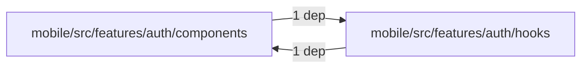
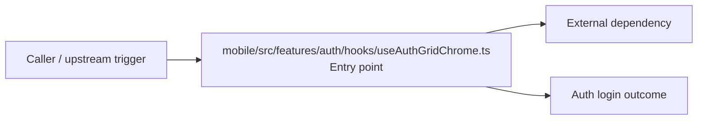

# Module mobile/src/features/auth/hooks

- Overview: [emplus Docs Wiki](../../../../../../index.md)
- Summary: [SUMMARY](../../../../../../SUMMARY.md)
- Feature catalog: [All features](../../../../../../features/index.md)
- Module index: [All modules](../../../../index.md)
- Workspace index: [All workspaces](../../../../../../workspaces/index.md)

## Snapshot

- Path: `mobile/src/features/auth/hooks`
- Descendant files: 1
- Descendant symbols: 1
- Languages: `TypeScript`
- Workspace: [@emplus/mobile](../../../../../../workspaces/mobile.md)

## Related Features

- [Authentication Login](../../../../../../features/auth-login.md) - Authentication Login captures the login workflow inside authentication. It spans 2 workspaces. Key flows include Auth login, Auth registration, Auth login.
- [User Management Login](../../../../../../features/user-login.md) - User Management Login captures the login workflow inside user management. It spans 2 workspaces. Key flows include Auth login, Auth registration, Auth login.

## Business Capability

The `useAuthGridChrome` hook provides a customized background color for the login grid based on Chrome preferences.

## Basic Design

Hooks is inferred as a authentication and access control area. The visible implementation layers are Entry point. The module also integrates with expo-router, expo-system-ui, react.

### Boundaries

- Entry points: `mobile/src/features/auth/hooks/useAuthGridChrome.ts`
- External interfaces: `expo-router`, `expo-system-ui`, `react`

## Detail Design

Primary flow coverage includes Auth login. Representative files are mobile/src/features/auth/hooks/useAuthGridChrome.ts.

### Components

- Entry point: mobile/src/features/auth/hooks/useAuthGridChrome.ts

## Module Interactions

- `mobile/src/features/auth/components` -> `mobile/src/features/auth/hooks` (1 dependencies)
- `mobile/src/features/auth/hooks` -> `mobile/src/features/auth/components` (1 dependencies)

### Interaction Diagram

## Inferred Business Flows

### Auth login

Authenticate the caller, validate credentials, and establish a usable session or token.

#### Steps

- mobile/src/features/auth/hooks/useAuthGridChrome.ts receives the request and turns it into an application-level login command. It then hands off to LoginGridAnimatedBackground, LoginGridAnimatedBackground.tsx.

#### Flow Diagram

## Child Modules

No child modules.

## Direct Files

- [mobile/src/features/auth/hooks/useAuthGridChrome.ts](../../../../../files/mobile/src/features/auth/hooks/useAuthGridChrome.ts.md) — The `useAuthGridChrome` hook provides a customized background color for the login grid based on Chrome preferences.
