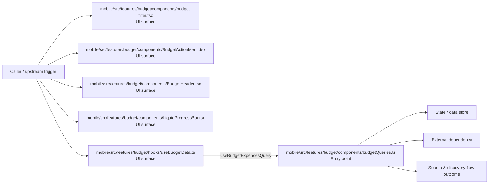

# Module mobile/src/features/budget

- Overview: [emplus Docs Wiki](../../../../../index.md)
- Summary: [SUMMARY](../../../../../SUMMARY.md)
- Feature catalog: [All features](../../../../../features/index.md)
- Module index: [All modules](../../../index.md)
- Workspace index: [All workspaces](../../../../../workspaces/index.md)

## Snapshot

- Path: `mobile/src/features/budget`
- Descendant files: 10
- Descendant symbols: 11
- Languages: `TypeScript`
- Workspace: [@emplus/mobile](../../../../../workspaces/mobile.md)

## Related Features

- [Authentication Read / List](../../../../../features/auth-list.md) - Authentication Read / List captures the read / list workflow inside authentication. It spans 3 workspaces.
- [Search Read / List](../../../../../features/search-list.md) - Search Read / List captures the read / list workflow inside search. It spans 3 workspaces.
- [Reporting Read / List](../../../../../features/reporting-list.md) - Reporting Read / List captures the read / list workflow inside reporting. It spans 2 workspaces.
- [Search Create](../../../../../features/search-create.md) - Search Create captures the create workflow inside search. It spans 2 workspaces.
- [User Management Create](../../../../../features/user-create.md) - User Management Create captures the create workflow inside user management. It spans 2 workspaces.

## Business Capability

BudgetFilter component

## Basic Design

Budget is inferred as a search and discovery area. The visible implementation layers are UI surface, Entry point, Configuration. State is likely persisted in primary database. The module also integrates with @, react, react-native, @expo, expo-blur, @tanstack.

### Boundaries

- Entry points: `mobile/src/features/budget/components/budget-filter.tsx`, `mobile/src/features/budget/components/BudgetActionMenu.tsx`, `mobile/src/features/budget/components/BudgetHeader.tsx`, `mobile/src/features/budget/components/LiquidProgressBar.tsx`, `mobile/src/features/budget/hooks/useBudgetData.ts`, `mobile/src/features/budget/components/budgetQueries.ts`
- Data stores: Primary database
- External interfaces: `@`, `react`, `react-native`, `@expo`, `expo-blur`, `@tanstack`

## Detail Design

Primary flow coverage includes Search &amp; discovery flow. Representative files are mobile/src/features/budget/components/budget-filter.tsx, mobile/src/features/budget/components/BudgetActionMenu.tsx, mobile/src/features/budget/components/BudgetHeader.tsx, mobile/src/features/budget/components/budgetQueries.ts, mobile/src/features/budget/components/BudgetSummaryCard.tsx. Observed behavior hints: A component rendering a budget action menu that provides context to the user.

### Components

- UI surface: mobile/src/features/budget/components/budget-filter.tsx
- UI surface: mobile/src/features/budget/components/BudgetActionMenu.tsx
- UI surface: mobile/src/features/budget/components/BudgetHeader.tsx
- UI surface: mobile/src/features/budget/components/LiquidProgressBar.tsx
- UI surface: mobile/src/features/budget/hooks/useBudgetData.ts
- Entry point: mobile/src/features/budget/components/budgetQueries.ts
- Entry point: mobile/src/features/budget/components/BudgetSummaryCard.tsx
- Entry point: mobile/src/features/budget/components/ExpenseItem.tsx

## Inferred Business Flows

### Search &amp; discovery flow

Handle the main search and discovery use case exposed by this module.

#### Steps

- The user or operator enters the flow through mobile/src/features/budget/components/budget-filter.tsx, which surfaces the request handling interaction. It then hands off to constants.ts.
- The user or operator enters the flow through mobile/src/features/budget/components/BudgetActionMenu.tsx, which surfaces the request handling interaction.
- The user or operator enters the flow through mobile/src/features/budget/components/BudgetHeader.tsx, which surfaces the request handling interaction.
- The user or operator enters the flow through mobile/src/features/budget/components/LiquidProgressBar.tsx, which surfaces the request handling interaction.
- The user or operator enters the flow through mobile/src/features/budget/hooks/useBudgetData.ts, which surfaces the request handling interaction. It then hands off to useBudgetExpensesQuery, budgetQueries.ts.
- mobile/src/features/budget/components/budgetQueries.ts receives the request and turns it into an application-level request handling command.

#### Flow Diagram

## Child Modules

- [mobile/src/features/budget/components](budget/components.md) - 8 files, 10 symbols
- [mobile/src/features/budget/hooks](budget/hooks.md) - 1 file, 1 symbol

## Direct Files

- [mobile/src/features/budget/index.ts](../../../../files/mobile/src/features/budget/index.ts.md) — Index of the budget features module in a mobile application, providing a centralized interface for managing budgets.
