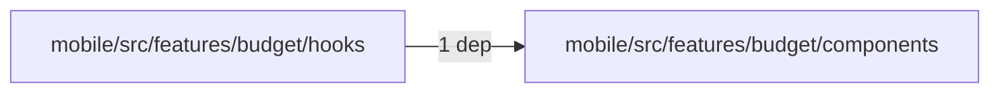
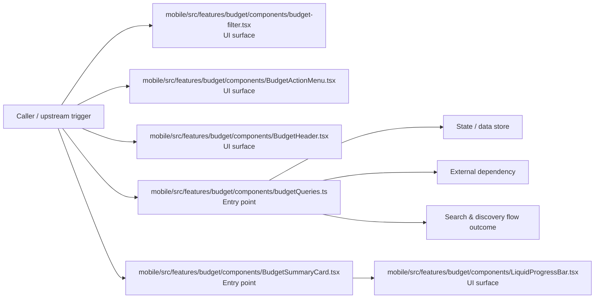

# Module mobile/src/features/budget/components

- Overview: [emplus Docs Wiki](../../../../../../index.md)
- Summary: [SUMMARY](../../../../../../SUMMARY.md)
- Feature catalog: [All features](../../../../../../features/index.md)
- Module index: [All modules](../../../../index.md)
- Workspace index: [All workspaces](../../../../../../workspaces/index.md)

## Snapshot

- Path: `mobile/src/features/budget/components`
- Descendant files: 8
- Descendant symbols: 10
- Languages: `TypeScript`
- Workspace: [@emplus/mobile](../../../../../../workspaces/mobile.md)

## Related Features

- [Search Create](../../../../../../features/search-create.md) - Search Create captures the create workflow inside search. It spans 2 workspaces.
- [User Management Create](../../../../../../features/user-create.md) - User Management Create captures the create workflow inside user management. It spans 2 workspaces.

## Business Capability

BudgetFilter component

## Basic Design

Components is inferred as a search and discovery area. The visible implementation layers are UI surface, Entry point, Configuration. State is likely persisted in primary database. The module also integrates with @, react, react-native, @expo, expo-blur, @tanstack.

### Boundaries

- Entry points: `mobile/src/features/budget/components/budget-filter.tsx`, `mobile/src/features/budget/components/BudgetActionMenu.tsx`, `mobile/src/features/budget/components/BudgetHeader.tsx`, `mobile/src/features/budget/components/LiquidProgressBar.tsx`, `mobile/src/features/budget/components/budgetQueries.ts`, `mobile/src/features/budget/components/BudgetSummaryCard.tsx`
- Data stores: Primary database
- External interfaces: `@`, `react`, `react-native`, `@expo`, `expo-blur`, `@tanstack`

## Detail Design

Primary flow coverage includes Search &amp; discovery flow. Representative files are mobile/src/features/budget/components/budget-filter.tsx, mobile/src/features/budget/components/BudgetActionMenu.tsx, mobile/src/features/budget/components/BudgetHeader.tsx, mobile/src/features/budget/components/budgetQueries.ts, mobile/src/features/budget/components/BudgetSummaryCard.tsx. Observed behavior hints: A component rendering a budget action menu that provides context to the user.

### Components

- UI surface: mobile/src/features/budget/components/budget-filter.tsx
- UI surface: mobile/src/features/budget/components/BudgetActionMenu.tsx
- UI surface: mobile/src/features/budget/components/BudgetHeader.tsx
- UI surface: mobile/src/features/budget/components/LiquidProgressBar.tsx
- Entry point: mobile/src/features/budget/components/budgetQueries.ts
- Entry point: mobile/src/features/budget/components/BudgetSummaryCard.tsx
- Entry point: mobile/src/features/budget/components/ExpenseItem.tsx
- Configuration: mobile/src/features/budget/components/constants.ts

## Module Interactions

- `mobile/src/features/budget/hooks` -> `mobile/src/features/budget/components` (1 dependencies)

### Interaction Diagram

## Inferred Business Flows

### Search &amp; discovery flow

Handle the main search and discovery use case exposed by this module.

#### Steps

- The user or operator enters the flow through mobile/src/features/budget/components/budget-filter.tsx, which surfaces the request handling interaction. It then hands off to constants.ts.
- The user or operator enters the flow through mobile/src/features/budget/components/BudgetActionMenu.tsx, which surfaces the request handling interaction.
- The user or operator enters the flow through mobile/src/features/budget/components/BudgetHeader.tsx, which surfaces the request handling interaction.
- The user or operator enters the flow through mobile/src/features/budget/components/LiquidProgressBar.tsx, which surfaces the request handling interaction.
- mobile/src/features/budget/components/budgetQueries.ts receives the request and turns it into an application-level request handling command.
- mobile/src/features/budget/components/BudgetSummaryCard.tsx receives the request and turns it into an application-level request handling command. It then hands off to LiquidProgressBar.tsx.

#### Flow Diagram

## Child Modules

No child modules.

## Direct Files

- [mobile/src/features/budget/components/budget-filter.tsx](../../../../../files/mobile/src/features/budget/components/budget-filter.tsx.md) — BudgetFilter component
- [mobile/src/features/budget/components/BudgetActionMenu.tsx](../../../../../files/mobile/src/features/budget/components/BudgetActionMenu.tsx.md) — A component rendering a budget action menu that provides context to the user.
- [mobile/src/features/budget/components/BudgetHeader.tsx](../../../../../files/mobile/src/features/budget/components/BudgetHeader.tsx.md) — A reusable budget header component that displays a title and customizable button to toggle menu visibility.
- [mobile/src/features/budget/components/budgetQueries.ts](../../../../../files/mobile/src/features/budget/components/budgetQueries.ts.md) — Bases the `useBudgetSummaryQuery` and `useBudgetExpensesQuery` requests on various budget-related query APIs.
- [mobile/src/features/budget/components/BudgetSummaryCard.tsx](../../../../../files/mobile/src/features/budget/components/BudgetSummaryCard.tsx.md) — Provides 1 documented symbol in mobile/src/features/budget/components/BudgetSummaryCard.tsx.
- [mobile/src/features/budget/components/constants.ts](../../../../../files/mobile/src/features/budget/components/constants.ts.md) — Constants for Mobile Budget features
- [mobile/src/features/budget/components/ExpenseItem.tsx](../../../../../files/mobile/src/features/budget/components/ExpenseItem.tsx.md) — Props for an ExpenseItem component.
- [mobile/src/features/budget/components/LiquidProgressBar.tsx](../../../../../files/mobile/src/features/budget/components/LiquidProgressBar.tsx.md) — Props for a LiquidProgressBar component.
