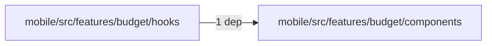
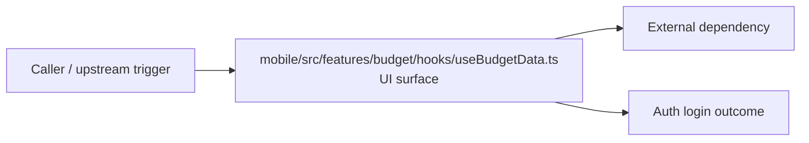

# Module mobile/src/features/budget/hooks

- Overview: [emplus Docs Wiki](../../../../../../index.md)
- Summary: [SUMMARY](../../../../../../SUMMARY.md)
- Feature catalog: [All features](../../../../../../features/index.md)
- Module index: [All modules](../../../../index.md)
- Workspace index: [All workspaces](../../../../../../workspaces/index.md)

## Snapshot

- Path: `mobile/src/features/budget/hooks`
- Descendant files: 1
- Descendant symbols: 1
- Languages: `TypeScript`
- Workspace: [@emplus/mobile](../../../../../../workspaces/mobile.md)

## Related Features

- [Authentication Read / List](../../../../../../features/auth-list.md) - Authentication Read / List captures the read / list workflow inside authentication. It spans 3 workspaces.
- [Search Read / List](../../../../../../features/search-list.md) - Search Read / List captures the read / list workflow inside search. It spans 3 workspaces.
- [Reporting Read / List](../../../../../../features/reporting-list.md) - Reporting Read / List captures the read / list workflow inside reporting. It spans 2 workspaces.

## Business Capability

The `useBudgetData` hook retrieves budget data from various sources and manages the state for displaying a summary or expenses report.

## Basic Design

Hooks is inferred as a authentication and access control area. The visible implementation layers are UI surface. The module also integrates with @, react.

### Boundaries

- Entry points: `mobile/src/features/budget/hooks/useBudgetData.ts`
- External interfaces: `@`, `react`

## Detail Design

Primary flow coverage includes Auth login. Representative files are mobile/src/features/budget/hooks/useBudgetData.ts.

### Components

- UI surface: mobile/src/features/budget/hooks/useBudgetData.ts

## Module Interactions

- `mobile/src/features/budget/hooks` -> `mobile/src/features/budget/components` (1 dependencies)

### Interaction Diagram

## Inferred Business Flows

### Auth login

Authenticate the caller, validate credentials, and establish a usable session or token.

#### Steps

- The user or operator enters the flow through mobile/src/features/budget/hooks/useBudgetData.ts, which surfaces the login interaction. It then hands off to useBudgetExpensesQuery, budgetQueries.ts.

#### Flow Diagram

## Child Modules

No child modules.

## Direct Files

- [mobile/src/features/budget/hooks/useBudgetData.ts](../../../../../files/mobile/src/features/budget/hooks/useBudgetData.ts.md) — The `useBudgetData` hook retrieves budget data from various sources and manages the state for displaying a summary or expenses report.
