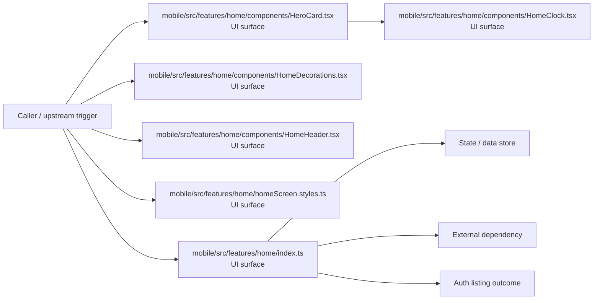

# Module mobile/src/features/home

- Overview: [emplus Docs Wiki](../../../../../index.md)
- Summary: [SUMMARY](../../../../../SUMMARY.md)
- Feature catalog: [All features](../../../../../features/index.md)
- Module index: [All modules](../../../index.md)
- Workspace index: [All workspaces](../../../../../workspaces/index.md)

## Snapshot

- Path: `mobile/src/features/home`
- Descendant files: 13
- Descendant symbols: 23
- Languages: `TypeScript`
- Workspace: [@emplus/mobile](../../../../../workspaces/mobile.md)

## Related Features

- [Authentication Read / List](../../../../../features/auth-list.md) - Authentication Read / List captures the read / list workflow inside authentication. It spans 3 workspaces.
- [Search Read / List](../../../../../features/search-list.md) - Search Read / List captures the read / list workflow inside search. It spans 3 workspaces.
- [User Management Read / List](../../../../../features/user-list.md) - User Management Read / List captures the read / list workflow inside user management. It spans 3 workspaces.

## Business Capability

The FocusCard component structure and its properties.

## Basic Design

Home is inferred as a authentication and access control area. The visible implementation layers are Entry point, UI surface. State is likely persisted in primary database. The module also integrates with @, @expo, expo-router, react, react-native, expo-linear-gradient.

### Boundaries

- Entry points: `mobile/src/features/home/components/HeroCard.tsx`, `mobile/src/features/home/components/HomeClock.tsx`, `mobile/src/features/home/components/HomeDecorations.tsx`, `mobile/src/features/home/components/HomeHeader.tsx`, `mobile/src/features/home/homeScreen.styles.ts`, `mobile/src/features/home/index.ts`
- Data stores: Primary database
- External interfaces: `@`, `@expo`, `expo-router`, `react`, `react-native`, `expo-linear-gradient`

## Detail Design

Primary flow coverage includes Auth listing. Representative files are mobile/src/features/home/components/FocusCard.tsx, mobile/src/features/home/components/HeroCard.tsx, mobile/src/features/home/components/HomeChromeNotificationButton.tsx, mobile/src/features/home/components/HomeClock.tsx, mobile/src/features/home/components/HomeDecorations.tsx. Observed behavior hints: Represents the properties of a HeroCard component.

### Components

- UI surface: mobile/src/features/home/components/HeroCard.tsx
- UI surface: mobile/src/features/home/components/HomeClock.tsx
- UI surface: mobile/src/features/home/components/HomeDecorations.tsx
- UI surface: mobile/src/features/home/components/HomeHeader.tsx
- UI surface: mobile/src/features/home/homeScreen.styles.ts
- UI surface: mobile/src/features/home/index.ts
- Entry point: mobile/src/features/home/components/FocusCard.tsx
- Entry point: mobile/src/features/home/components/HomeChromeNotificationButton.tsx

## Inferred Business Flows

### Auth listing

Execute the module's listing use case inside authentication and access control.

#### Steps

- The user or operator enters the flow through mobile/src/features/home/components/HeroCard.tsx, which surfaces the listing interaction. It then hands off to HomeClock.tsx.
- The user or operator enters the flow through mobile/src/features/home/components/HomeClock.tsx, which surfaces the listing interaction.
- The user or operator enters the flow through mobile/src/features/home/components/HomeDecorations.tsx, which surfaces the listing interaction.
- The user or operator enters the flow through mobile/src/features/home/components/HomeHeader.tsx, which surfaces the listing interaction.
- The user or operator enters the flow through mobile/src/features/home/homeScreen.styles.ts, which surfaces the listing interaction.
- The user or operator enters the flow through mobile/src/features/home/index.ts, which surfaces the listing interaction.

#### Flow Diagram

## Child Modules

- [mobile/src/features/home/components](home/components.md) - 10 files, 21 symbols
- [mobile/src/features/home/hooks](home/hooks.md) - 1 file, 2 symbols

## Direct Files

- [mobile/src/features/home/homeScreen.styles.ts](../../../../files/mobile/src/features/home/homeScreen.styles.ts.md) — Feature home screen styles sheet for the mobile app.
- [mobile/src/features/home/index.ts](../../../../files/mobile/src/features/home/index.ts.md) — Feature index for mobile application's home page, responsible for presenting the user with a list of features.
