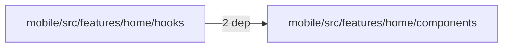
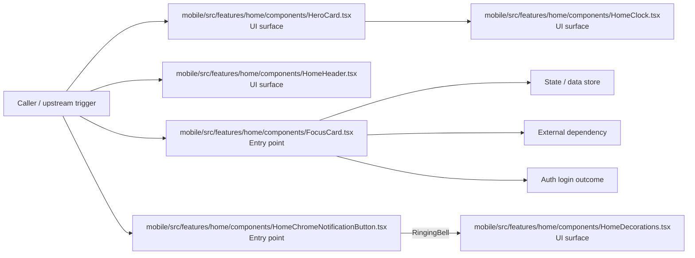

# Module mobile/src/features/home/components

- Overview: [emplus Docs Wiki](../../../../../../index.md)
- Summary: [SUMMARY](../../../../../../SUMMARY.md)
- Feature catalog: [All features](../../../../../../features/index.md)
- Module index: [All modules](../../../../index.md)
- Workspace index: [All workspaces](../../../../../../workspaces/index.md)

## Snapshot

- Path: `mobile/src/features/home/components`
- Descendant files: 10
- Descendant symbols: 21
- Languages: `TypeScript`
- Workspace: [@emplus/mobile](../../../../../../workspaces/mobile.md)

## Related Features

- [Authentication Read / List](../../../../../../features/auth-list.md) - Authentication Read / List captures the read / list workflow inside authentication. It spans 3 workspaces.

## Business Capability

The FocusCard component structure and its properties.

## Basic Design

Components is inferred as a authentication and access control area. The visible implementation layers are Entry point, UI surface. State is likely persisted in primary database. The module also integrates with @, @expo, expo-router, react, react-native, expo-linear-gradient.

### Boundaries

- Entry points: `mobile/src/features/home/components/HeroCard.tsx`, `mobile/src/features/home/components/HomeClock.tsx`, `mobile/src/features/home/components/HomeDecorations.tsx`, `mobile/src/features/home/components/HomeHeader.tsx`, `mobile/src/features/home/components/FocusCard.tsx`, `mobile/src/features/home/components/HomeChromeNotificationButton.tsx`
- Data stores: Primary database
- External interfaces: `@`, `@expo`, `expo-router`, `react`, `react-native`, `expo-linear-gradient`

## Detail Design

Primary flow coverage includes Auth login. Representative files are mobile/src/features/home/components/FocusCard.tsx, mobile/src/features/home/components/HeroCard.tsx, mobile/src/features/home/components/HomeChromeNotificationButton.tsx, mobile/src/features/home/components/HomeClock.tsx, mobile/src/features/home/components/HomeDecorations.tsx. Observed behavior hints: Represents the properties of a HeroCard component.

### Components

- UI surface: mobile/src/features/home/components/HeroCard.tsx
- UI surface: mobile/src/features/home/components/HomeClock.tsx
- UI surface: mobile/src/features/home/components/HomeDecorations.tsx
- UI surface: mobile/src/features/home/components/HomeHeader.tsx
- Entry point: mobile/src/features/home/components/FocusCard.tsx
- Entry point: mobile/src/features/home/components/HomeChromeNotificationButton.tsx
- Entry point: mobile/src/features/home/components/homeMap.ts
- Entry point: mobile/src/features/home/components/homeQueries.ts

## Module Interactions

- `mobile/src/features/home/hooks` -> `mobile/src/features/home/components` (2 dependencies)

### Interaction Diagram

## Inferred Business Flows

### Auth login

Authenticate the caller, validate credentials, and establish a usable session or token.

#### Steps

- The user or operator enters the flow through mobile/src/features/home/components/HeroCard.tsx, which surfaces the login interaction. It then hands off to HomeClock.tsx.
- The user or operator enters the flow through mobile/src/features/home/components/HomeClock.tsx, which surfaces the login interaction.
- The user or operator enters the flow through mobile/src/features/home/components/HomeDecorations.tsx, which surfaces the login interaction.
- The user or operator enters the flow through mobile/src/features/home/components/HomeHeader.tsx, which surfaces the login interaction.
- mobile/src/features/home/components/FocusCard.tsx receives the request and turns it into an application-level login command.
- mobile/src/features/home/components/HomeChromeNotificationButton.tsx receives the request and turns it into an application-level login command. It then hands off to RingingBell, HomeDecorations.tsx.

#### Flow Diagram

## Child Modules

No child modules.

## Direct Files

- [mobile/src/features/home/components/FocusCard.tsx](../../../../../files/mobile/src/features/home/components/FocusCard.tsx.md) — The FocusCard component structure and its properties.
- [mobile/src/features/home/components/HeroCard.tsx](../../../../../files/mobile/src/features/home/components/HeroCard.tsx.md) — Represents the properties of a HeroCard component.
- [mobile/src/features/home/components/HomeChromeNotificationButton.tsx](../../../../../files/mobile/src/features/home/components/HomeChromeNotificationButton.tsx.md) — The HomeChromeNotificationButton component is a reusable button for displaying Chrome notifications.
- [mobile/src/features/home/components/HomeClock.tsx](../../../../../files/mobile/src/features/home/components/HomeClock.tsx.md) — Home Clock component functions and returns a ClockTicker.
- [mobile/src/features/home/components/HomeDecorations.tsx](../../../../../files/mobile/src/features/home/components/HomeDecorations.tsx.md) — A PulseStar component for decorating screens with a custom star shape.
- [mobile/src/features/home/components/HomeHeader.tsx](../../../../../files/mobile/src/features/home/components/HomeHeader.tsx.md) — Interface defining the properties of a HomeHeader component.
- [mobile/src/features/home/components/homeMap.ts](../../../../../files/mobile/src/features/home/components/homeMap.ts.md) — /api/features/home/components/homeMap function:mapDashboardData
- [mobile/src/features/home/components/homeQueries.ts](../../../../../files/mobile/src/features/home/components/homeQueries.ts.md) — Provides a mobile home queries feature that retrieves data from the dashboard using an API with user's access token.
- [mobile/src/features/home/components/QuickActions.tsx](../../../../../files/mobile/src/features/home/components/QuickActions.tsx.md) — Properties of the QuickActions component
- [mobile/src/features/home/components/UpcomingEvents.tsx](../../../../../files/mobile/src/features/home/components/UpcomingEvents.tsx.md) — The UpcomingEvents component displays a list of upcoming events.
