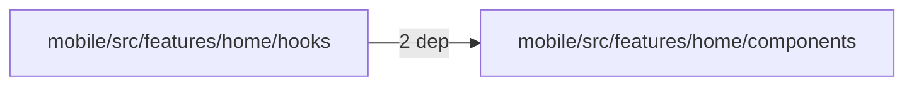
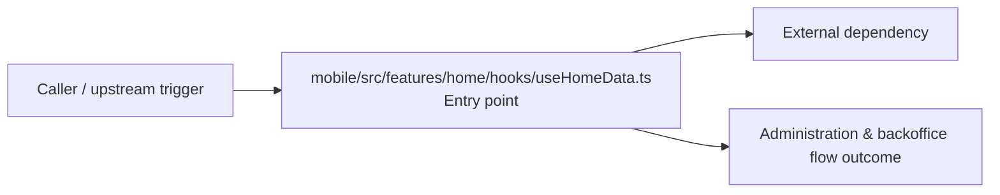

# Module mobile/src/features/home/hooks

- Overview: [emplus Docs Wiki](../../../../../../index.md)
- Summary: [SUMMARY](../../../../../../SUMMARY.md)
- Feature catalog: [All features](../../../../../../features/index.md)
- Module index: [All modules](../../../../index.md)
- Workspace index: [All workspaces](../../../../../../workspaces/index.md)

## Snapshot

- Path: `mobile/src/features/home/hooks`
- Descendant files: 1
- Descendant symbols: 2
- Languages: `TypeScript`
- Workspace: [@emplus/mobile](../../../../../../workspaces/mobile.md)

## Business Capability

UseHomeData hooks the mobile app's home data management system.

## Basic Design

Hooks is inferred as a administration and backoffice area. The visible implementation layers are Entry point. The module also integrates with @, react.

### Boundaries

- Entry points: `mobile/src/features/home/hooks/useHomeData.ts`
- External interfaces: `@`, `react`

## Detail Design

Primary flow coverage includes Administration &amp; backoffice flow. Representative files are mobile/src/features/home/hooks/useHomeData.ts.

### Components

- Entry point: mobile/src/features/home/hooks/useHomeData.ts

## Module Interactions

- `mobile/src/features/home/hooks` -> `mobile/src/features/home/components` (2 dependencies)

### Interaction Diagram

## Inferred Business Flows

### Administration &amp; backoffice flow

Handle the main administration and backoffice use case exposed by this module.

#### Steps

- mobile/src/features/home/hooks/useHomeData.ts receives the request and turns it into an application-level request handling command. It then hands off to mapDashboardData, useHomeQuery, homeMap.ts.

#### Flow Diagram

## Child Modules

No child modules.

## Direct Files

- [mobile/src/features/home/hooks/useHomeData.ts](../../../../../files/mobile/src/features/home/hooks/useHomeData.ts.md) — UseHomeData hooks the mobile app's home data management system.
