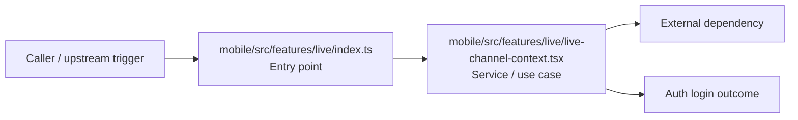

# Module mobile/src/features/live

- Overview: [emplus Docs Wiki](../../../../../index.md)
- Summary: [SUMMARY](../../../../../SUMMARY.md)
- Feature catalog: [All features](../../../../../features/index.md)
- Module index: [All modules](../../../index.md)
- Workspace index: [All workspaces](../../../../../workspaces/index.md)

## Snapshot

- Path: `mobile/src/features/live`
- Descendant files: 2
- Descendant symbols: 8
- Languages: `TypeScript`
- Workspace: [@emplus/mobile](../../../../../workspaces/mobile.md)

## Related Features

- [Notifications Notify](../../../../../features/notification-notify.md) - Notifications Notify captures the notify workflow inside notifications. It spans 2 workspaces.
- [Integrations Notify](../../../../../features/integration-notify.md) - Integrations Notify captures the notify workflow inside integrations. It spans 2 workspaces.
- [User Management Notify](../../../../../features/user-notify.md) - User Management Notify captures the notify workflow inside user management. It spans 2 workspaces.

## Business Capability

The index file for the mobile app's live features.

## Basic Design

Live is inferred as a authentication and access control area. The visible implementation layers are Entry point, Service / use case. The module also integrates with @, react.

### Boundaries

- Entry points: `mobile/src/features/live/index.ts`
- External interfaces: `@`, `react`

## Detail Design

Primary flow coverage includes Auth login. Representative files are mobile/src/features/live/index.ts, mobile/src/features/live/live-channel-context.tsx. Observed behavior hints: The LiveChannelProvider class is responsible for managing live channel functionality.

### Components

- Entry point: mobile/src/features/live/index.ts
- Service / use case: mobile/src/features/live/live-channel-context.tsx

## Inferred Business Flows

### Auth login

Authenticate the caller, validate credentials, and establish a usable session or token.

#### Steps

- mobile/src/features/live/index.ts receives the request and turns it into an application-level login command.
- mobile/src/features/live/live-channel-context.tsx coordinates the core business rules and state changes for the flow.

#### Flow Diagram

## Child Modules

No child modules.

## Direct Files

- [mobile/src/features/live/index.ts](../../../../files/mobile/src/features/live/index.ts.md) — The index file for the mobile app's live features.
- [mobile/src/features/live/live-channel-context.tsx](../../../../files/mobile/src/features/live/live-channel-context.tsx.md) — The LiveChannelProvider class is responsible for managing live channel functionality.
