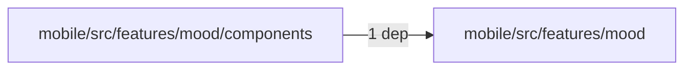
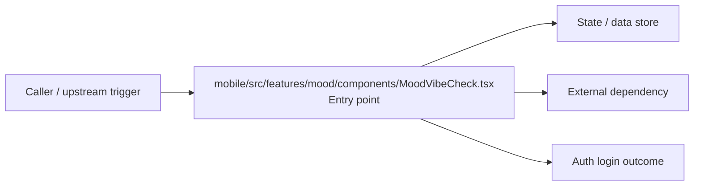

# Module mobile/src/features/mood

- Overview: [emplus Docs Wiki](../../../../../index.md)
- Summary: [SUMMARY](../../../../../SUMMARY.md)
- Feature catalog: [All features](../../../../../features/index.md)
- Module index: [All modules](../../../index.md)
- Workspace index: [All workspaces](../../../../../workspaces/index.md)

## Snapshot

- Path: `mobile/src/features/mood`
- Descendant files: 3
- Descendant symbols: 10
- Languages: `TypeScript`
- Workspace: [@emplus/mobile](../../../../../workspaces/mobile.md)

## Related Features

- [Authentication Verification](../../../../../features/auth-verify.md) - Authentication Verification captures the verification workflow inside authentication. It spans 2 workspaces. Key flows include Credential validation, Auth login, Auth login.
- [Storage Verification](../../../../../features/storage-verify.md) - Storage Verification captures the verification workflow inside storage. It spans 2 workspaces. Key flows include Credential validation, Auth login, Auth login.
- [Integrations Verification](../../../../../features/integration-verify.md) - Integrations Verification captures the verification workflow inside integrations. It spans 2 workspaces. Key flows include Credential validation, Auth login, Auth login.

## Business Capability

MoodVibeCheck component

## Basic Design

Mood is inferred as a authentication and access control area. The visible implementation layers are Utility, Entry point. State is likely persisted in primary database. The module also integrates with @, @expo, @tanstack, expo-linear-gradient, react, react-native.

### Boundaries

- Entry points: `mobile/src/features/mood/components/MoodVibeCheck.tsx`
- Data stores: Primary database
- External interfaces: `@`, `@expo`, `@tanstack`, `expo-linear-gradient`, `react`, `react-native`

## Detail Design

Primary flow coverage includes Auth login. Representative files are mobile/src/features/mood/components/MoodVibeCheck.tsx, mobile/src/features/mood/index.ts, mobile/src/features/mood/mood-band.ts. Observed behavior hints: Function to track mood and provide insights

### Components

- Entry point: mobile/src/features/mood/components/MoodVibeCheck.tsx
- Utility: mobile/src/features/mood/index.ts
- Utility: mobile/src/features/mood/mood-band.ts

## Module Interactions

- `mobile/src/features/mood/components` -> `mobile/src/features/mood` (1 dependencies)

### Interaction Diagram

## Inferred Business Flows

### Auth login

Authenticate the caller, validate credentials, and establish a usable session or token.

#### Steps

- mobile/src/features/mood/components/MoodVibeCheck.tsx receives the request and turns it into an application-level login command. It then hands off to MoodBand, mood-band.ts.

#### Flow Diagram

## Child Modules

- [mobile/src/features/mood/components](mood/components.md) - 1 file, 8 symbols

## Direct Files

- [mobile/src/features/mood/index.ts](../../../../files/mobile/src/features/mood/index.ts.md) — Function to track mood and provide insights
- [mobile/src/features/mood/mood-band.ts](../../../../files/mobile/src/features/mood/mood-band.ts.md) — A function that maps numeric values to MoodBand types
