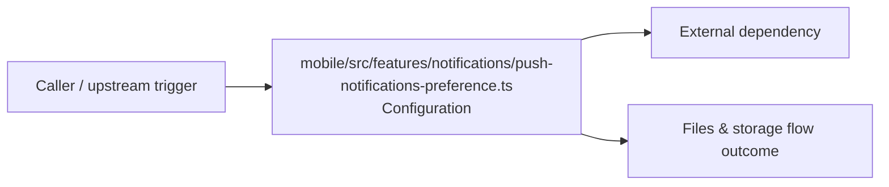

# Module mobile/src/features/notifications

- Overview: [emplus Docs Wiki](../../../../../index.md)
- Summary: [SUMMARY](../../../../../SUMMARY.md)
- Feature catalog: [All features](../../../../../features/index.md)
- Module index: [All modules](../../../index.md)
- Workspace index: [All workspaces](../../../../../workspaces/index.md)

## Snapshot

- Path: `mobile/src/features/notifications`
- Descendant files: 1
- Descendant symbols: 2
- Languages: `TypeScript`
- Workspace: [@emplus/mobile](../../../../../workspaces/mobile.md)

## Related Features

- [Authentication Read / List](../../../../../features/auth-list.md) - Authentication Read / List captures the read / list workflow inside authentication. It spans 3 workspaces.
- [Notifications Read / List](../../../../../features/notification-list.md) - Notifications Read / List captures the read / list workflow inside notifications. It spans 2 workspaces.
- [Storage Read / List](../../../../../features/storage-list.md) - Storage Read / List captures the read / list workflow inside storage. It spans 4 workspaces.

## Business Capability

gets the current push notification preference value from stored cache.

## Basic Design

Notifications is inferred as a files and storage area. The visible implementation layers are Configuration. The module also integrates with @, @react-native-async-storage.

### Boundaries

- External interfaces: `@`, `@react-native-async-storage`

## Detail Design

Primary flow coverage includes Files &amp; storage flow. Representative files are mobile/src/features/notifications/push-notifications-preference.ts.

### Components

- Configuration: mobile/src/features/notifications/push-notifications-preference.ts

## Inferred Business Flows

### Files &amp; storage flow

Handle the main files and storage use case exposed by this module.

#### Steps

- mobile/src/features/notifications/push-notifications-preference.ts supplies runtime configuration that shapes how the flow behaves.

#### Flow Diagram

## Child Modules

No child modules.

## Direct Files

- [mobile/src/features/notifications/push-notifications-preference.ts](../../../../files/mobile/src/features/notifications/push-notifications-preference.ts.md) — gets the current push notification preference value from stored cache.
