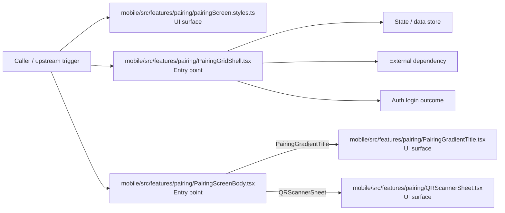
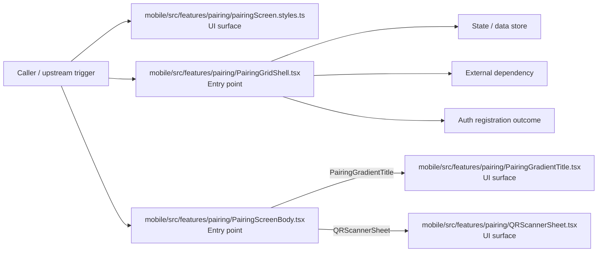

# Module mobile/src/features/pairing

- Overview: [emplus Docs Wiki](../../../../../index.md)
- Summary: [SUMMARY](../../../../../SUMMARY.md)
- Feature catalog: [All features](../../../../../features/index.md)
- Module index: [All modules](../../../index.md)
- Workspace index: [All workspaces](../../../../../workspaces/index.md)

## Snapshot

- Path: `mobile/src/features/pairing`
- Descendant files: 5
- Descendant symbols: 6
- Languages: `TypeScript`
- Workspace: [@emplus/mobile](../../../../../workspaces/mobile.md)

## Related Features

- [Authentication Login](../../../../../features/auth-login.md) - Authentication Login captures the login workflow inside authentication. It spans 2 workspaces. Key flows include Auth login, Auth registration, Auth login.

## Business Capability

A function to render a pairing gradient with title 'Ghép đôi'

## Basic Design

Pairing is inferred as a authentication and access control area. The visible implementation layers are UI surface, Entry point. State is likely persisted in session / token state, primary database. The module also integrates with @react-native-masked-view, expo-linear-gradient, react, react-native, @, expo-router.

### Boundaries

- Entry points: `mobile/src/features/pairing/PairingGradientTitle.tsx`, `mobile/src/features/pairing/pairingScreen.styles.ts`, `mobile/src/features/pairing/QRScannerSheet.tsx`, `mobile/src/features/pairing/PairingGridShell.tsx`, `mobile/src/features/pairing/PairingScreenBody.tsx`
- Data stores: Session / token state, Primary database
- External interfaces: `@react-native-masked-view`, `expo-linear-gradient`, `react`, `react-native`, `@`, `expo-router`

## Detail Design

Primary flow coverage includes Auth login, Auth registration. Representative files are mobile/src/features/pairing/PairingGradientTitle.tsx, mobile/src/features/pairing/PairingGridShell.tsx, mobile/src/features/pairing/pairingScreen.styles.ts, mobile/src/features/pairing/PairingScreenBody.tsx, mobile/src/features/pairing/QRScannerSheet.tsx. Observed behavior hints: The PairingGridShell component is a wrapper around the AppScreen component, responsible for managing login and registration screens.

### Components

- UI surface: mobile/src/features/pairing/PairingGradientTitle.tsx
- UI surface: mobile/src/features/pairing/pairingScreen.styles.ts
- UI surface: mobile/src/features/pairing/QRScannerSheet.tsx
- Entry point: mobile/src/features/pairing/PairingGridShell.tsx
- Entry point: mobile/src/features/pairing/PairingScreenBody.tsx

## Inferred Business Flows

### Auth login

Authenticate the caller, validate credentials, and establish a usable session or token.

#### Steps

- The user or operator enters the flow through mobile/src/features/pairing/PairingGradientTitle.tsx, which surfaces the login interaction.
- The user or operator enters the flow through mobile/src/features/pairing/pairingScreen.styles.ts, which surfaces the login interaction.
- The user or operator enters the flow through mobile/src/features/pairing/QRScannerSheet.tsx, which surfaces the login interaction.
- mobile/src/features/pairing/PairingGridShell.tsx receives the request and turns it into an application-level login command.
- mobile/src/features/pairing/PairingScreenBody.tsx receives the request and turns it into an application-level login command. It then hands off to PairingGradientTitle, QRScannerSheet, PairingGradientTitle.tsx.

#### Flow Diagram

### Auth registration

Execute the module's registration use case inside authentication and access control.

#### Steps

- The user or operator enters the flow through mobile/src/features/pairing/PairingGradientTitle.tsx, which surfaces the registration interaction.
- The user or operator enters the flow through mobile/src/features/pairing/pairingScreen.styles.ts, which surfaces the registration interaction.
- The user or operator enters the flow through mobile/src/features/pairing/QRScannerSheet.tsx, which surfaces the registration interaction.
- mobile/src/features/pairing/PairingGridShell.tsx receives the request and turns it into an application-level registration command.
- mobile/src/features/pairing/PairingScreenBody.tsx receives the request and turns it into an application-level registration command. It then hands off to PairingGradientTitle, QRScannerSheet, PairingGradientTitle.tsx.

#### Flow Diagram

## Child Modules

No child modules.

## Direct Files

- [mobile/src/features/pairing/PairingGradientTitle.tsx](../../../../files/mobile/src/features/pairing/PairingGradientTitle.tsx.md) — A function to render a pairing gradient with title 'Ghép đôi'
- [mobile/src/features/pairing/PairingGridShell.tsx](../../../../files/mobile/src/features/pairing/PairingGridShell.tsx.md) — The PairingGridShell component is a wrapper around the AppScreen component, responsible for managing login and registration screens.
- [mobile/src/features/pairing/pairingScreen.styles.ts](../../../../files/mobile/src/features/pairing/pairingScreen.styles.ts.md) — Style definitions for the pairing screen
- [mobile/src/features/pairing/PairingScreenBody.tsx](../../../../files/mobile/src/features/pairing/PairingScreenBody.tsx.md) — The PairingScreenBody component is responsible for rendering the pairingscreen body and handling user input for pairing devices, including invite codes and join codes.
- [mobile/src/features/pairing/QRScannerSheet.tsx](../../../../files/mobile/src/features/pairing/QRScannerSheet.tsx.md) — Defines the structure of the QRScannerSheet functional component.
