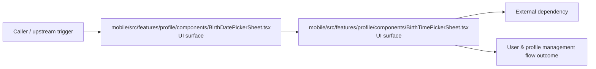

# Module mobile/src/features/profile

- Overview: [emplus Docs Wiki](../../../../../index.md)
- Summary: [SUMMARY](../../../../../SUMMARY.md)
- Feature catalog: [All features](../../../../../features/index.md)
- Module index: [All modules](../../../index.md)
- Workspace index: [All workspaces](../../../../../workspaces/index.md)

## Snapshot

- Path: `mobile/src/features/profile`
- Descendant files: 2
- Descendant symbols: 4
- Languages: `TypeScript`
- Workspace: [@emplus/mobile](../../../../../workspaces/mobile.md)

## Business Capability

A component representing a date picker sheet with customizable options.

## Basic Design

Profile is inferred as a user and profile management area. The visible implementation layers are UI surface. The module also integrates with @, react-native.

### Boundaries

- Entry points: `mobile/src/features/profile/components/BirthDatePickerSheet.tsx`, `mobile/src/features/profile/components/BirthTimePickerSheet.tsx`
- External interfaces: `@`, `react-native`

## Detail Design

Primary flow coverage includes User &amp; profile management flow. Representative files are mobile/src/features/profile/components/BirthDatePickerSheet.tsx, mobile/src/features/profile/components/BirthTimePickerSheet.tsx. Observed behavior hints: The `BirthTimePickerSheet` component renders a time picker that allows the user to select their birth time.

### Components

- UI surface: mobile/src/features/profile/components/BirthDatePickerSheet.tsx
- UI surface: mobile/src/features/profile/components/BirthTimePickerSheet.tsx

## Inferred Business Flows

### User &amp; profile management flow

Handle the main user and profile management use case exposed by this module.

#### Steps

- The user or operator enters the flow through mobile/src/features/profile/components/BirthDatePickerSheet.tsx, which surfaces the request handling interaction.
- The user or operator enters the flow through mobile/src/features/profile/components/BirthTimePickerSheet.tsx, which surfaces the request handling interaction.

#### Flow Diagram

## Child Modules

- [mobile/src/features/profile/components](profile/components.md) - 2 files, 4 symbols

## Direct Files

No files directly under this module.
