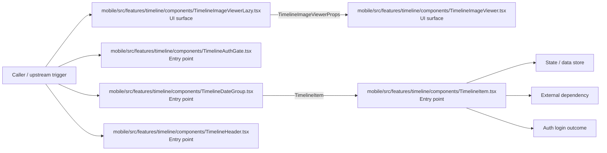

# Module mobile/src/features/timeline

- Overview: [emplus Docs Wiki](../../../../../index.md)
- Summary: [SUMMARY](../../../../../SUMMARY.md)
- Feature catalog: [All features](../../../../../features/index.md)
- Module index: [All modules](../../../index.md)
- Workspace index: [All workspaces](../../../../../workspaces/index.md)

## Snapshot

- Path: `mobile/src/features/timeline`
- Descendant files: 16
- Descendant symbols: 25
- Languages: `TypeScript`
- Workspace: [@emplus/mobile](../../../../../workspaces/mobile.md)

## Related Features

- [Authentication Login](../../../../../features/auth-login.md) - Authentication Login captures the login workflow inside authentication. It spans 2 workspaces. Key flows include Auth login, Auth registration, Auth login.
- [Authentication Read / List](../../../../../features/auth-list.md) - Authentication Read / List captures the read / list workflow inside authentication. It spans 3 workspaces.
- [User Management Login](../../../../../features/user-login.md) - User Management Login captures the login workflow inside user management. It spans 2 workspaces. Key flows include Auth login, Auth registration, Auth login.
- [Search Read / List](../../../../../features/search-list.md) - Search Read / List captures the read / list workflow inside search. It spans 3 workspaces.
- [Search Login](../../../../../features/search-login.md) - Search Login captures the login workflow inside search. It spans 2 workspaces. Key flows include Auth login, Auth registration, Auth login.
- [Notifications Read / List](../../../../../features/notification-list.md) - Notifications Read / List captures the read / list workflow inside notifications. It spans 2 workspaces.
- [User Management Read / List](../../../../../features/user-list.md) - User Management Read / List captures the read / list workflow inside user management. It spans 3 workspaces.
- [Order Management Login](../../../../../features/order-login.md) - Order Management Login captures the login workflow inside order management. It spans 2 workspaces. Key flows include Auth login, Auth login, Auth login.
- [Notifications Login](../../../../../features/notification-login.md) - Notifications Login captures the login workflow inside notifications. It spans 2 workspaces. Key flows include Auth login, Auth registration, Auth login.
- [Order Management Read / List](../../../../../features/order-list.md) - Order Management Read / List captures the read / list workflow inside order management. It spans 2 workspaces.

## Business Capability

.url's array,

## Basic Design

Timeline is inferred as a authentication and access control area. The visible implementation layers are Entry point, Utility, UI surface. State is likely persisted in primary database. The module also integrates with @, expo-image, react, react-native, expo-router, @expo.

### Boundaries

- Entry points: `mobile/src/features/timeline/components/TimelineImageViewer.tsx`, `mobile/src/features/timeline/components/TimelineImageViewerLazy.tsx`, `mobile/src/features/timeline/components/TimelineAuthGate.tsx`, `mobile/src/features/timeline/components/TimelineDateGroup.tsx`, `mobile/src/features/timeline/components/TimelineHeader.tsx`, `mobile/src/features/timeline/components/TimelineItem.tsx`
- Data stores: Primary database
- External interfaces: `@`, `expo-image`, `react`, `react-native`, `expo-router`, `@expo`

## Detail Design

Primary flow coverage includes Auth login. Representative files are mobile/src/features/timeline/components/MemoryDetailBentoGrid.tsx, mobile/src/features/timeline/components/TimelineAuthGate.tsx, mobile/src/features/timeline/components/TimelineDateGroup.tsx, mobile/src/features/timeline/components/TimelineDateGroupHeader.tsx, mobile/src/features/timeline/components/TimelineHeader.tsx. Observed behavior hints: The TimelineAuthGate component verifies user authentication and presents a login or pairing button.

### Components

- UI surface: mobile/src/features/timeline/components/TimelineImageViewer.tsx
- UI surface: mobile/src/features/timeline/components/TimelineImageViewerLazy.tsx
- Entry point: mobile/src/features/timeline/components/TimelineAuthGate.tsx
- Entry point: mobile/src/features/timeline/components/TimelineDateGroup.tsx
- Entry point: mobile/src/features/timeline/components/TimelineHeader.tsx
- Entry point: mobile/src/features/timeline/components/TimelineItem.tsx
- Entry point: mobile/src/features/timeline/components/timelineMap.ts
- Entry point: mobile/src/features/timeline/components/TimelineMemoryRow.tsx

## Inferred Business Flows

### Auth login

Authenticate the caller, validate credentials, and establish a usable session or token.

#### Steps

- The user or operator enters the flow through mobile/src/features/timeline/components/TimelineImageViewer.tsx, which surfaces the login interaction.
- The user or operator enters the flow through mobile/src/features/timeline/components/TimelineImageViewerLazy.tsx, which surfaces the login interaction. It then hands off to TimelineImageViewerProps, TimelineImageViewer.tsx.
- mobile/src/features/timeline/components/TimelineAuthGate.tsx receives the request and turns it into an application-level login command.
- mobile/src/features/timeline/components/TimelineDateGroup.tsx receives the request and turns it into an application-level login command. It then hands off to TimelineItem.tsx.
- mobile/src/features/timeline/components/TimelineHeader.tsx receives the request and turns it into an application-level login command.
- mobile/src/features/timeline/components/TimelineItem.tsx receives the request and turns it into an application-level login command.

#### Flow Diagram

## Child Modules

- [mobile/src/features/timeline/components](timeline/components.md) - 12 files, 22 symbols
- [mobile/src/features/timeline/hooks](timeline/hooks.md) - 2 files, 2 symbols
- [mobile/src/features/timeline/screens](timeline/screens.md) - 1 file, 1 symbol

## Direct Files

- [mobile/src/features/timeline/index.ts](../../../../files/mobile/src/features/timeline/index.ts.md) — Timeline feature index file.
