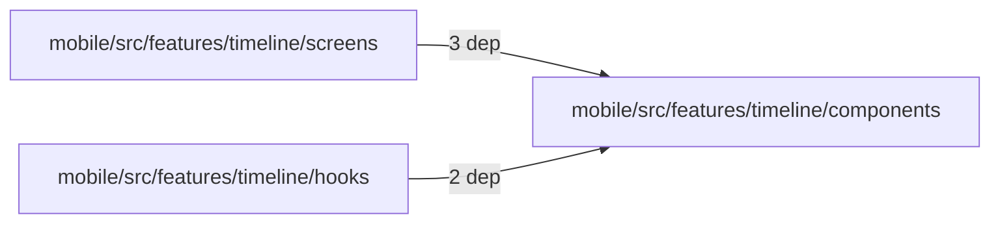
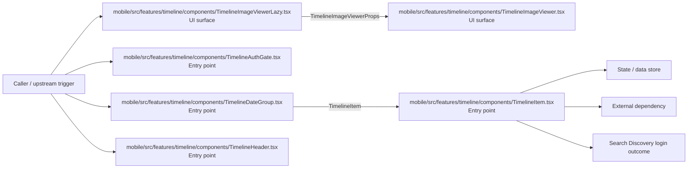

# Module mobile/src/features/timeline/components

- Overview: [emplus Docs Wiki](../../../../../../index.md)
- Summary: [SUMMARY](../../../../../../SUMMARY.md)
- Feature catalog: [All features](../../../../../../features/index.md)
- Module index: [All modules](../../../../index.md)
- Workspace index: [All workspaces](../../../../../../workspaces/index.md)

## Snapshot

- Path: `mobile/src/features/timeline/components`
- Descendant files: 12
- Descendant symbols: 22
- Languages: `TypeScript`
- Workspace: [@emplus/mobile](../../../../../../workspaces/mobile.md)

## Related Features

- [Authentication Login](../../../../../../features/auth-login.md) - Authentication Login captures the login workflow inside authentication. It spans 2 workspaces. Key flows include Auth login, Auth registration, Auth login.
- [Authentication Read / List](../../../../../../features/auth-list.md) - Authentication Read / List captures the read / list workflow inside authentication. It spans 3 workspaces.
- [User Management Login](../../../../../../features/user-login.md) - User Management Login captures the login workflow inside user management. It spans 2 workspaces. Key flows include Auth login, Auth registration, Auth login.
- [Search Read / List](../../../../../../features/search-list.md) - Search Read / List captures the read / list workflow inside search. It spans 3 workspaces.
- [Search Login](../../../../../../features/search-login.md) - Search Login captures the login workflow inside search. It spans 2 workspaces. Key flows include Auth login, Auth registration, Auth login.
- [Notifications Read / List](../../../../../../features/notification-list.md) - Notifications Read / List captures the read / list workflow inside notifications. It spans 2 workspaces.
- [User Management Read / List](../../../../../../features/user-list.md) - User Management Read / List captures the read / list workflow inside user management. It spans 3 workspaces.
- [Order Management Read / List](../../../../../../features/order-list.md) - Order Management Read / List captures the read / list workflow inside order management. It spans 2 workspaces.

## Business Capability

.url's array,

## Basic Design

Components is inferred as a search and discovery area. The visible implementation layers are Entry point, UI surface, Utility. State is likely persisted in primary database. The module also integrates with @, expo-image, react, react-native, expo-router, @expo.

### Boundaries

- Entry points: `mobile/src/features/timeline/components/TimelineImageViewer.tsx`, `mobile/src/features/timeline/components/TimelineImageViewerLazy.tsx`, `mobile/src/features/timeline/components/TimelineAuthGate.tsx`, `mobile/src/features/timeline/components/TimelineDateGroup.tsx`, `mobile/src/features/timeline/components/TimelineHeader.tsx`, `mobile/src/features/timeline/components/TimelineItem.tsx`
- Data stores: Primary database
- External interfaces: `@`, `expo-image`, `react`, `react-native`, `expo-router`, `@expo`

## Detail Design

Primary flow coverage includes Search Discovery listing, Search Discovery login. Representative files are mobile/src/features/timeline/components/MemoryDetailBentoGrid.tsx, mobile/src/features/timeline/components/TimelineAuthGate.tsx, mobile/src/features/timeline/components/TimelineDateGroup.tsx, mobile/src/features/timeline/components/TimelineDateGroupHeader.tsx, mobile/src/features/timeline/components/TimelineHeader.tsx. Observed behavior hints: The TimelineAuthGate component verifies user authentication and presents a login or pairing button.

### Components

- UI surface: mobile/src/features/timeline/components/TimelineImageViewer.tsx
- UI surface: mobile/src/features/timeline/components/TimelineImageViewerLazy.tsx
- Entry point: mobile/src/features/timeline/components/TimelineAuthGate.tsx
- Entry point: mobile/src/features/timeline/components/TimelineDateGroup.tsx
- Entry point: mobile/src/features/timeline/components/TimelineHeader.tsx
- Entry point: mobile/src/features/timeline/components/TimelineItem.tsx
- Entry point: mobile/src/features/timeline/components/timelineMap.ts
- Entry point: mobile/src/features/timeline/components/TimelineMemoryRow.tsx

## Module Interactions

- `mobile/src/features/timeline/screens` -> `mobile/src/features/timeline/components` (3 dependencies)
- `mobile/src/features/timeline/hooks` -> `mobile/src/features/timeline/components` (2 dependencies)

### Interaction Diagram

## Inferred Business Flows

### Search Discovery listing

Execute the module's listing use case inside search and discovery.

#### Steps

- The user or operator enters the flow through mobile/src/features/timeline/components/TimelineImageViewer.tsx, which surfaces the listing interaction.
- The user or operator enters the flow through mobile/src/features/timeline/components/TimelineImageViewerLazy.tsx, which surfaces the listing interaction. It then hands off to TimelineImageViewerProps, TimelineImageViewer.tsx.
- mobile/src/features/timeline/components/TimelineAuthGate.tsx receives the request and turns it into an application-level listing command.
- mobile/src/features/timeline/components/TimelineDateGroup.tsx receives the request and turns it into an application-level listing command. It then hands off to TimelineItem.tsx.
- mobile/src/features/timeline/components/TimelineHeader.tsx receives the request and turns it into an application-level listing command.
- mobile/src/features/timeline/components/TimelineItem.tsx receives the request and turns it into an application-level listing command.

#### Flow Diagram

### Search Discovery login

Execute the module's login use case inside search and discovery.

#### Steps

- The user or operator enters the flow through mobile/src/features/timeline/components/TimelineImageViewer.tsx, which surfaces the login interaction.
- The user or operator enters the flow through mobile/src/features/timeline/components/TimelineImageViewerLazy.tsx, which surfaces the login interaction. It then hands off to TimelineImageViewerProps, TimelineImageViewer.tsx.
- mobile/src/features/timeline/components/TimelineAuthGate.tsx receives the request and turns it into an application-level login command.
- mobile/src/features/timeline/components/TimelineDateGroup.tsx receives the request and turns it into an application-level login command. It then hands off to TimelineItem.tsx.
- mobile/src/features/timeline/components/TimelineHeader.tsx receives the request and turns it into an application-level login command.
- mobile/src/features/timeline/components/TimelineItem.tsx receives the request and turns it into an application-level login command.

#### Flow Diagram

## Child Modules

No child modules.

## Direct Files

- [mobile/src/features/timeline/components/MemoryDetailBentoGrid.tsx](../../../../../files/mobile/src/features/timeline/components/MemoryDetailBentoGrid.tsx.md) — .url's array,
- [mobile/src/features/timeline/components/TimelineAuthGate.tsx](../../../../../files/mobile/src/features/timeline/components/TimelineAuthGate.tsx.md) — The TimelineAuthGate component verifies user authentication and presents a login or pairing button.
- [mobile/src/features/timeline/components/TimelineDateGroup.tsx](../../../../../files/mobile/src/features/timeline/components/TimelineDateGroup.tsx.md) — React component for displaying a group of timeline dates with an image
- [mobile/src/features/timeline/components/TimelineDateGroupHeader.tsx](../../../../../files/mobile/src/features/timeline/components/TimelineDateGroupHeader.tsx.md) — Provides 2 documented symbols in mobile/src/features/timeline/components/TimelineDateGroupHeader.tsx.
- [mobile/src/features/timeline/components/TimelineHeader.tsx](../../../../../files/mobile/src/features/timeline/components/TimelineHeader.tsx.md) — TSX component representing a timeline header.
- [mobile/src/features/timeline/components/TimelineImageViewer.tsx](../../../../../files/mobile/src/features/timeline/components/TimelineImageViewer.tsx.md) — The TimelineImageViewer component is responsible for rendering a timeline view of images within the application.
- [mobile/src/features/timeline/components/TimelineImageViewerLazy.tsx](../../../../../files/mobile/src/features/timeline/components/TimelineImageViewerLazy.tsx.md) — Lazy renders a TimelineImageViewer component with fallback content.
- [mobile/src/features/timeline/components/TimelineItem.tsx](../../../../../files/mobile/src/features/timeline/components/TimelineItem.tsx.md) — A React component representing a single item in a timeline.
- [mobile/src/features/timeline/components/timelineMap.ts](../../../../../files/mobile/src/features/timeline/components/timelineMap.ts.md) — Grouping Memory Items by Date
- [mobile/src/features/timeline/components/TimelineMemoryRow.tsx](../../../../../files/mobile/src/features/timeline/components/TimelineMemoryRow.tsx.md) — TimelineMemoryRow component props
- [mobile/src/features/timeline/components/TimelineMemorySectionList.tsx](../../../../../files/mobile/src/features/timeline/components/TimelineMemorySectionList.tsx.md) — Components for displaying a list of memory sections in a timeline.
- [mobile/src/features/timeline/components/timelineQueries.ts](../../../../../files/mobile/src/features/timeline/components/timelineQueries.ts.md) — The `useTimelineMemoriesQuery` function in the `timelineQueries` module retrieves a paginated list of timeline memories based on an active filter and order.
