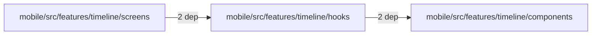
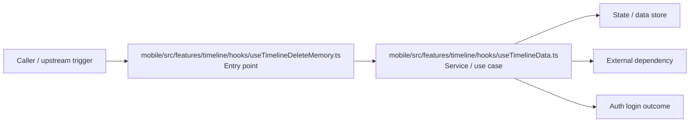

# Module mobile/src/features/timeline/hooks

- Overview: [emplus Docs Wiki](../../../../../../index.md)
- Summary: [SUMMARY](../../../../../../SUMMARY.md)
- Feature catalog: [All features](../../../../../../features/index.md)
- Module index: [All modules](../../../../index.md)
- Workspace index: [All workspaces](../../../../../../workspaces/index.md)

## Snapshot

- Path: `mobile/src/features/timeline/hooks`
- Descendant files: 2
- Descendant symbols: 2
- Languages: `TypeScript`
- Workspace: [@emplus/mobile](../../../../../../workspaces/mobile.md)

## Related Features

- [Authentication Login](../../../../../../features/auth-login.md) - Authentication Login captures the login workflow inside authentication. It spans 2 workspaces. Key flows include Auth login, Auth registration, Auth login.
- [Authentication Read / List](../../../../../../features/auth-list.md) - Authentication Read / List captures the read / list workflow inside authentication. It spans 3 workspaces.
- [User Management Login](../../../../../../features/user-login.md) - User Management Login captures the login workflow inside user management. It spans 2 workspaces. Key flows include Auth login, Auth registration, Auth login.
- [Search Read / List](../../../../../../features/search-list.md) - Search Read / List captures the read / list workflow inside search. It spans 3 workspaces.
- [Search Login](../../../../../../features/search-login.md) - Search Login captures the login workflow inside search. It spans 2 workspaces. Key flows include Auth login, Auth registration, Auth login.
- [Notifications Read / List](../../../../../../features/notification-list.md) - Notifications Read / List captures the read / list workflow inside notifications. It spans 2 workspaces.
- [User Management Read / List](../../../../../../features/user-list.md) - User Management Read / List captures the read / list workflow inside user management. It spans 3 workspaces.
- [Order Management Login](../../../../../../features/order-login.md) - Order Management Login captures the login workflow inside order management. It spans 2 workspaces. Key flows include Auth login, Auth login, Auth login.
- [Notifications Login](../../../../../../features/notification-login.md) - Notifications Login captures the login workflow inside notifications. It spans 2 workspaces. Key flows include Auth login, Auth registration, Auth login.
- [Order Management Read / List](../../../../../../features/order-list.md) - Order Management Read / List captures the read / list workflow inside order management. It spans 2 workspaces.

## Business Capability

The useTimelineData function sets up hooks for managing the timeline data, including authentication and navigation.

## Basic Design

Hooks is inferred as a authentication and access control area. The visible implementation layers are Entry point, Service / use case. State is likely persisted in primary database. The module also integrates with @, react, @tanstack.

### Boundaries

- Entry points: `mobile/src/features/timeline/hooks/useTimelineDeleteMemory.ts`
- Data stores: Primary database
- External interfaces: `@`, `react`, `@tanstack`

## Detail Design

Primary flow coverage includes Auth login. Representative files are mobile/src/features/timeline/hooks/useTimelineData.ts, mobile/src/features/timeline/hooks/useTimelineDeleteMemory.ts. Observed behavior hints: The `useTimelineDeleteMemory` hook provides a mechanism for deleting timeline memories with confirmation.

### Components

- Entry point: mobile/src/features/timeline/hooks/useTimelineDeleteMemory.ts
- Service / use case: mobile/src/features/timeline/hooks/useTimelineData.ts

## Module Interactions

- `mobile/src/features/timeline/hooks` -> `mobile/src/features/timeline/components` (2 dependencies)
- `mobile/src/features/timeline/screens` -> `mobile/src/features/timeline/hooks` (2 dependencies)

### Interaction Diagram

## Inferred Business Flows

### Auth login

Authenticate the caller, validate credentials, and establish a usable session or token.

#### Steps

- mobile/src/features/timeline/hooks/useTimelineDeleteMemory.ts receives the request and turns it into an application-level login command.
- mobile/src/features/timeline/hooks/useTimelineData.ts coordinates the core business rules and state changes for the flow. It then hands off to groupMemories, useTimelineMemoriesQuery, timelineMap.ts.

#### Flow Diagram

## Child Modules

No child modules.

## Direct Files

- [mobile/src/features/timeline/hooks/useTimelineData.ts](../../../../../files/mobile/src/features/timeline/hooks/useTimelineData.ts.md) — The useTimelineData function sets up hooks for managing the timeline data, including authentication and navigation.
- [mobile/src/features/timeline/hooks/useTimelineDeleteMemory.ts](../../../../../files/mobile/src/features/timeline/hooks/useTimelineDeleteMemory.ts.md) — The `useTimelineDeleteMemory` hook provides a mechanism for deleting timeline memories with confirmation.
