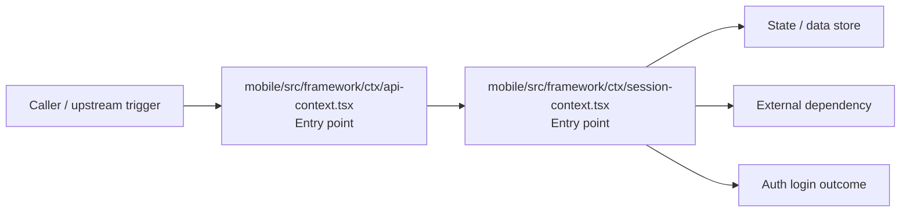

# Module mobile/src/framework/ctx

- Overview: [emplus Docs Wiki](../../../../../index.md)
- Summary: [SUMMARY](../../../../../SUMMARY.md)
- Feature catalog: [All features](../../../../../features/index.md)
- Module index: [All modules](../../../index.md)
- Workspace index: [All workspaces](../../../../../workspaces/index.md)

## Snapshot

- Path: `mobile/src/framework/ctx`
- Descendant files: 2
- Descendant symbols: 6
- Languages: `TypeScript`
- Workspace: [@emplus/mobile](../../../../../workspaces/mobile.md)

## Related Features

- [Authentication Login](../../../../../features/auth-login.md) - Authentication Login captures the login workflow inside authentication. It spans 2 workspaces. Key flows include Auth login, Auth registration, Auth login.
- [Storage Login](../../../../../features/storage-login.md) - Storage Login captures the login workflow inside storage. It spans 2 workspaces. Key flows include Auth login, Auth registration, Auth login.
- [Integrations Login](../../../../../features/integration-login.md) - Integrations Login captures the login workflow inside integrations. It spans 2 workspaces. Key flows include Auth login, Auth registration, Auth login.

## Business Capability

The `ApiContext` file sets up a network listener and uses a configured query client to manage queries in the app's persistence layer.

## Basic Design

Ctx is inferred as a authentication and access control area. The visible implementation layers are Entry point. State is likely persisted in primary database, session / token state. The module also integrates with @, @react-native-async-storage, @react-native-community, @tanstack, react, react-native.

### Boundaries

- Entry points: `mobile/src/framework/ctx/api-context.tsx`, `mobile/src/framework/ctx/session-context.tsx`
- Data stores: Primary database, Session / token state
- External interfaces: `@`, `@react-native-async-storage`, `@react-native-community`, `@tanstack`, `react`, `react-native`

## Detail Design

Primary flow coverage includes Auth login. Representative files are mobile/src/framework/ctx/api-context.tsx, mobile/src/framework/ctx/session-context.tsx. Observed behavior hints: SessionProvider uses SessionContext to manage authentication session and refresh API token.

### Components

- Entry point: mobile/src/framework/ctx/api-context.tsx
- Entry point: mobile/src/framework/ctx/session-context.tsx

## Inferred Business Flows

### Auth login

Authenticate the caller, validate credentials, and establish a usable session or token.

#### Steps

- mobile/src/framework/ctx/api-context.tsx receives the request and turns it into an application-level login command.
- mobile/src/framework/ctx/session-context.tsx receives the request and turns it into an application-level login command.

#### Flow Diagram

## Child Modules

No child modules.

## Direct Files

- [mobile/src/framework/ctx/api-context.tsx](../../../../files/mobile/src/framework/ctx/api-context.tsx.md) — The `ApiContext` file sets up a network listener and uses a configured query client to manage queries in the app's persistence layer.
- [mobile/src/framework/ctx/session-context.tsx](../../../../files/mobile/src/framework/ctx/session-context.tsx.md) — SessionProvider uses SessionContext to manage authentication session and refresh API token.
