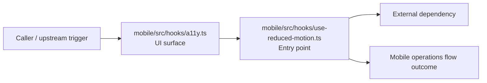

# Module mobile/src/hooks

- Overview: [emplus Docs Wiki](../../../../index.md)
- Summary: [SUMMARY](../../../../SUMMARY.md)
- Feature catalog: [All features](../../../../features/index.md)
- Module index: [All modules](../../index.md)
- Workspace index: [All workspaces](../../../../workspaces/index.md)

## Snapshot

- Path: `mobile/src/hooks`
- Descendant files: 2
- Descendant symbols: 10
- Languages: `TypeScript`
- Workspace: [@emplus/mobile](../../../../workspaces/mobile.md)

## Related Features

- [Authentication Read / List](../../../../features/auth-list.md) - Authentication Read / List captures the read / list workflow inside authentication. It spans 3 workspaces.
- [Authentication Verification](../../../../features/auth-verify.md) - Authentication Verification captures the verification workflow inside authentication. It spans 2 workspaces. Key flows include Credential validation, Auth login, Auth login.
- [Mobile](../../../../features/mobile.md) - Mobile captures the main mobile behavior discovered in the codebase. Key flows include Mobile operations flow, Mobile operations flow.

## Business Capability

Provides 9 documented symbols in mobile/src/hooks/a11y.ts.

## Basic Design

Hooks is inferred as a mobile operations area. The visible implementation layers are Entry point, UI surface. The module also integrates with react, react-native.

### Boundaries

- Entry points: `mobile/src/hooks/a11y.ts`, `mobile/src/hooks/use-reduced-motion.ts`
- External interfaces: `react`, `react-native`

## Detail Design

Primary flow coverage includes Mobile operations flow. Representative files are mobile/src/hooks/a11y.ts, mobile/src/hooks/use-reduced-motion.ts. Observed behavior hints: Uses the AccessibilityInfo API to enable or disable reduced motion animations.

### Components

- UI surface: mobile/src/hooks/a11y.ts
- Entry point: mobile/src/hooks/use-reduced-motion.ts

## Inferred Business Flows

### Mobile operations flow

Handle the main mobile operations use case exposed by this module.

#### Steps

- The user or operator enters the flow through mobile/src/hooks/a11y.ts, which surfaces the request handling interaction.
- mobile/src/hooks/use-reduced-motion.ts receives the request and turns it into an application-level request handling command.

#### Flow Diagram

## Child Modules

No child modules.

## Direct Files

- [mobile/src/hooks/a11y.ts](../../../files/mobile/src/hooks/a11y.ts.md) — Provides 9 documented symbols in mobile/src/hooks/a11y.ts.
- [mobile/src/hooks/use-reduced-motion.ts](../../../files/mobile/src/hooks/use-reduced-motion.ts.md) — Uses the AccessibilityInfo API to enable or disable reduced motion animations.
