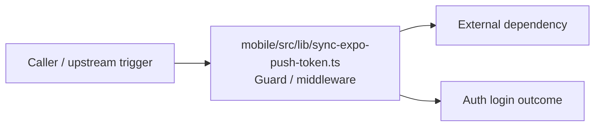

# Module mobile/src/lib

- Overview: [emplus Docs Wiki](../../../../index.md)
- Summary: [SUMMARY](../../../../SUMMARY.md)
- Feature catalog: [All features](../../../../features/index.md)
- Module index: [All modules](../../index.md)
- Workspace index: [All workspaces](../../../../workspaces/index.md)

## Snapshot

- Path: `mobile/src/lib`
- Descendant files: 1
- Descendant symbols: 4
- Languages: `TypeScript`
- Workspace: [@emplus/mobile](../../../../workspaces/mobile.md)

## Business Capability

Provides functions for enabling and disabling Expo push notifications on the server-side

## Basic Design

Lib is inferred as a authentication and access control area. The visible implementation layers are Guard / middleware. The module also integrates with @, expo-constants, expo-device, expo-notifications, react-native.

### Boundaries

- Entry points: `mobile/src/lib/sync-expo-push-token.ts`
- External interfaces: `@`, `expo-constants`, `expo-device`, `expo-notifications`, `react-native`

## Detail Design

Primary flow coverage includes Auth login. Representative files are mobile/src/lib/sync-expo-push-token.ts.

### Components

- Guard / middleware: mobile/src/lib/sync-expo-push-token.ts

## Inferred Business Flows

### Auth login

Authenticate the caller, validate credentials, and establish a usable session or token.

#### Steps

- mobile/src/lib/sync-expo-push-token.ts performs policy, session, or guard checks before deeper processing continues.

#### Flow Diagram

## Child Modules

No child modules.

## Direct Files

- [mobile/src/lib/sync-expo-push-token.ts](../../../files/mobile/src/lib/sync-expo-push-token.ts.md) — Provides functions for enabling and disabling Expo push notifications on the server-side
