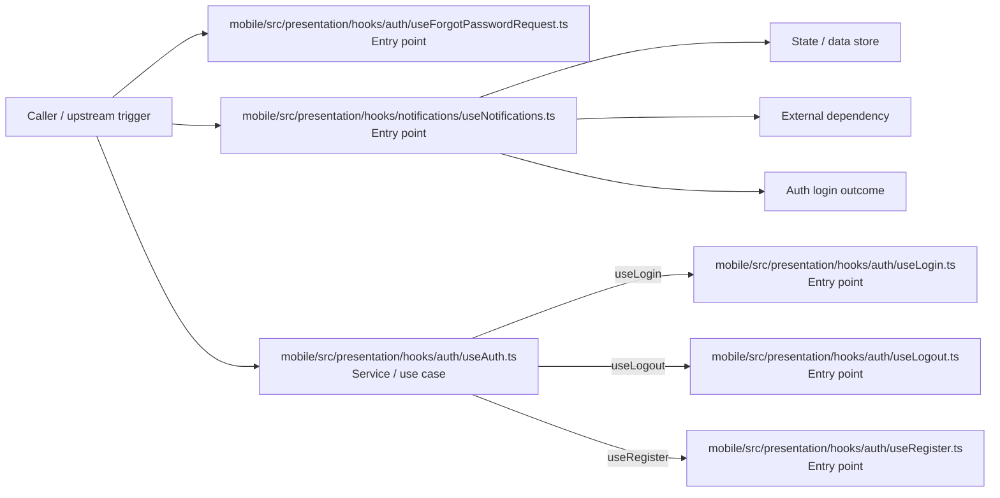

# Module mobile/src/presentation/hooks

- Overview: [emplus Docs Wiki](../../../../../index.md)
- Summary: [SUMMARY](../../../../../SUMMARY.md)
- Feature catalog: [All features](../../../../../features/index.md)
- Module index: [All modules](../../../index.md)
- Workspace index: [All workspaces](../../../../../workspaces/index.md)

## Snapshot

- Path: `mobile/src/presentation/hooks`
- Descendant files: 7
- Descendant symbols: 11
- Languages: `TypeScript`
- Workspace: [@emplus/mobile](../../../../../workspaces/mobile.md)

## Related Features

- [Authentication Login](../../../../../features/auth-login.md) - Authentication Login captures the login workflow inside authentication. It spans 2 workspaces. Key flows include Auth login, Auth registration, Auth login.
- [Authentication Read / List](../../../../../features/auth-list.md) - Authentication Read / List captures the read / list workflow inside authentication. It spans 3 workspaces.
- [User Management Login](../../../../../features/user-login.md) - User Management Login captures the login workflow inside user management. It spans 2 workspaces. Key flows include Auth login, Auth registration, Auth login.
- [Search Read / List](../../../../../features/search-list.md) - Search Read / List captures the read / list workflow inside search. It spans 3 workspaces.
- [Search Login](../../../../../features/search-login.md) - Search Login captures the login workflow inside search. It spans 2 workspaces. Key flows include Auth login, Auth registration, Auth login.
- [Notifications Read / List](../../../../../features/notification-list.md) - Notifications Read / List captures the read / list workflow inside notifications. It spans 2 workspaces.
- [Search Notify](../../../../../features/search-notify.md) - Search Notify captures the notify workflow inside search. It spans 2 workspaces.
- [Integrations Login](../../../../../features/integration-login.md) - Integrations Login captures the login workflow inside integrations. It spans 2 workspaces. Key flows include Auth login, Auth registration, Auth login.
- [Authentication Password Reset](../../../../../features/auth-reset.md) - Authentication Password Reset captures the password reset workflow inside authentication. It spans 3 workspaces. Key flows include Password reset, Password reset, Password reset.

## Business Capability

Authenticator flow logic

## Basic Design

Hooks is inferred as a authentication and access control area. The visible implementation layers are Entry point, Service / use case, Utility. State is likely persisted in session / token state, primary database. The module also integrates with @, react, @tanstack.

### Boundaries

- Entry points: `mobile/src/presentation/hooks/auth/useForgotPasswordRequest.ts`, `mobile/src/presentation/hooks/auth/useLogin.ts`, `mobile/src/presentation/hooks/auth/useLogout.ts`, `mobile/src/presentation/hooks/auth/useRegister.ts`, `mobile/src/presentation/hooks/notifications/useNotifications.ts`
- Data stores: Session / token state, Primary database
- External interfaces: `@`, `react`, `@tanstack`

## Detail Design

Primary flow coverage includes Auth login. Representative files are mobile/src/presentation/hooks/auth/index.ts, mobile/src/presentation/hooks/auth/useAuth.ts, mobile/src/presentation/hooks/auth/useForgotPasswordRequest.ts, mobile/src/presentation/hooks/auth/useLogin.ts, mobile/src/presentation/hooks/auth/useLogout.ts. Observed behavior hints: The `useAuth` hook is responsible for managing authentication state and interactions.

### Components

- Entry point: mobile/src/presentation/hooks/auth/useForgotPasswordRequest.ts
- Entry point: mobile/src/presentation/hooks/auth/useLogin.ts
- Entry point: mobile/src/presentation/hooks/auth/useLogout.ts
- Entry point: mobile/src/presentation/hooks/auth/useRegister.ts
- Entry point: mobile/src/presentation/hooks/notifications/useNotifications.ts
- Service / use case: mobile/src/presentation/hooks/auth/useAuth.ts
- Utility: mobile/src/presentation/hooks/auth/index.ts

## Inferred Business Flows

### Auth login

Authenticate the caller, validate credentials, and establish a usable session or token.

#### Steps

- mobile/src/presentation/hooks/auth/useForgotPasswordRequest.ts receives the request and turns it into an application-level login command.
- mobile/src/presentation/hooks/auth/useLogin.ts receives the request and turns it into an application-level login command.
- mobile/src/presentation/hooks/auth/useLogout.ts receives the request and turns it into an application-level login command.
- mobile/src/presentation/hooks/auth/useRegister.ts receives the request and turns it into an application-level login command.
- mobile/src/presentation/hooks/notifications/useNotifications.ts receives the request and turns it into an application-level login command.
- mobile/src/presentation/hooks/auth/useAuth.ts coordinates the core business rules and state changes for the flow. It then hands off to useLogin, useLogout, useRegister.

#### Flow Diagram

## Child Modules

- [mobile/src/presentation/hooks/auth](hooks/auth.md) - 6 files, 8 symbols
- [mobile/src/presentation/hooks/notifications](hooks/notifications.md) - 1 file, 3 symbols

## Direct Files

No files directly under this module.
