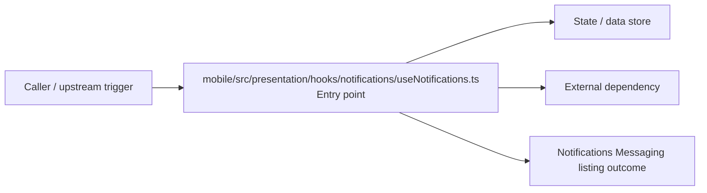

# Module mobile/src/presentation/hooks/notifications

- Overview: [emplus Docs Wiki](../../../../../../index.md)
- Summary: [SUMMARY](../../../../../../SUMMARY.md)
- Feature catalog: [All features](../../../../../../features/index.md)
- Module index: [All modules](../../../../index.md)
- Workspace index: [All workspaces](../../../../../../workspaces/index.md)

## Snapshot

- Path: `mobile/src/presentation/hooks/notifications`
- Descendant files: 1
- Descendant symbols: 3
- Languages: `TypeScript`
- Workspace: [@emplus/mobile](../../../../../../workspaces/mobile.md)

## Related Features

- [Authentication Read / List](../../../../../../features/auth-list.md) - Authentication Read / List captures the read / list workflow inside authentication. It spans 3 workspaces.
- [Search Read / List](../../../../../../features/search-list.md) - Search Read / List captures the read / list workflow inside search. It spans 3 workspaces.
- [Notifications Read / List](../../../../../../features/notification-list.md) - Notifications Read / List captures the read / list workflow inside notifications. It spans 2 workspaces.

## Business Capability

Provides 3 documented symbols in mobile/src/presentation/hooks/notifications/useNotifications.ts.

## Basic Design

Notifications is inferred as a notifications and messaging area. The visible implementation layers are Entry point. State is likely persisted in primary database. The module also integrates with @, @tanstack.

### Boundaries

- Entry points: `mobile/src/presentation/hooks/notifications/useNotifications.ts`
- Data stores: Primary database
- External interfaces: `@`, `@tanstack`

## Detail Design

Primary flow coverage includes Notifications Messaging listing. Representative files are mobile/src/presentation/hooks/notifications/useNotifications.ts.

### Components

- Entry point: mobile/src/presentation/hooks/notifications/useNotifications.ts

## Inferred Business Flows

### Notifications Messaging listing

Execute the module's listing use case inside notifications and messaging.

#### Steps

- mobile/src/presentation/hooks/notifications/useNotifications.ts receives the request and turns it into an application-level listing command.

#### Flow Diagram

## Child Modules

No child modules.

## Direct Files

- [mobile/src/presentation/hooks/notifications/useNotifications.ts](../../../../../files/mobile/src/presentation/hooks/notifications/useNotifications.ts.md) — Provides 3 documented symbols in mobile/src/presentation/hooks/notifications/useNotifications.ts.
