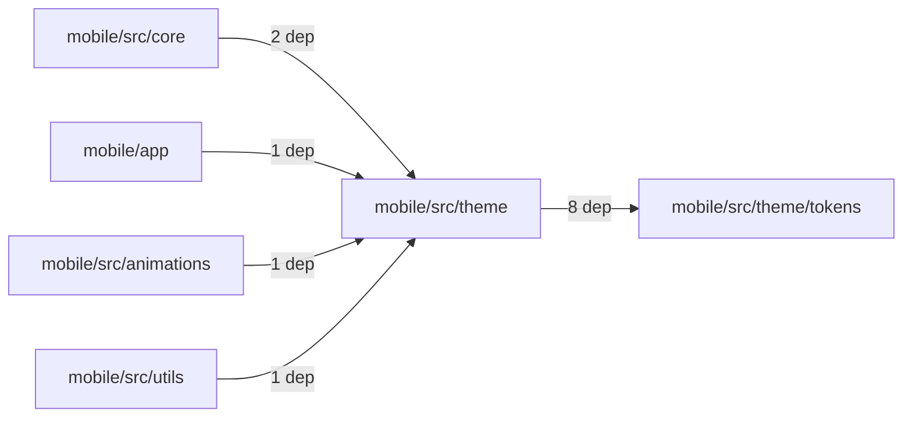
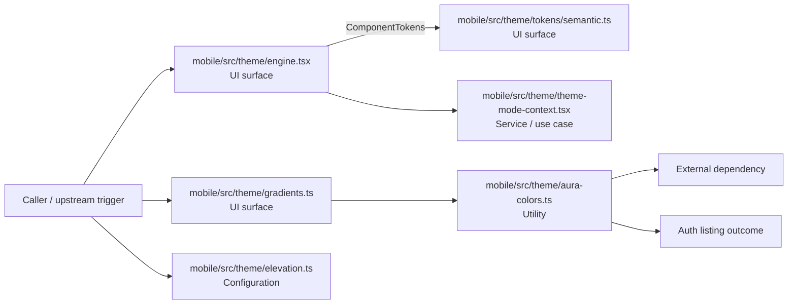

# Module mobile/src/theme

- Overview: [emplus Docs Wiki](../../../../index.md)
- Summary: [SUMMARY](../../../../SUMMARY.md)
- Feature catalog: [All features](../../../../features/index.md)
- Module index: [All modules](../../index.md)
- Workspace index: [All workspaces](../../../../workspaces/index.md)

## Snapshot

- Path: `mobile/src/theme`
- Descendant files: 13
- Descendant symbols: 40
- Languages: `TypeScript`
- Workspace: [@emplus/mobile](../../../../workspaces/mobile.md)

## Related Features

- [Authentication Read / List](../../../../features/auth-list.md) - Authentication Read / List captures the read / list workflow inside authentication. It spans 3 workspaces.
- [Search Read / List](../../../../features/search-list.md) - Search Read / List captures the read / list workflow inside search. It spans 3 workspaces.
- [Notifications Read / List](../../../../features/notification-list.md) - Notifications Read / List captures the read / list workflow inside notifications. It spans 2 workspaces.
- [Storage Read / List](../../../../features/storage-list.md) - Storage Read / List captures the read / list workflow inside storage. It spans 4 workspaces.
- [Integrations Read / List](../../../../features/integration-list.md) - Integrations Read / List captures the read / list workflow inside integrations. It spans 3 workspaces.
- [Search Create](../../../../features/search-create.md) - Search Create captures the create workflow inside search. It spans 2 workspaces.

## Business Capability

A function to retrieve the gradient for an aura avatar.

## Basic Design

Theme is inferred as a authentication and access control area. The visible implementation layers are Utility, UI surface, Configuration. The module also integrates with react, react-native, @react-native-async-storage.

### Boundaries

- Entry points: `mobile/src/theme/engine.tsx`, `mobile/src/theme/gradients.ts`, `mobile/src/theme/tokens/semantic.ts`
- External interfaces: `react`, `react-native`, `@react-native-async-storage`

## Detail Design

Primary flow coverage includes Auth listing. Representative files are mobile/src/theme/aura-colors.ts, mobile/src/theme/elevation.ts, mobile/src/theme/emplus-design-tokens.ts, mobile/src/theme/engine.tsx, mobile/src/theme/gradients.ts. Observed behavior hints: ElevationKey represents a constant symbol used to represent elevation levels in a mobile application.

### Components

- UI surface: mobile/src/theme/engine.tsx
- UI surface: mobile/src/theme/gradients.ts
- UI surface: mobile/src/theme/tokens/semantic.ts
- Service / use case: mobile/src/theme/theme-mode-context.tsx
- Configuration: mobile/src/theme/elevation.ts
- Utility: mobile/src/theme/aura-colors.ts
- Utility: mobile/src/theme/emplus-design-tokens.ts
- Utility: mobile/src/theme/index.ts

## Module Interactions

- `mobile/src/theme` -> `mobile/src/theme/tokens` (8 dependencies)
- `mobile/src/core` -> `mobile/src/theme` (2 dependencies)
- `mobile/app` -> `mobile/src/theme` (1 dependencies)
- `mobile/src/animations` -> `mobile/src/theme` (1 dependencies)
- `mobile/src/utils` -> `mobile/src/theme` (1 dependencies)

### Interaction Diagram

## Inferred Business Flows

### Auth listing

Execute the module's listing use case inside authentication and access control.

#### Steps

- The user or operator enters the flow through mobile/src/theme/engine.tsx, which surfaces the listing interaction. It then hands off to Theme, SpaceKey, ComponentTokens.
- The user or operator enters the flow through mobile/src/theme/gradients.ts, which surfaces the listing interaction. It then hands off to aura-colors.ts.
- The user or operator enters the flow through mobile/src/theme/tokens/semantic.ts, which surfaces the listing interaction. It then hands off to palette.ts.
- mobile/src/theme/elevation.ts supplies runtime configuration that shapes how the flow behaves. It then hands off to index.ts.
- mobile/src/theme/theme-mode-context.tsx coordinates the core business rules and state changes for the flow.
- mobile/src/theme/aura-colors.ts provides helper logic used during the flow. It then hands off to palette.ts.

#### Flow Diagram

## Child Modules

- [mobile/src/theme/tokens](theme/tokens.md) - 3 files, 7 symbols

## Direct Files

- [mobile/src/theme/aura-colors.ts](../../../files/mobile/src/theme/aura-colors.ts.md) — A function to retrieve the gradient for an aura avatar.
- [mobile/src/theme/elevation.ts](../../../files/mobile/src/theme/elevation.ts.md) — ElevationKey represents a constant symbol used to represent elevation levels in a mobile application.
- [mobile/src/theme/emplus-design-tokens.ts](../../../files/mobile/src/theme/emplus-design-tokens.ts.md) — EmplusInputSize is a token that represents an input size with a maximum height of 15 units.
- [mobile/src/theme/engine.tsx](../../../files/mobile/src/theme/engine.tsx.md) — The useTheme function returns a Theme object for the current theme
- [mobile/src/theme/gradients.ts](../../../files/mobile/src/theme/gradients.ts.md) — returns string
- [mobile/src/theme/index.ts](../../../files/mobile/src/theme/index.ts.md) — Index for mobile app theme configuration.
- [mobile/src/theme/theme-builder.ts](../../../files/mobile/src/theme/theme-builder.ts.md)
- [mobile/src/theme/theme-mode-context.tsx](../../../files/mobile/src/theme/theme-mode-context.tsx.md) — Class representing the context for theme modes.
- [mobile/src/theme/themes.ts](../../../files/mobile/src/theme/themes.ts.md) — Defines the `ThemeName` symbol for the theme registry
- [mobile/src/theme/typography-roles.ts](../../../files/mobile/src/theme/typography-roles.ts.md) — Defines the `TypographyRole` types for typography roles, specifying which properties are available.
