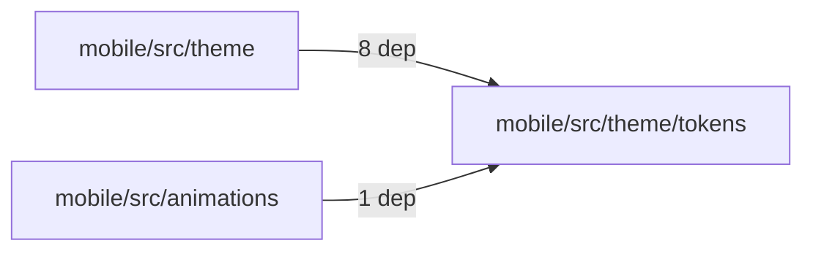
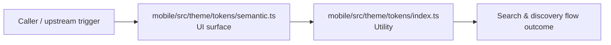

# Module mobile/src/theme/tokens

- Overview: [emplus Docs Wiki](../../../../../index.md)
- Summary: [SUMMARY](../../../../../SUMMARY.md)
- Feature catalog: [All features](../../../../../features/index.md)
- Module index: [All modules](../../../index.md)
- Workspace index: [All workspaces](../../../../../workspaces/index.md)

## Snapshot

- Path: `mobile/src/theme/tokens`
- Descendant files: 3
- Descendant symbols: 7
- Languages: `TypeScript`
- Workspace: [@emplus/mobile](../../../../../workspaces/mobile.md)

## Business Capability

An assignment statement to assign a string value.

## Basic Design

Tokens is inferred as a search and discovery area. The visible implementation layers are Utility, UI surface.

### Boundaries

- Entry points: `mobile/src/theme/tokens/semantic.ts`

## Detail Design

Primary flow coverage includes Search &amp; discovery flow. Representative files are mobile/src/theme/tokens/index.ts, mobile/src/theme/tokens/palette.ts, mobile/src/theme/tokens/semantic.ts. Observed behavior hints: An alias for Keyof typeof palette, defining the PaletteKey symbol.

### Components

- UI surface: mobile/src/theme/tokens/semantic.ts
- Utility: mobile/src/theme/tokens/index.ts
- Utility: mobile/src/theme/tokens/palette.ts

## Module Interactions

- `mobile/src/theme` -> `mobile/src/theme/tokens` (8 dependencies)
- `mobile/src/animations` -> `mobile/src/theme/tokens` (1 dependencies)

### Interaction Diagram

## Inferred Business Flows

### Search &amp; discovery flow

Handle the main search and discovery use case exposed by this module.

#### Steps

- The user or operator enters the flow through mobile/src/theme/tokens/semantic.ts, which surfaces the request handling interaction. It then hands off to palette.ts.
- mobile/src/theme/tokens/index.ts provides helper logic used during the flow. It then hands off to palette.ts.

#### Flow Diagram

## Child Modules

No child modules.

## Direct Files

- [mobile/src/theme/tokens/index.ts](../../../../files/mobile/src/theme/tokens/index.ts.md) — An assignment statement to assign a string value.
- [mobile/src/theme/tokens/palette.ts](../../../../files/mobile/src/theme/tokens/palette.ts.md) — An alias for Keyof typeof palette, defining the PaletteKey symbol.
- [mobile/src/theme/tokens/semantic.ts](../../../../files/mobile/src/theme/tokens/semantic.ts.md) — Builds component tokens based on a given `SemanticColors` object.
