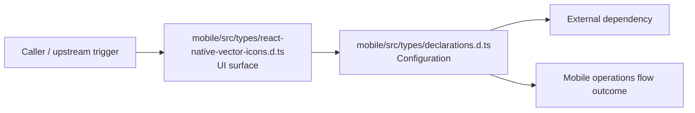

# Module mobile/src/types

- Overview: [emplus Docs Wiki](../../../../index.md)
- Summary: [SUMMARY](../../../../SUMMARY.md)
- Feature catalog: [All features](../../../../features/index.md)
- Module index: [All modules](../../index.md)
- Workspace index: [All workspaces](../../../../workspaces/index.md)

## Snapshot

- Path: `mobile/src/types`
- Descendant files: 2
- Descendant symbols: 7
- Languages: `TypeScript`
- Workspace: [@emplus/mobile](../../../../workspaces/mobile.md)

## Related Features

- [Mobile](../../../../features/mobile.md) - Mobile captures the main mobile behavior discovered in the codebase. Key flows include Mobile operations flow, Mobile operations flow.

## Business Capability

A namespace with a single interface to manage environment variables for Expo.

## Basic Design

Types is inferred as a mobile operations area. The visible implementation layers are Configuration, UI surface. The module also integrates with react.

### Boundaries

- Entry points: `mobile/src/types/react-native-vector-icons.d.ts`
- External interfaces: `react`

## Detail Design

Primary flow coverage includes Mobile operations flow. Representative files are mobile/src/types/declarations.d.ts, mobile/src/types/react-native-vector-icons.d.ts. Observed behavior hints: Icon types and classes for mobile applications.

### Components

- UI surface: mobile/src/types/react-native-vector-icons.d.ts
- Configuration: mobile/src/types/declarations.d.ts

## Inferred Business Flows

### Mobile operations flow

Handle the main mobile operations use case exposed by this module.

#### Steps

- The user or operator enters the flow through mobile/src/types/react-native-vector-icons.d.ts, which surfaces the request handling interaction.
- mobile/src/types/declarations.d.ts supplies runtime configuration that shapes how the flow behaves.

#### Flow Diagram

## Child Modules

No child modules.

## Direct Files

- [mobile/src/types/declarations.d.ts](../../../files/mobile/src/types/declarations.d.ts.md) — A namespace with a single interface to manage environment variables for Expo.
- [mobile/src/types/react-native-vector-icons.d.ts](../../../files/mobile/src/types/react-native-vector-icons.d.ts.md) — Icon types and classes for mobile applications.
