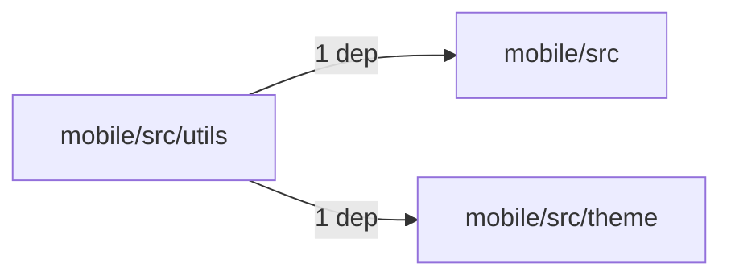

# Module mobile/src/utils

- Overview: [emplus Docs Wiki](../../../../index.md)
- Summary: [SUMMARY](../../../../SUMMARY.md)
- Feature catalog: [All features](../../../../features/index.md)
- Module index: [All modules](../../index.md)
- Workspace index: [All workspaces](../../../../workspaces/index.md)

## Snapshot

- Path: `mobile/src/utils`
- Descendant files: 9
- Descendant symbols: 44
- Languages: `TypeScript`
- Workspace: [@emplus/mobile](../../../../workspaces/mobile.md)

## Related Features

- [Authentication Read / List](../../../../features/auth-list.md) - Authentication Read / List captures the read / list workflow inside authentication. It spans 3 workspaces.
- [Search Read / List](../../../../features/search-list.md) - Search Read / List captures the read / list workflow inside search. It spans 3 workspaces.
- [Notifications Read / List](../../../../features/notification-list.md) - Notifications Read / List captures the read / list workflow inside notifications. It spans 2 workspaces.
- [Storage Read / List](../../../../features/storage-list.md) - Storage Read / List captures the read / list workflow inside storage. It spans 4 workspaces.
- [Integrations Read / List](../../../../features/integration-list.md) - Integrations Read / List captures the read / list workflow inside integrations. It spans 3 workspaces.
- [User Management Read / List](../../../../features/user-list.md) - User Management Read / List captures the read / list workflow inside user management. It spans 3 workspaces.
- [Notifications Notify](../../../../features/notification-notify.md) - Notifications Notify captures the notify workflow inside notifications. It spans 2 workspaces.
- [Reporting Read / List](../../../../features/reporting-list.md) - Reporting Read / List captures the read / list workflow inside reporting. It spans 2 workspaces.
- [Administration Read / List](../../../../features/admin-list.md) - Administration Read / List captures the read / list workflow inside administration. It spans 2 workspaces.

## Business Capability

A function that merges an object with a class.

## Basic Design

Utils is inferred as a authentication and access control area. The visible implementation layers are Utility, UI surface, Entry point. The module also integrates with clsx, tailwind-merge, expo-clipboard, expo-document-picker, expo-image-picker, expo-notifications.

### Boundaries

- Entry points: `mobile/src/utils/glass.ts`, `mobile/src/utils/home-helpers.ts`, `mobile/src/utils/tws.ts`, `mobile/src/utils/session-api-feedback.ts`, `mobile/src/utils/timeline-helpers.ts`
- External interfaces: `clsx`, `tailwind-merge`, `expo-clipboard`, `expo-document-picker`, `expo-image-picker`, `expo-notifications`

## Detail Design

Primary flow coverage includes Auth listing. Representative files are mobile/src/utils/cn.ts, mobile/src/utils/date-format-vn.ts, mobile/src/utils/expo-helpers.ts, mobile/src/utils/glass.ts, mobile/src/utils/home-helpers.ts. Observed behavior hints: Utility functions to work with date strings in the Vietnamese calendar.

### Components

- UI surface: mobile/src/utils/glass.ts
- UI surface: mobile/src/utils/home-helpers.ts
- UI surface: mobile/src/utils/tws.ts
- Entry point: mobile/src/utils/session-api-feedback.ts
- Entry point: mobile/src/utils/timeline-helpers.ts
- Utility: mobile/src/utils/cn.ts
- Utility: mobile/src/utils/date-format-vn.ts
- Utility: mobile/src/utils/expo-helpers.ts

## Module Interactions

- `mobile/src/utils` -> `mobile/src` (1 dependencies)
- `mobile/src/utils` -> `mobile/src/theme` (1 dependencies)

### Interaction Diagram

## Inferred Business Flows

### Auth listing

Execute the module's listing use case inside authentication and access control.

#### Steps

- The user or operator enters the flow through mobile/src/utils/glass.ts, which surfaces the listing interaction.
- The user or operator enters the flow through mobile/src/utils/home-helpers.ts, which surfaces the listing interaction. It then hands off to index.ts.
- The user or operator enters the flow through mobile/src/utils/tws.ts, which surfaces the listing interaction.
- mobile/src/utils/session-api-feedback.ts receives the request and turns it into an application-level listing command.
- mobile/src/utils/timeline-helpers.ts receives the request and turns it into an application-level listing command. It then hands off to loginWithEmail, api.ts.
- mobile/src/utils/expo-helpers.ts provides helper logic used during the flow.

#### Flow Diagram

```mermaid
flowchart LR
  caller["Caller / upstream trigger"]
  n1_glass_ts["mobile/src/utils/glass.ts\nUI surface"]
  n2_home_helpers_ts["mobile/src/utils/home-helpers.ts\nUI surface"]
  n3_tws_ts["mobile/src/utils/tws.ts\nUI surface"]
  n4_session_api_feedback_ts["mobile/src/utils/session-api-feedback.ts\nEntry point"]
  n5_timeline_helpers_ts["mobile/src/utils/timeline-helpers.ts\nEntry point"]
  n6_expo_helpers_ts["mobile/src/utils/expo-helpers.ts\nUtility"]
  caller --> n1_glass_ts
  n1_glass_ts --> n2_home_helpers_ts
  n2_home_helpers_ts --> n3_tws_ts
  n3_tws_ts --> n4_session_api_feedback_ts
  n4_session_api_feedback_ts --> n5_timeline_helpers_ts
  n5_timeline_helpers_ts --> n6_expo_helpers_ts
  ext["External dependency"]
  n6_expo_helpers_ts --> ext
  outcome["Auth listing outcome"]
  n6_expo_helpers_ts --> outcome
```

## Child Modules

No child modules.

## Direct Files

- [mobile/src/utils/cn.ts](../../../files/mobile/src/utils/cn.ts.md) — A function that merges an object with a class.
- [mobile/src/utils/date-format-vn.ts](../../../files/mobile/src/utils/date-format-vn.ts.md) — Utility functions to work with date strings in the Vietnamese calendar.
- [mobile/src/utils/expo-helpers.ts](../../../files/mobile/src/utils/expo-helpers.ts.md) — expo-utils
- [mobile/src/utils/glass.ts](../../../files/mobile/src/utils/glass.ts.md) — Mobile's Glass Material Configuration Utility.
- [mobile/src/utils/home-helpers.ts](../../../files/mobile/src/utils/home-helpers.ts.md) — Utility functions for handling and formatting date and time related data.
- [mobile/src/utils/lunar-label.ts](../../../files/mobile/src/utils/lunar-label.ts.md) — Lunar day and month labels for a given date
- [mobile/src/utils/session-api-feedback.ts](../../../files/mobile/src/utils/session-api-feedback.ts.md) — Displays error messages for session or token failures, including unauthorized and network errors.
- [mobile/src/utils/timeline-helpers.ts](../../../files/mobile/src/utils/timeline-helpers.ts.md)
- [mobile/src/utils/tws.ts](../../../files/mobile/src/utils/tws.ts.md) — Used to convert Tailwind CSS classes to styles objects for various styling needs.
