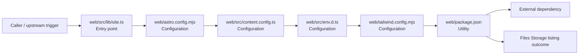

# Module web

- Overview: [emplus Docs Wiki](../../index.md)
- Summary: [SUMMARY](../../SUMMARY.md)
- Feature catalog: [All features](../../features/index.md)
- Module index: [All modules](index.md)
- Workspace index: [All workspaces](../../workspaces/index.md)

## Snapshot

- Path: `web`
- Descendant files: 9
- Descendant symbols: 7
- Languages: `CSS`, `JSON`, `JavaScript`, `TypeScript`
- Workspace: [@emplus/web](../../workspaces/web.md)

## Related Features

- [Storage Read / List](../../features/storage-list.md) - Storage Read / List captures the read / list workflow inside storage. It spans 4 workspaces.
- [Web](../../features/web.md) - Web captures the main web behavior discovered in the codebase. Key flows include Web operations flow, Web Operations listing.

## Business Capability

Configuration file for Astro, a tool for creating fast and elegant web applications.

## Basic Design

Web is inferred as a files and storage area. The visible implementation layers are Configuration, Utility, Entry point. The module also integrates with @astrojs, astro, @, @tailwindcss, tailwindcss.

### Boundaries

- Entry points: `web/src/lib/site.ts`
- External interfaces: `@astrojs`, `astro`, `@`, `@tailwindcss`, `tailwindcss`

## Detail Design

Primary flow coverage includes Files Storage listing. Representative files are web/astro.config.mjs, web/package.json, web/src/content.config.ts, web/src/env.d.ts, web/src/lib/site.ts. Observed behavior hints: Web package file (web/package.json)

### Components

- Entry point: web/src/lib/site.ts
- Configuration: web/astro.config.mjs
- Configuration: web/src/content.config.ts
- Configuration: web/src/env.d.ts
- Configuration: web/tailwind.config.mjs
- Utility: web/package.json
- Utility: web/src/pages/rss.xml.ts
- Utility: web/src/styles/global.css

## Inferred Business Flows

### Files Storage listing

Execute the module's listing use case inside files and storage.

#### Steps

- web/src/lib/site.ts receives the request and turns it into an application-level listing command.
- web/astro.config.mjs supplies runtime configuration that shapes how the flow behaves.
- web/src/content.config.ts supplies runtime configuration that shapes how the flow behaves.
- web/src/env.d.ts supplies runtime configuration that shapes how the flow behaves.
- web/tailwind.config.mjs supplies runtime configuration that shapes how the flow behaves.
- web/package.json provides helper logic used during the flow.

#### Flow Diagram

## Child Modules

- [web/src](web/src.md) - 5 files, 5 symbols

## Direct Files

- [web/astro.config.mjs](../files/web/astro.config.mjs.md) — Configuration file for Astro, a tool for creating fast and elegant web applications.
- [web/package.json](../files/web/package.json.md) — Web package file (web/package.json)
- [web/tailwind.config.mjs](../files/web/tailwind.config.mjs.md) — Configuration file for Tailwind CSS.
- [web/tsconfig.json](../files/web/tsconfig.json.md) — TSConfig
