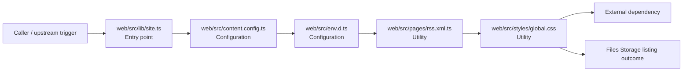

# Module web/src

- Overview: [emplus Docs Wiki](../../../index.md)
- Summary: [SUMMARY](../../../SUMMARY.md)
- Feature catalog: [All features](../../../features/index.md)
- Module index: [All modules](../index.md)
- Workspace index: [All workspaces](../../../workspaces/index.md)

## Snapshot

- Path: `web/src`
- Descendant files: 5
- Descendant symbols: 5
- Languages: `CSS`, `TypeScript`
- Workspace: [@emplus/web](../../../workspaces/web.md)

## Related Features

- [Storage Read / List](../../../features/storage-list.md) - Storage Read / List captures the read / list workflow inside storage. It spans 4 workspaces.
- [Web](../../../features/web.md) - Web captures the main web behavior discovered in the codebase. Key flows include Web operations flow, Web Operations listing.

## Business Capability

The content configuration file for the Web application.

## Basic Design

Src is inferred as a files and storage area. The visible implementation layers are Configuration, Utility, Entry point. The module also integrates with astro, @, @astrojs.

### Boundaries

- Entry points: `web/src/lib/site.ts`
- External interfaces: `astro`, `@`, `@astrojs`

## Detail Design

Primary flow coverage includes Files Storage listing. Representative files are web/src/content.config.ts, web/src/env.d.ts, web/src/lib/site.ts, web/src/pages/rss.xml.ts, web/src/styles/global.css. Observed behavior hints: Name of the public site URL import meta.

### Components

- Entry point: web/src/lib/site.ts
- Configuration: web/src/content.config.ts
- Configuration: web/src/env.d.ts
- Utility: web/src/pages/rss.xml.ts
- Utility: web/src/styles/global.css

## Inferred Business Flows

### Files Storage listing

Execute the module's listing use case inside files and storage.

#### Steps

- web/src/lib/site.ts receives the request and turns it into an application-level listing command.
- web/src/content.config.ts supplies runtime configuration that shapes how the flow behaves.
- web/src/env.d.ts supplies runtime configuration that shapes how the flow behaves.
- web/src/pages/rss.xml.ts provides helper logic used during the flow.
- web/src/styles/global.css provides helper logic used during the flow.

#### Flow Diagram

## Child Modules

- [web/src/lib](src/lib.md) - 1 file, 1 symbol
- [web/src/pages](src/pages.md) - 1 file, 1 symbol
- [web/src/styles](src/styles.md) - 1 file, 1 symbol

## Direct Files

- [web/src/content.config.ts](../../files/web/src/content.config.ts.md) — The content configuration file for the Web application.
- [web/src/env.d.ts](../../files/web/src/env.d.ts.md) — Name of the public site URL import meta.
