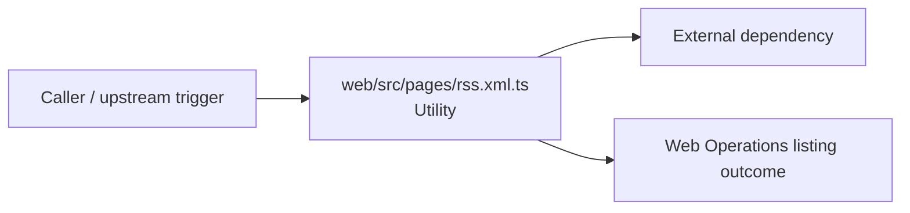

# Module web/src/pages

- Overview: [emplus Docs Wiki](../../../../index.md)
- Summary: [SUMMARY](../../../../SUMMARY.md)
- Feature catalog: [All features](../../../../features/index.md)
- Module index: [All modules](../../index.md)
- Workspace index: [All workspaces](../../../../workspaces/index.md)

## Snapshot

- Path: `web/src/pages`
- Descendant files: 1
- Descendant symbols: 1
- Languages: `TypeScript`
- Workspace: [@emplus/web](../../../../workspaces/web.md)

## Related Features

- [Storage Read / List](../../../../features/storage-list.md) - Storage Read / List captures the read / list workflow inside storage. It spans 4 workspaces.
- [Web](../../../../features/web.md) - Web captures the main web behavior discovered in the codebase. Key flows include Web operations flow, Web Operations listing.

## Business Capability

Defines a promise-bound fetch request to retrieve RSS data.

## Basic Design

Pages is inferred as a web operations area. The visible implementation layers are Utility. The module also integrates with @, @astrojs, astro.

### Boundaries

- External interfaces: `@`, `@astrojs`, `astro`

## Detail Design

Primary flow coverage includes Web Operations listing. Representative files are web/src/pages/rss.xml.ts.

### Components

- Utility: web/src/pages/rss.xml.ts

## Inferred Business Flows

### Web Operations listing

Execute the module's listing use case inside web operations.

#### Steps

- web/src/pages/rss.xml.ts provides helper logic used during the flow.

#### Flow Diagram

## Child Modules

No child modules.

## Direct Files

- [web/src/pages/rss.xml.ts](../../../files/web/src/pages/rss.xml.ts.md) — Defines a promise-bound fetch request to retrieve RSS data.
